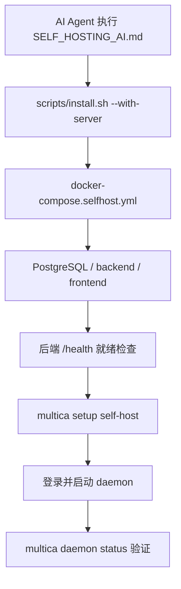

# Other — SELF_HOSTING_AI.md

## 模块概览

`SELF_HOSTING_AI.md` 是根目录下的自托管快速运行手册，目标读者是需要直接执行命令的 AI Agent。它不是可执行代码模块，不定义函数、类或路由；GitNexus 中也没有内部调用、外部调用、入站调用或执行流。它的真实运行效果来自文档中引用的脚本、Makefile 目标和 CLI 命令。

该文档覆盖一条完整链路：安装 Multica CLI、拉起本机自托管服务、配置 CLI 指向本机后端和前端、完成登录、启动 daemon（守护进程），最后验证本机 agent 是否被 daemon 检测到。



## 标准安装流程

推荐路径是通过 `scripts/install.sh` 的 `--with-server` 模式一次性完成 CLI 安装和自托管服务部署：

```bash
# 安装 CLI，并在本机创建自托管服务
curl -fsSL https://raw.githubusercontent.com/multica-ai/multica/main/scripts/install.sh | bash -s -- --with-server

# 配置 CLI 指向本机自托管服务，登录，并启动 daemon
multica setup self-host
```

`run_with_server()` 会依次执行 `detect_os()`、`check_docker()`、`setup_server()` 和 `install_cli()`。其中 `setup_server()` 会把仓库准备到 `MULTICA_INSTALL_DIR`，默认是 `$HOME/.multica/server`，创建 `.env`，生成随机 `JWT_SECRET` 和 `POSTGRES_PASSWORD`，然后执行：

```bash
docker compose -f docker-compose.selfhost.yml up -d
```

安装脚本通过 `selfhost_backend_port()` 读取后端端口，并轮询 `http://localhost:<port>/health`。看到 `✓ Multica server is running and CLI is ready!` 后，才应该继续执行 `multica setup self-host`。

## 手动部署路径

文档中的手动路径适合开发者从当前仓库或指定 checkout 启动服务：

```bash
git clone https://github.com/multica-ai/multica.git
cd multica
make selfhost
brew install multica-ai/tap/multica
multica setup self-host
```

`make selfhost` 定义在 `Makefile` 中。它会运行 `REQUIRE_COMPOSE` 检查 Docker Compose CLI 插件，创建 `.env`，拉取官方镜像，然后启动 `docker-compose.selfhost.yml`。如果官方 GHCR 镜像尚未发布，`make selfhost` 会提示改用 `make selfhost-build` 从当前 checkout 构建本地镜像。

## Docker 服务组成

`docker-compose.selfhost.yml` 启动三个服务：

- `postgres`：使用 `pgvector/pgvector:pg17`，数据卷是 `pgdata`。
- `backend`：默认镜像是 `ghcr.io/multica-ai/multica-backend:${MULTICA_IMAGE_TAG:-latest}`，宿主机端口默认绑定到 `127.0.0.1:8080`。
- `frontend`：默认镜像是 `ghcr.io/multica-ai/multica-web:${MULTICA_IMAGE_TAG:-latest}`，宿主机端口默认绑定到 `127.0.0.1:3000`。

Compose 文件刻意把后端和前端绑定到 `127.0.0.1`，不是 `0.0.0.0`。如果要跨机器或公网访问，应通过 Caddy、nginx 或 Cloudflare Tunnel 等反向代理终止 TLS，再转发到本机端口；不要直接暴露 Docker 绑定端口。

## `multica setup self-host` 的行为

`multica setup self-host` 由 `server/cmd/multica/cmd_setup.go` 中的 `setupSelfHostCmd` 定义，实际入口是 `runSetupSelfHost()`。

它的主要步骤是：

1. 通过 `resolveSelfHostServerURL()` 解析后端地址。
2. 通过 `resolveSelfHostAppURL()` 解析前端地址。
3. 调用 `confirmOverwrite()`，如果已有配置则提示覆盖。
4. 调用 `persistSelfHostConfigIfReachable()`，先用 `probeServer()` 请求 `/health`，只有服务可达才写入 `cli.CLIConfig`。
5. 调用 `runLogin()` 打开浏览器完成登录。
6. 调用 `runDaemonBackground()` 在后台启动 daemon。

后端 URL 的优先级是 `--server-url`、`MULTICA_SERVER_URL`、已有配置、`--port` 生成的 `http://localhost:<port>`。前端 URL 的优先级是 `--app-url`、`MULTICA_APP_URL`、已有配置、本机 `http://localhost:<frontend-port>`。如果 `--server-url` 指向远程主机且没有提供 `--app-url`，`promptAppURL()` 会要求输入前端地址，因为远程 API 域名无法可靠推导出前端域名。

## 登录与验证码

登录流程由 `runLogin()` 接管。浏览器会打开前端登录页，验证码来源取决于后端邮件配置：

- 配置了 `RESEND_API_KEY` 时，验证码通过邮件发送。
- 未配置 Resend 时，开发或自托管场景下验证码会打印在后端日志中。
- `.env.example` 还支持 SMTP 配置；当 `SMTP_HOST` 设置后，SMTP 路径优先于 Resend。

排查验证码时通常查看：

```bash
docker compose -f docker-compose.selfhost.yml logs backend
```

## 端口与 URL 配置

默认访问地址是：

- 前端：`http://localhost:3000`
- 后端：`http://localhost:8080`

文档中的自定义端口流程是修改 `.env` 后重新启动服务，并把同样的端口传给 CLI：

```bash
make selfhost
multica setup self-host --port <后端端口> --frontend-port <前端端口>
```

维护时要注意当前代码里的端口来源：`docker-compose.selfhost.yml` 的后端宿主端口读取 `BACKEND_PORT`，`Makefile` 会用 `BACKEND_PORT`、`API_PORT`、`SERVER_PORT`、`PORT` 推导本地后端端口。更新这份文档时，应保持 `PORT`、`BACKEND_PORT` 和 `--port` 的说明一致，避免服务端口和 CLI 配置端口不匹配。

## 验证与停止

部署后用 CLI 检查 daemon：

```bash
multica daemon status
```

`cmd_daemon.go` 中的 `checkDaemonHealthOnPort()` 会访问 daemon 的本地健康端点，`printDaemonStatusReport()` 会输出运行状态、检测到的 agents 和 workspaces。预期结果是状态为 `running`，并能看到本机可用的 agent CLI。

停止流程分两层：

```bash
# 停止 daemon
multica daemon stop

# 停止 Docker 服务
make selfhost-stop
```

如果是通过安装脚本部署到 `$HOME/.multica/server`，也可以使用安装脚本的 `--stop` 模式；它会进入安装目录执行 `docker compose -f docker-compose.selfhost.yml down`，并尝试停止 daemon。

## 故障排查入口

`SELF_HOSTING_AI.md` 保留了最小但关键的诊断命令：

```bash
# 后端日志
docker compose -f docker-compose.selfhost.yml logs backend

# 前端日志
docker compose -f docker-compose.selfhost.yml logs frontend

# daemon 日志
multica daemon logs

# 后端存活检查
curl http://localhost:8080/health

# 依赖就绪检查
curl http://localhost:8080/readyz
```

`/health` 用于基础存活检查，也是 `probeServer()` 和 self-host 启动等待逻辑依赖的端点。`/readyz` 用于依赖感知的就绪检查，更适合排查数据库或外部依赖未就绪的问题。

## 与代码库的连接点

这个模块本身是文档，但它必须与以下代码保持同步：

- `scripts/install.sh`：安装器输出、`--with-server`、`--stop`、`MULTICA_INSTALL_DIR`、`MULTICA_SELFHOST_REF`。
- `Makefile`：`selfhost`、`selfhost-build`、`selfhost-stop`、端口变量和 Compose 检查。
- `docker-compose.selfhost.yml`：服务组成、镜像名、端口绑定、环境变量。
- `server/cmd/multica/cmd_setup.go`：`setupSelfHostCmd` 的 flags、URL 解析优先级、登录和 daemon 启动行为。
- `server/cmd/multica/cmd_daemon.go`：`daemon status`、`daemon logs`、`daemon stop` 的用户可见行为。
- `.env.example`：自托管环境变量、邮件、端口、公开 URL、反向代理和存储配置。

## 维护建议

修改 CLI flags、安装脚本输出、Compose 服务名、默认端口、健康检查路径或登录方式时，需要同步更新 `SELF_HOSTING_AI.md`。尤其是安装器完成提示 `✓ Multica server is running and CLI is ready!` 被 AI Agent 用作继续执行下一步的信号；如果脚本文案变化，文档中的等待条件也要一起变化。