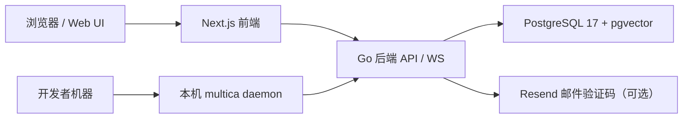

# Other — SELF_HOSTING.md

## 模块概览

`SELF_HOSTING.md` 是 Multica 自托管部署的入口文档，面向希望在本地、内网或自有基础设施上运行 Multica 的开发者和运维人员。它不包含可执行代码，也没有函数、类、内部调用或执行流；它的作用是把仓库中的部署资产、CLI 工作流和高级配置文档串成一条可操作路径。

本文档覆盖三类部署路径：

- 快速安装：通过 `scripts/install.sh` 一次性安装 CLI、拉取服务镜像并配置本地 self-host 环境。
- 手动 Docker Compose：通过 `make selfhost`、`make selfhost-build` 或 `docker compose -f docker-compose.selfhost.yml` 管理本机服务。
- Kubernetes / Helm：通过 `deploy/helm/multica/` 或发布到 GHCR 的 OCI Helm chart 部署到集群。

## 自托管架构

Multica 自托管由三部分服务端组件和一个本机执行组件组成：

| 组件 | 作用 | 相关技术或入口 |
| --- | --- | --- |
| Backend | 提供 REST API、WebSocket、认证、迁移和任务调度 | Go 单二进制，默认端口 `8080` |
| Frontend | 提供 Web UI | Next.js 16，默认端口 `3000` |
| Database | 存储主数据、任务、成员、用量聚合等 | PostgreSQL 17 + pgvector |
| CLI / daemon | 运行在用户本机，发现 agent CLI 并执行被分配的任务 | `multica` CLI，`multica daemon` |



关键点是：服务端可以运行在 Docker Compose 或 Kubernetes 中，但 `multica daemon` 运行在每个需要执行 AI agent 的开发者本机，而不是运行在服务端容器或集群里。

## 快速安装路径

推荐路径是两条命令：

```bash
# 1. 安装 CLI，并拉起 self-host 服务端
curl -fsSL https://raw.githubusercontent.com/multica-ai/multica/main/scripts/install.sh | bash -s -- --with-server

# 2. 配置 CLI、完成认证，并启动 daemon
multica setup self-host
```

这条路径会完成以下事情：

1. 安装 `multica` CLI。
2. 检出最新的 self-host 部署资产。
3. 从 GHCR 拉取官方 Multica 镜像。
4. 为 `localhost` 默认端口配置服务端和前端。
5. 引导 CLI 登录并启动后台 daemon。

默认访问地址是：

- Web UI：`http://localhost:3000`
- Backend API：`http://localhost:8080`

如果只需要安装 CLI，而服务端已经存在，可以使用 Homebrew：

```bash
brew install multica-ai/tap/multica
```

## Docker Compose 部署路径

`make selfhost` 是手动部署的主入口：

```bash
git clone https://github.com/multica-ai/multica.git
cd multica
make selfhost
```

该目标会自动完成：

- 从 `.env.example` 创建 `.env`。
- 生成随机 `JWT_SECRET`。
- 通过 `docker-compose.selfhost.yml` 启动 backend、frontend 和 PostgreSQL。
- 默认拉取 GHCR 上的稳定镜像。

如果当前 GHCR tag 尚未发布，或者需要从本地 checkout 构建镜像，使用：

```bash
make selfhost-build
```

`make selfhost-build` 使用本地镜像 tag：

- `multica-backend:dev`
- `multica-web:dev`

这样不会覆盖已经拉取的 `:latest` 镜像。

也可以完全手动执行 Compose：

```bash
cp .env.example .env
# 至少修改 JWT_SECRET
JWT_SECRET=$(openssl rand -hex 32)

docker compose -f docker-compose.selfhost.yml pull
docker compose -f docker-compose.selfhost.yml up -d
```

停止 Docker Compose 服务时使用：

```bash
make selfhost-stop
```

如果是通过安装脚本部署的，也可以用脚本停止：

```bash
curl -fsSL https://raw.githubusercontent.com/multica-ai/multica/main/scripts/install.sh | bash -s -- --stop
```

## 登录与验证码配置

Docker self-host 栈默认在 `docker-compose.selfhost.yml` 中使用 `APP_ENV=production`，因此默认没有固定验证码。登录方式有三种：

| 方式 | 适用场景 | 配置 |
| --- | --- | --- |
| Resend 邮件验证码 | 推荐的生产方式 | 在 `.env` 设置 `RESEND_API_KEY`，重启 backend |
| 后端日志验证码 | 单机临时测试 | 不配置 Resend，从 backend 日志读取 `[DEV] Verification code for ...:` |
| 固定开发验证码 | 本地或私有测试 | 设置 `APP_ENV=development` 和 `MULTICA_DEV_VERIFICATION_CODE=888888` |

不要在公网可访问实例上设置 `MULTICA_DEV_VERIFICATION_CODE`。只要知道邮箱地址，任何人都可以使用该固定验证码登录。

这些运行时配置变更需要重启 backend 或 Compose 栈：

- `ALLOW_SIGNUP`
- `DISABLE_WORKSPACE_CREATION`
- `GOOGLE_CLIENT_ID`
- `RESEND_API_KEY`
- `MULTICA_DEV_VERIFICATION_CODE`

Web UI 会在运行时从 `/api/config` 读取 `ALLOW_SIGNUP`、`DISABLE_WORKSPACE_CREATION` 和 `GOOGLE_CLIENT_ID`，因此这些值变更后不需要重新构建 web 镜像。

## CLI 与 Daemon 工作流

自托管服务端启动后，每个需要运行 AI agent 的团队成员都要在自己的机器上安装 CLI 和至少一个 agent CLI。

安装 Multica CLI：

```bash
brew install multica-ai/tap/multica
```

支持的 agent CLI 包括文档中列出的 `claude`、`codex`、`copilot`、`openclaw`、`opencode`、`hermes`、`pi`、`cursor-agent`、`kimi`、`kiro-cli`、`qodercli`、`traecli` 和 `grok`。

本地 self-host 默认配置：

```bash
multica setup self-host
```

自定义域名或内网部署：

```bash
multica setup self-host \
  --server-url https://api.example.com \
  --app-url https://app.example.com
```

该命令会：

1. 配置 CLI 的 `server_url` 和 `app_url`。
2. 打开浏览器完成登录。
3. 发现用户可访问的 workspace。
4. 在后台启动 daemon。

可以用以下命令检查 daemon 状态：

```bash
multica daemon status
```

手动配置等价流程是：

```bash
multica config set server_url http://localhost:8080
multica config set app_url http://localhost:3000
multica login
multica daemon start
```

切回 Multica Cloud 时使用：

```bash
multica setup
```

这会重新配置 CLI 指向 `multica.ai`，并重新认证、重启 daemon；本地 Docker 服务不会自动停止。

## Kubernetes / Helm 部署路径

Kubernetes 部署使用 OCI Helm chart：

```bash
helm install multica oci://ghcr.io/multica-ai/charts/multica \
  --version <chart-version> \
  -n multica
```

也可以从源码 chart 部署：

```bash
helm install multica deploy/helm/multica -n multica
```

chart 主要创建：

- `multica-postgres`：使用 `pgvector/pgvector:pg17`，默认 10Gi PVC。
- `multica-backend`：Go API / WebSocket 服务，默认有 5Gi uploads PVC。
- `multica-frontend`：Next.js standalone server。
- 两个 `Ingress`：分别用于 web host 和 backend host。
- `multica-config` ConfigMap：由 `values.yaml` 渲染。
- `backend` ExternalName Service：兼容预构建 web 镜像中的 `REMOTE_API_URL=http://backend:8080`。

`multica-secrets` 不由 chart 管理，需要手动创建：

```bash
kubectl -n multica create secret generic multica-secrets \
  --from-literal=JWT_SECRET="$(openssl rand -hex 32)" \
  --from-literal=POSTGRES_PASSWORD="$(openssl rand -hex 16)" \
  --from-literal=RESEND_API_KEY="" \
  --from-literal=GOOGLE_CLIENT_SECRET="" \
  --from-literal=CLOUDFRONT_PRIVATE_KEY="" \
  --from-literal=MULTICA_DEV_VERIFICATION_CODE=""
```

默认 host 是：

- Web：`multica.dev.lan`
- Backend：`api.multica.dev.lan`

需要通过 `/etc/hosts` 或本地 DNS 指向 Ingress IP：

```text
192.168.1.206  multica.dev.lan api.multica.dev.lan
```

集群部署后，daemon 仍然运行在用户本机：

```bash
multica setup self-host \
  --server-url http://api.multica.dev.lan \
  --app-url http://multica.dev.lan
```

## 用量看板 Rollup

Usage / Runtime 看板读取派生表 `task_usage_hourly`。该表由数据库函数 `rollup_task_usage_hourly()` 填充。

MUL-2957 之后，backend 会在每个副本内运行一个基于数据库的调度器：

- 调度状态写入 `sys_cron_executions`。
- 每个副本每 30 秒 tick 一次。
- 每个 5 分钟 UTC plan 通过唯一键 `(job_name, scope_kind, scope_id, plan_time)` 保证只有一个副本成功认领。
- SQL 函数内部持有 advisory lock `4246`，所以兼容旧的外部调度方式，不会重复写入 rollup。

检查调度状态：

```sql
SELECT plan_time, status, attempt, runner_id,
       error_code, error_msg, started_at, finished_at
  FROM sys_cron_executions
 WHERE job_name = 'rollup_task_usage_hourly'
 ORDER BY plan_time DESC
 LIMIT 20;
```

旧部署可能仍然使用这些兼容路径：

- 数据库内 `pg_cron`
- 外部 cron
- systemd timer
- Kubernetes `CronJob`

新部署不需要这些外部调度器。确认 `sys_cron_executions` 中已经持续出现 `SUCCESS` 后，可以移除旧的 `pg_cron` job：

```sql
SELECT cron.unschedule('rollup_task_usage_hourly')
  FROM cron.job WHERE jobname = 'rollup_task_usage_hourly';
```

## 升级与回滚

Docker Compose 升级：

```bash
docker compose -f docker-compose.selfhost.yml pull
docker compose -f docker-compose.selfhost.yml up -d
```

如果希望固定版本，在 `.env` 设置：

```bash
MULTICA_IMAGE_TAG=v0.2.4
```

Kubernetes 升级到指定 chart 版本：

```bash
helm upgrade multica oci://ghcr.io/multica-ai/charts/multica \
  --version <chart-version> \
  -n multica \
  -f my-values.yaml
```

如果需要让 chart 版本和应用镜像版本分离，在 values 文件中覆盖：

```yaml
images:
  backend:
    tag: v0.2.4
  frontend:
    tag: v0.2.4
```

回滚 Helm release：

```bash
helm -n multica rollback multica
```

从 `v0.3.4` 升级到 `v0.3.5+` 时，旧版本可能因为 migration `103` 的 fail-closed guard 报错：`refusing to drop legacy daily rollups: ...`。MUL-2957 之后，`migrate up` 会在应用 migration `103` 前自动运行幂等的 monthly-slice backfill；如果仍在使用更早的二进制或自动 hook 因环境原因失败，需要手动运行 `backfill_task_usage_hourly` 后再重试升级。

## 与其他文档和仓库资产的关系

`SELF_HOSTING.md` 是自托管的快速入口，详细配置被拆到 `SELF_HOSTING_ADVANCED.md`。当修改以下内容时，需要同步检查两个文档：

- 环境变量含义或默认值。
- `docker-compose.selfhost.yml` 或 `docker-compose.selfhost.build.yml` 的服务、端口、镜像 tag 逻辑。
- `Makefile` 中的 `selfhost`、`selfhost-build`、`selfhost-stop` 行为。
- `scripts/install.sh` 的安装、停止或 server provisioning 参数。
- `deploy/helm/multica/values.yaml`、模板、Secret / ConfigMap 字段。
- CLI 命令，例如 `multica setup self-host`、`multica config set`、`multica daemon start/status/stop`。
- 认证相关配置，例如 `RESEND_API_KEY`、`APP_ENV`、`MULTICA_DEV_VERIFICATION_CODE`、`ALLOW_SIGNUP`、`DISABLE_WORKSPACE_CREATION`、`GOOGLE_CLIENT_ID`。
- 用量 rollup、migration `103`、`sys_cron_executions` 或 `rollup_task_usage_hourly()` 的行为。

这个模块的写作目标是让读者先用最短路径跑起来，再在需要时进入手动 Compose、Kubernetes、升级、回滚和高级配置。维护时应优先保证命令可复制、默认值准确、风险提示明确。