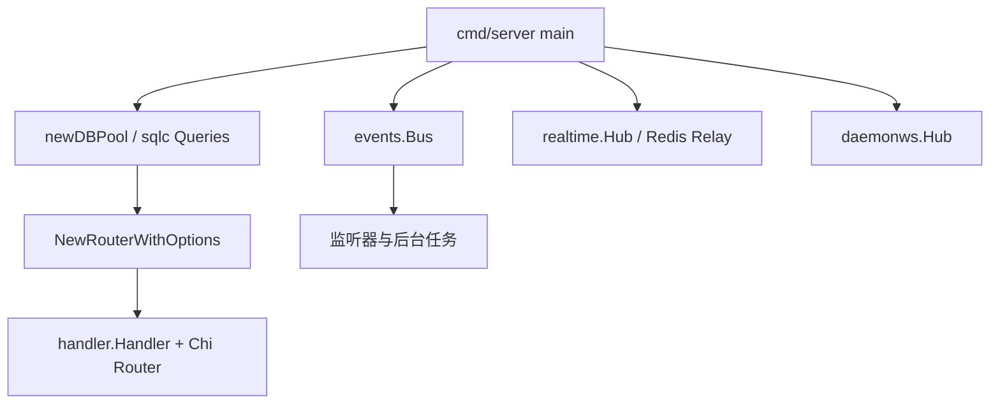

# Other — server-cmd

## 模块概览

`server/cmd` 包含 Multica 后端的 Go 可执行入口和命令行工具。这里的代码基本都是 `package main`，职责是组装依赖、解析命令/环境变量、调用 `server/internal` 和 `server/pkg` 中的业务实现，而不是承载核心业务逻辑。

主要入口：

- `server/cmd/server`：HTTP API 服务进程，负责路由、实时广播、后台任务和优雅关闭。
- `server/cmd/multica`：`multica` CLI，基于 Cobra 暴露工作区、问题、Agent、运行时、附件等命令。
- `server/cmd/migrate`：数据库迁移执行器，带 Postgres advisory lock 防并发竞态。
- `server/cmd/backfill_task_usage_hourly`：历史 `task_usage` 到 `task_usage_hourly` 的小时聚合回填工具。
- `server/cmd/backfill_codex_usage_cache`：修复历史 Codex cached input 重复计入的运维回填工具。

## 运行时结构



`cmd/server/main.go` 是服务进程的组合层。启动时它会初始化 logger、读取环境变量、建立 `pgxpool.Pool`、创建 `events.Bus`、`realtime.Hub`、`daemonws.Hub`，然后通过 `NewRouterWithOptions` 构建 HTTP 路由和 `handler.Handler`。

如果设置了 `REDIS_URL`，实时广播会从单机内存 Hub 切换到 Redis relay。`realtimeRelayModeFromEnv` 支持 `sharded`、`dual`、`legacy`，相关参数由 `shardedRelayConfigFromEnv`、`envPositiveInt`、`envPositiveInt64`、`envDuration` 解析。Redis 客户端通过 `newNamedRedisClient` 创建，默认设置 `CLIENT SETNAME`，也可以用 `REDIS_DISABLE_CLIENT_NAME` 禁用。

`NewRouterWithOptions` 位于 `cmd/server/router.go`，是 HTTP 层最重要的扩展点。它把 `db.New(pool)`、存储后端、CloudFront signer、邮件服务、channel engine、feature flags、metrics、daemon wakeup 等依赖注入到 `handler.New`。普通测试和简单调用可以用 `NewRouter`；需要驱动后台生命周期的调用方使用 `NewRouterWithOptions` 返回的 `*handler.Handler`。

后台任务由 `main` 统一启动和关闭，包括：

- `runRuntimeSweeper`
- `handler.NewBatchedHeartbeatScheduler(...).Run`
- `runAutopilotFailureMonitor`
- `runDBStatsLogger`
- `WebhookDeliveryWorker.Run`
- `ChannelSupervisor.Run`
- `scheduler.Manager` 注册的 `TaskUsageHourlyJob` 和 `AutopilotScheduleDispatchJob`

关闭顺序很关键：先 `srv.Shutdown` drain HTTP 请求，再停止 sweeper context，最后调用 `heartbeatScheduler.Stop()` 刷新待写心跳。Channel supervisor 和 webhook worker 都有 bounded wait，避免进程退出时长期卡住。

## CLI 命令模型

`server/cmd/multica/main.go` 定义 `rootCmd`，所有子命令都用 Cobra 的全局变量注册。`init()` 中设置版本信息、全局 flags，并按 `groupCore`、`groupRuntime`、`groupAdditional` 分组挂载命令。`initHelp`、`exactArgs`、`formatCommandList` 提供统一帮助输出和参数数量校验。

CLI 的通用调用路径是：

1. 子命令定义 `var xxxCmd = &cobra.Command{..., RunE: runXxx}`。
2. `init()` 中把子命令挂到父命令，并注册 flags。
3. `runXxx` 调用 `newAPIClient(cmd)` 获取 `cli.APIClient`。
4. 用 `cli.APIContext` 或带超时的 `context.WithTimeout` 发 HTTP 请求。
5. 通过 `cli.PrintJSON` 或 `cli.PrintTable` 输出结果。

`newAPIClient` 是 CLI API 调用的中心入口。它依赖：

- `resolveServerURL`
- `resolveWorkspaceID`
- `resolveToken`
- `inDaemonManagedExecutionContext`
- `daemonTaskContextMarkerPath`

在 daemon 管理的 Agent 任务环境中，CLI 必须 fail closed：如果检测到 `MULTICA_AGENT_ID`、`MULTICA_TASK_ID`、`MULTICA_DAEMON_PORT` 或 daemon task marker，就不能回退读取用户全局配置里的 PAT。`newAPIClient` 要求这类上下文中的 `MULTICA_TOKEN` 是 `mat_` task-scoped token，否则返回错误。这个规则防止 Agent 子进程因为环境变量丢失而用成员 PAT 写入，造成作者身份错乱。

`resolveWorkspaceID` 同样在 daemon-managed context 中禁止配置文件回退；`requireWorkspaceID` 会给出专门的 agent execution context 错误。相关回归测试集中在 `cmd_agent_test.go`。

## CLI 中的高风险输入模式

Agent 环境变量和 MCP 配置被当作 secret-bearing 输入处理：

- `parseCustomEnv` 只接受 JSON object，`{}` 表示明确清空。
- `resolveCustomEnv` 支持 `--custom-env`、`--custom-env-stdin`、`--custom-env-file`，三者互斥。
- `parseMcpConfig` 接受 JSON object 或 `null`，`null` 表示清空。
- `resolveMcpConfig` 支持 `--mcp-config`、`--mcp-config-stdin`、`--mcp-config-file`，同样互斥。
- JSON 解析错误不能泄漏原始输入片段，测试会检查敏感字符串没有出现在错误信息里。

`agent update` 有意不暴露 `--custom-env*`。环境变量只能通过 `multica agent env get/set` 走 `/api/agents/{id}/env` 审计路径。`mcp_config` 仍然可通过 `agent create/update` 设置，因为它没有单独的审计 endpoint。

`runAttachmentUpload` 和 `runAttachmentDownload` 是另一个安全边界示例。上传要求本地文件路径和 task id；下载时用 `filepath.Base` 清理服务端返回的文件名，避免 `../report.txt` 逃出输出目录。`escapeMarkdownLabel` 会转义 Markdown label 中的 `[ ] ( ) \`，确保生成的 `!file[name](url)` 或 `` 片段不会被文件名截断。

## 迁移执行器

`server/cmd/migrate/main.go` 提供 `go run ./cmd/migrate <up|down>`。核心函数是 `runMigrations(ctx, pool, runOptions)`。

关键约束：

- `Direction` 只能是 `"up"` 或 `"down"`，非法值会在接触数据库前返回错误。
- 迁移表默认是 `schema_migrations`，测试可通过 `runOptions.SchemaMigrationsTable` 覆盖。
- `quoteQualifiedIdentifier` 只接受 `table` 或 `schema.table` 形态，并用 `pgx.Identifier.Sanitize()` 安全插入 SQL。
- 整个迁移循环使用 `pg_advisory_lock` 串行化，锁必须绑定到同一个 `*pgxpool.Conn`；不能用 `pool.Exec` 分散到不同连接。
- 迁移循环不包单个大事务，因为仓库中存在 `CREATE INDEX CONCURRENTLY` 这类不能在事务块中执行的 SQL。

`preMigrationHooks` 支持在某个 migration version 前运行幂等钩子。目前 `103_drop_legacy_daily_rollups` 之前会运行 `runTaskUsageHourlyHook`，它调用 `taskusagebackfill.Hook` 预先补齐小时 rollup，避免迁移 103 的 fail-closed lag guard 在服务未启动时误判。

`migrate_concurrent_test.go` 用真实 Postgres 验证并发语义：pending schema、already applied schema、外部持锁阻塞、小连接池压力和非法 direction。这些测试说明 `runMigrations` 被设计成可被多副本启动同时调用。

## 数据回填工具

`backfill_task_usage_hourly` 是历史 rollup 回填工具。`run` 读取 `--dry-run`、`--months-back`、`--force-partial`、`--sleep-between-slices`，再按月切片调用数据库函数：

```sql
SELECT rollup_task_usage_hourly_window($1::timestamptz, $2::timestamptz)
```

它使用 advisory lock `4246` 与 cron / scheduler rollup 串行化。非 dry-run 完成后，`stampWatermark` 会把 `task_usage_hourly_rollup_state.watermark_at` 更新为 `now() - 5 minutes`，避免后续调度重复扫描历史窗口。`--months-back` 会永久放弃更早 buckets，因此必须配合 `--force-partial`。

`backfill_codex_usage_cache` 用于修复历史 Codex cached input 重复计入。`run` 默认 dry-run，必须显式传 `--execute` 才会更新数据。`config.parseAndValidate` 强制 `--cutoff` 为过去的 RFC3339 时间，防止对修复上线后的数据二次扣减。

候选条件集中在 `loadDryRunSummary` 和 `executeBackfill`：

- `tu.provider = 'codex'`
- `cache_read_tokens > 0`
- `input_tokens > 0`
- `COALESCE(updated_at, created_at) < cutoff`
- 可选 `workspace_id` 限制

`executeBackfill` 批量更新 `input_tokens = GREATEST(input_tokens - cache_read_tokens, 0)`，使用 `FOR UPDATE OF tu SKIP LOCKED` 和 `batchSize` 控制写入。更新后如果 `rebuildRollup` 为 true，会用 `databaseClock` 记录更新窗口，再通过 `rollupWindow` 前后各扩一秒，调用 `rollup_task_usage_hourly_window` 重建受影响小时聚合。

## 与内部包的关系

`server/cmd` 不应成为业务逻辑归属地。新增行为时优先放在内部包中，cmd 层只做编排：

- HTTP 处理：`server/internal/handler`
- 业务服务：`server/internal/service`
- 事件总线：`server/internal/events`
- 实时广播：`server/internal/realtime`、`server/internal/daemonws`
- 调度：`server/internal/scheduler`
- CLI 客户端与配置：`server/internal/cli`
- SQLC 查询：`server/pkg/db/generated`
- migration 发现：`server/internal/migrations`
- task usage 回填复用逻辑：`server/internal/taskusagebackfill`

如果代码需要被其他包复用，不要从 `server/cmd/...` 导入；应该迁移到合适的 `server/internal/...` 或 `server/pkg/...` 包。

## 添加或修改命令的建议流程

添加 CLI 子命令时，沿用现有模式：定义 `*cobra.Command` 变量，在 `init()` 中注册 flags 和父子关系，实现 `runXxx`，并使用 `newAPIClient`、`exactArgs`、`cli.APIContext`、`cli.PrintJSON` / `cli.PrintTable`。涉及 secret 的 flags 应优先提供 stdin/file 通道，并避免把原始输入包进错误链。

修改 server 启动逻辑时，保持 `cmd/server/main.go` 作为生命周期编排层。路由和 handler 依赖优先通过 `RouterOptions` 注入，业务分支放到 `handler` 或 `service`。事件监听器注册顺序要谨慎，例如 subscriber listeners 必须早于 notification listeners。

修改迁移器时，先确认并发语义。任何新 pre-migration hook 都必须幂等，失败后不能写入 `schema_migrations`，下次运行应能重试。需要 session-level lock 的逻辑必须固定连接。

修改回填工具时，默认应保持 dry-run 或显式执行开关，并提供清晰的候选汇总。涉及 rollup 的工具应复用数据库幂等窗口函数，并与 advisory lock `4246` 协调。