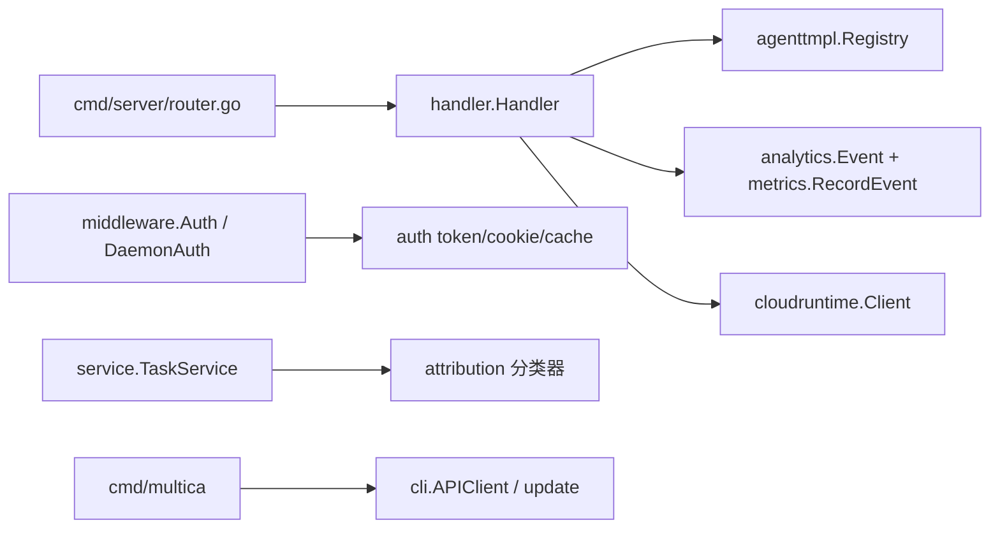

# Other — server-internal

## 模块定位

`server/internal` 下的这组代码是服务端内部支撑层，不是单一业务流程。它为 `handler`、`middleware`、`service`、`cmd/server` 和 `cmd/multica` 提供可复用能力：内置 Agent 模板、服务端事件构造、任务归因、认证辅助、CLI HTTP 客户端/自更新，以及 Cloud Runtime Fleet 代理客户端。

## `agenttmpl`：内置 Agent 模板目录

`server/internal/agenttmpl` 负责加载 `server/internal/agenttmpl/templates/*.json` 中的 curated templates，供 `server/internal/handler/agent_template.go` 的“从模板创建 Agent”流程使用。

核心类型是 `Template`、`TemplateSkillRef` 和只读的 `Registry`。`Load()` 通过 `go:embed` 读取模板文件，内部调用 `loadFromFS()` 后返回 `*Registry`；调用方通过 `Registry.List()` 获取稳定顺序列表，通过 `Registry.Get(slug)` 获取单个模板。

模板加载是启动期强校验：`validate()` 要求 `slug` 非空、符合 lowercase kebab-case、等于文件名 basename，`name` 和 `instructions` 非空，每个 `TemplateSkillRef.SourceURL` 非空。`skills: []` 是合法的 prompt-only 模板，不要恢复“至少一个 skill”的规则。模板文件排序后加载，因此 `List()` 输出可预测，适合 UI 与测试依赖稳定顺序。

新增模板时，文件名必须是 `<slug>.json`，并让 JSON 内的 `"slug"` 完全一致。模板内容是产品配置，随代码 PR 审核发布；当前没有运行时编辑或 DB 后端。

## `analytics`：事件构造与指标入口

`server/internal/analytics` 定义服务端事件模型和事件构造函数。`Event` 是统一载体，包含 `Name`、`DistinctID`、`WorkspaceID`、`Properties`、`SetOnce`、`Set` 和可选 `Timestamp`。业务代码通常不手写 `Event`，而是调用 helper，例如 `Signup()`、`WorkspaceCreated()`、`IssueCreated()`、`RuntimeReady()`、`AutopilotRunFailed()`、`FeedbackSubmitted()`。

`Client` 只有 `Capture(Event)` 和 `Close()` 两个方法。`NewFromEnv()` 根据 `POSTHOG_API_KEY`、`POSTHOG_HOST`、`ANALYTICS_ENVIRONMENT`、`APP_ENV` 和 `ANALYTICS_DISABLED` 返回 `NoopClient` 或 `PostHogClient`。`PostHogClient` 使用有界 channel、后台 worker、批量 `/batch/` 发送；`Capture()` 不阻塞，请求队列满时丢弃并计数。

当前要特别注意 `IsMetricsOnly()`：MUL-4127 之后，所有已声明的服务端产品事件都在服务端侧视为 Prometheus-only。实际调用点应走 `metrics.RecordEvent(h.Analytics, h.Metrics, analytics.X(...))`，由指标层记录 Grafana 计数，并对 `metricsOnlyEvents` 中的事件跳过 PostHog。不要在 handler/service 中裸调用 `Analytics.Capture(...)`；`server/internal/metrics/business_pairing_test.go` 会检查这一约束。

事件属性有隐私边界：例如 `Signup()` 写 `email_domain`，反馈只写长度桶和图片标记，`ContactSalesSubmitted()` 不传播自由文本。新增事件时同步维护事件常量、helper、`metricsOnlyEvents` 和对应 Prometheus 映射。

## `attribution`：任务的人类责任归因

`server/internal/attribution` 是纯规则包，给 agent task enqueue 流程解析“这次运行应归因到哪个人”。它不查数据库，也不做权限判断；调用方在 `service.TaskService` 中读取事实，再传入 `ClassifyComment()`、`ClassifyDirect()`、`DirectHumanRun()`、`RuleOwner()`、`TriggerOwner()` 或 `Unattributed()`。

最重要的不变量在 `Result`：

`UserID` 是授权来源，会写入 `originator_user_id`；`AccountableUserID` 是审计责任人，会写入 `accountable_user_id`。`finalizeAttribution()` 保证单向不变量：只要 `UserID.Valid == true`，`AccountableUserID` 必须等于 `UserID`。当 `UserID` 为空时，`RuleOwner`、`TriggerOwner`、`OwnerFallback` 或 autopilot-rooted delegation 可以只设置审计责任人，不伪造授权来源。

`Source` 表示归因来源层级。`SourceDirectHuman`、`SourceDelegation`、`SourceCommentSource`、`SourceTriggerOwner` 和 `SourceRuleOwner` 是 precise；`SourceOwnerFallback`、`SourceBackfill`、`SourceUnattributed` 是 degraded。新增 enqueue 路径时，应先明确 `TriggerKind` 和归因规则，而不是在调用点手写 `Result`。

常见路径：

- 成员评论、分配、chat：使用 `ClassifyComment()` 或 `DirectHumanRun()`，归为 `direct_human`。
- Agent 评论或 Agent 创建子 issue：从父任务复制 `ParentOriginator` 或 `ParentAccountable`，归为 `delegation` 或 `comment_source`。
- Autopilot schedule/webhook：优先 `TriggerOwner()`，缺失 trigger creator 时再降级 `RuleOwner()`。
- 未能精确解析时：先 `Unattributed()`，由 enqueue 边界按 workspace 策略决定是否 `OwnerFallback()`。

## `auth`：认证 token、cookie、缓存和 CDN 签名

`server/internal/auth` 提供认证基础设施，实际 HTTP 分支在 `server/internal/middleware/auth.go` 和 `server/internal/middleware/daemon_auth.go`。

基础 token 函数包括 `JWTSecret()`、`GeneratePATToken()`、`GenerateDaemonToken()`、`GenerateAgentTaskToken()` 和 `HashToken()`。PAT 使用 `mul_` 前缀，daemon token 使用 `mdt_`，agent task token 使用 `mat_`，Cloud Node PAT 使用 `CloudPATPrefix == "mcn_"`。

Cookie 相关函数是 `SetAuthCookies()`、`ClearAuthCookies()` 和 `ValidateCSRF()`。`SetAuthCookies()` 同时设置 HttpOnly 的 `multica_auth` 和可读的 `multica_csrf`。CSRF token 是绑定 auth token 的 HMAC，非安全方法必须带 `X-CSRF-Token`。`cookieDomain()` 会拒绝 IP literal 的 `COOKIE_DOMAIN`，因为浏览器会丢弃这类 Domain cookie；`isSecureCookie()` 按 `FRONTEND_ORIGIN` scheme 决定 `Secure`，HTTP 自托管部署不会错误设置 Secure。

Redis 缓存有三个：

- `PATCache`：缓存 token hash 到 user id，TTL 由 `TTLForExpiry()` 限制在 `AuthCacheTTL` 和 token 剩余生命周期之间。
- `DaemonTokenCache`：缓存 daemon token hash 到 `DaemonTokenIdentity{WorkspaceID, DaemonID}`。
- `MembershipCache`：缓存 user/workspace 成员存在性，不缓存 role，role 授权仍必须查 DB。

这三个缓存都是 nil-safe；Redis 错误只记录日志并降级，不应让认证失败。撤销 PAT、删除 daemon token、成员变更、workspace leave/delete 等路径必须调用对应 `Invalidate()`，否则访问可能保留到 TTL 过期。

`CloudPATVerifier` 负责 `mcn_` token。`Verify(ctx, token, lookup)` 的顺序是：先查 Redis 正向缓存，再 POST Fleet 的 `/api/v1/pat/verify`，成功后用 `OwnerLookupFunc` 确认 `owner_id` 是本地用户。`valid:false` 和 `owner_unknown` 都映射为 `ErrCloudPATInvalid`，且不缓存；Fleet 5xx、网络错误、解码错误或本地 lookup 错误映射为 `ErrCloudPATUnavailable`，中间件应返回 503 而不是 401。

`CloudFrontSigner` 从环境或 AWS Secrets Manager 加载 RSA 私钥。`SignedCookies()` 为浏览器生成 CloudFront signed cookies；`SignedURL()` 和 `SignedURLWithContentDisposition()` 用于 CLI/API 下载附件。文件处理器会在 `h.CFSigner != nil` 时生成短期签名下载 URL。

## `cli`：命令行客户端、错误分类和自更新

`server/internal/cli` 是 `server/cmd/multica` 的共享库。`NewAPIClient(baseURL, workspaceID, token)` 创建 `APIClient`，所有请求通过 `setHeaders()` 自动带上 `Authorization`、`X-Workspace-ID`、`X-Agent-ID`、`X-Task-ID` 以及 `X-Client-Platform`、`X-Client-Version`、`X-Client-OS`。

HTTP helper 包括 `GetJSON()`、`GetJSONWithHeaders()`、`PostJSON()`、`PutJSON()`、`PatchJSON()`、`DeleteJSON()`、`DeleteJSONWithBody()`、`UploadFile()`、`UploadChatAttachment()`、`UploadFileWithURL()`、`ImportSkillFile()`、`DownloadFile()` 和 `HealthCheck()`。所有 HTTP status >= 400 的响应都应返回 `*HTTPError`，这样顶层 `FormatError()` 和 `ExitCodeFor()` 可以统一分类。

网络错误通过 `wrapTransport()` 转成 `*NetworkError`。`FormatError(err, debug)` 会按 `LC_ALL`、`LC_MESSAGES`、`LANG` 输出英文或中文友好文案，debug 模式附带原始链路。命令需要更具体提示时，用 `WithUserMessage(msg, err)` 包装；退出码由 `ExitCodeFor()` 固定映射：网络 2，认证 3，404 为 4，参数校验 5，其余 1。命令请求上下文应使用 `APIContext()` 或 `AtLeastAPITimeout()`，避免硬编码超时短于 `MULTICA_HTTP_TIMEOUT`。

配置文件由 `CLIConfig`、`LoadCLIConfigForProfile()` 和 `SaveCLIConfigForProfile()` 管理，默认路径是 `~/.multica/config.json`，profile 路径是 `~/.multica/profiles/<name>/config.json`。`Backends.OpenClaw` 和 `ProfileCommandOverrides` 都使用 `omitempty`，以保持旧配置兼容；当前 `encoding/json` 不保留未知字段。

自更新逻辑在 `update.go`。`FetchLatestRelease()` 查询 GitHub latest release；`IsReleaseVersion()` 和 `IsNewerVersion()` 防止开发版被误更新；`UpdateViaBrew()` 调 Homebrew；`UpdateViaDownloadWithTimeout()` 下载 release asset、读取 `checksums.txt`、用 `verifyAssetSHA256()` 校验后再解包替换当前二进制。Unix 用 rename 覆盖，Windows 的 `replaceBinary()` 会先把运行中的 exe 改名为 `.old`，启动后可用 `CleanupStaleUpdateArtifacts()` 清理。

## `cloudruntime`：Fleet 代理客户端

`server/internal/cloudruntime` 是服务端到 Multica Cloud Fleet 的窄 HTTP 客户端。`handler.New()` 用 `cloudruntime.NewClient(cloudruntime.Config{BaseURL, Timeout})` 构造后挂到 `Handler.CloudRuntime`，`server/internal/handler/cloud_runtime.go` 和 `cloud_billing.go` 通过 `h.CloudRuntime.Do()` 代理节点、计费和网关请求。

`Client.Do(ctx, Request)` 会校验 base URL 与 path，拼接 query/body，设置默认 `Accept: application/json` 和 JSON body 的 `Content-Type`，并权威写入 `X-User-ID`、`X-Request-ID`。`Request.Headers` 可以覆盖默认 header，例如 Stripe webhook passthrough 需要保留原始 `Content-Type` 和 `Stripe-Signature`，但不能覆盖 `X-User-ID` 或 `X-Request-ID`。响应体最多读取 1 MiB，避免 Fleet 异常响应造成内存风险。

`ErrDisabled` 表示未配置 Fleet URL，`ErrInvalidBaseURL` 表示配置不可用。`RequestRecorder` 是指标接口，`SetRecorder()` 可后置注入；`Do()` 根据 `Request.Op` 或路径推断 op，并把结果归为 `ok`、`4xx`、`5xx`、`timeout` 或 `error`。

## 贡献注意事项

改这个模块时优先保持“内部支撑包”的边界：规则包保持纯函数，网络客户端保持窄接口，缓存保持 nil-safe，HTTP helper 保持统一错误类型。

新增服务端事件必须走 `metrics.RecordEvent()`，不要绕过 Prometheus 配对。新增归因路径必须声明 `Source`/`TriggerKind` 并通过构造函数返回 `Result`。新增认证缓存写入必须用 `TTLForExpiry()` 或更短 TTL，且撤销路径要补 `Invalidate()`。新增 CLI API helper 时，status >= 400 要返回 `*HTTPError`，transport error 要经 `wrapTransport()`。

相关测试集中在这些包的 `*_test.go`，跨包行为还覆盖在 `server/internal/middleware/*_test.go`、`server/internal/handler/*_test.go`、`server/internal/service/attribution_stamp_test.go` 和 `server/internal/metrics/business_pairing_test.go`。Redis 相关测试依赖 `REDIS_TEST_URL`，未配置时会跳过。