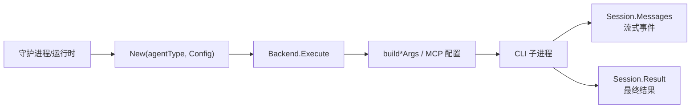

# Other — server-pkg

## `server/pkg/agent`：统一 Agent 后端适配层

`server/pkg/agent` 把不同编码 Agent CLI 封装成同一个 Go 接口。调用方只需要通过 `New(agentType, Config)` 取得 `Backend`，再调用 `Execute(ctx, prompt, ExecOptions)`，就能得到统一的流式 `Session.Messages` 和最终 `Session.Result`。



### 核心契约

`Backend` 是唯一执行接口：

```go
type Backend interface {
    Execute(ctx context.Context, prompt string, opts ExecOptions) (*Session, error)
}
```

`Session` 分成两个通道：

- `Messages <-chan Message`：执行过程中的文本、思考、工具调用、工具结果、日志、状态。
- `Result <-chan Result`：最终只发送一个结果，然后关闭。

`Result.Status` 使用 `"completed"`、`"failed"`、`"aborted"`、`"timeout"`、`"cancelled"` 这类统一状态。不同 CLI 的退出码、协议错误、内部超时都会在后端里映射到这个字段。

`ExecOptions` 是每次执行的配置入口，包含 `Cwd`、`Model`、`SystemPrompt`、`MaxTurns`、`Timeout`、`SemanticInactivityTimeout`、`HandshakeTimeout`、`ResumeSessionID`、`ExtraArgs`、`CustomArgs`、`McpConfig`、`ThinkingLevel`、`OpenclawMode` 等字段。不是所有后端都会消费所有字段；大多数后端会忽略不支持的字段，而不是让一次运行失败。

`runContext(ctx, timeout)` 定义超时语义：`timeout > 0` 时设置硬性墙钟 deadline；`timeout <= 0` 时不设置 deadline，把活性判断交给守护进程的 inactivity watchdog。这是为了避免正在持续输出的长任务只因为运行时间长而被杀掉。

### 后端注册与白名单

`SupportedTypes` 是官方支持的 agent 类型白名单，当前包括：

`claude`、`codebuddy`、`codex`、`copilot`、`opencode`、`deveco`、`openclaw`、`hermes`、`pi`、`cursor`、`kimi`、`kiro`、`antigravity`、`qoder`、`traecli`、`grok`。

`IsSupportedType(agentType)` 用于校验自定义 runtime profile 的 `protocol_family`。这个列表必须和数据库迁移里的 `runtime_profile.protocol_family` CHECK 约束保持同步。测试 `TestSupportedTypesLockstepWithNew` 和 `TestSupportedTypesMatchesMigrationWhitelist` 会阻止 `SupportedTypes`、`New` 和迁移白名单漂移。

新增后端时通常需要同时更新：

- `SupportedTypes`
- `New(agentType, cfg)` 的 `switch`
- `launchHeaders`
- 对应数据库迁移 CHECK
- `TestLaunchHeaderCoversAllSupportedBackends`
- 后端自己的参数构造、执行、解析和失败路径测试

`LaunchHeader(agentType)` 返回 UI 展示用的启动骨架，例如 `codex app-server`、`claude (stream-json)`、`agy -p (non-interactive)`。它不是完整命令行，只用于让用户理解 `custom_args` 会追加到哪个基础命令后面。

### Claude 后端

`claudeBackend.Execute` 通过 `buildClaudeArgs` 启动 `claude` 的 stream-json 模式：

- 固定使用 `-p`
- 固定 `--output-format stream-json`
- 固定 `--input-format stream-json`
- 固定 `--permission-mode bypassPermissions`
- 固定禁用 `AskUserQuestion`
- 可追加 `--model`、`--effort`、`--max-turns`、`--append-system-prompt`、`--resume`

`claudeBlockedArgs` 会过滤用户 `ExtraArgs` 和 `CustomArgs` 中会破坏协议的参数，例如 `--output-format`、`--input-format`、`--permission-mode`、`--mcp-config`、`--effort`。

执行时有一个重要并发约束：`writeClaudeInput` 在单独 goroutine 中写入 stdin，同时 stdout scanner 已经开始读取。这样可以避免 CLI 在读取 stdin 前先写大量 stdout 时发生双向管道死锁。`TestClaudeExecuteDoesNotDeadlockOnStartupStdoutBurst` 专门覆盖这个问题。

Claude 的事件解析集中在：

- `handleAssistant`：处理 assistant 文本、thinking、`tool_use`，并累计 token usage。
- `handleUser`：处理 `tool_result`，并识别 `async_launched`。
- `handleControlRequest`：自动批准 `control_request`，并通过 `forceClaudeToolInputForeground` 把 `run_in_background: true` 改成 `false`。
- `resolveSessionID`：处理 resume 失败时的 session id 上报策略。

如果 Claude 返回异步后台任务结果，后端会把最终状态改成 `failed`，因为 Multica 托管执行要求工具在当前 turn 内前台完成。

### CodeBuddy 后端

`codebuddyBackend` 基本镜像 Claude 后端，因为 CodeBuddy CLI 是 Claude Code 风格的 stream-json 协议。核心函数包括：

- `buildCodebuddyArgs`
- `writeCodebuddyInput`
- `handleAssistant`
- `handleUser`
- `handleControlRequest`
- `parseCodebuddyModels`
- `parseCodebuddyEffortHelp`

`ThinkingLevel` 会映射为 `--effort`。用户提供的 `--effort` 会被 `codebuddyBlockedArgs` 过滤，避免覆盖运行时配置。`ExtraArgs` 总是在 `CustomArgs` 之前追加，两层都会经过同一套阻断规则。

### Codex 后端

`codexBackend` 启动的是 `codex app-server --listen stdio://`，通信协议是 JSON-RPC 2.0。`buildCodexArgs` 固定 app-server transport，并阻止用户覆盖 `--listen`。

Codex 代码中有两类通知协议兼容逻辑：

- legacy：`codex/event`
- raw：`turn/started`、`turn/completed`、`item/started`、`item/completed`、`error`

`codexClient.handleLine` 会把这些事件统一转换成 `Message`，并在 turn 完成、失败、取消或终端错误时触发 `onTurnDone`。测试覆盖了 raw/legacy 自动识别、重复 `turn/completed` 去重、失败错误提取、retry error 不终止 turn 等行为。

Codex 还维护自己的活性保护：

- `CodexSemanticInactivityMarker`：进程还活着但长时间没有语义进展。
- `CodexFirstTurnNoProgressMarker`：首个 turn 被接受后没有任何有效进展。
- `CodexHandshakeTimeoutMarker`：启动 RPC 握手超时。

MCP 配置不通过 argv 传递，而是由 `ensureCodexMcpConfig` 写入每次任务的 `$CODEX_HOME/config.toml`。托管配置块使用 `multicaCodexMcpBeginMarker` 和 `multicaCodexMcpEndMarker` 包裹。存在托管 `McpConfig` 时，`filterCodexCustomConfigOverrides` 会过滤用户 `-c mcp_servers...` 覆盖项，避免用户参数遮蔽 MCP Tab 保存的配置。

Codex usage 的兜底读取来自 session jsonl。`parseCodexSessionFile` 和 `scanCodexSessionUsage` 会读取 token 统计，并把 `cached_input_tokens` 从 input 中扣除，同时记录到 `CacheReadTokens`。`codexSessionRoot(taskHome)` 优先使用本次任务显式的 `CODEX_HOME`，避免读取到全局 Codex home 的旧 session。

### Antigravity 后端

`antigravityBackend` 启动 `agy -p <prompt>`。Antigravity 没有结构化事件流，stdout 是普通文本，所以后端逐行发送 `MessageText`，并累计为 `Result.Output`。

`buildAntigravityArgs` 固定包含：

- `-p <prompt>`
- `--dangerously-skip-permissions`
- `--print-timeout <duration>`
- `--log-file <tmp>`
- 可选 `--model <display name>`
- 可选 `--conversation <ResumeSessionID>`
- 可选 `--add-dir <Cwd>`

`--print-timeout` 永远不能省略，因为 agy 省略时默认 5 分钟。`antigravityPrintTimeout` 在 `Timeout <= 0` 时返回 `antigravityNoCapPrintTimeout`，也就是 24 小时，用来表达“由守护进程 watchdog 管活性，而不是 agy 自己 5 分钟截断”。

Antigravity 的 session id 来自日志而不是 stdout。`readAntigravityConversationID` 会扫描 `--log-file` 里 `conversation=<uuid>` 的 glog 行。

失败识别也依赖日志：

- `antigravityPrintTimedOut` 识别 agy 自己的 print-mode timeout，即使进程 exit 0。
- `antigravityProviderError` 提取 provider/model 终端错误。
- `antigravityModelError` 在执行前校验非空 `opts.Model` 是否精确存在于 `agy models` 目录；空目录时 fail-open。

agy 1.0.14 可能 exit 0 且 stdout 为空，但实际回复写进 transcript。`readAntigravityTranscriptOutput(logPath, conversationID)` 会从 `<appDataDir>/brain/<conversation-id>/.system_generated/logs/transcript.jsonl` 恢复当前 turn 的 `PLANNER_RESPONSE` 文本。因为 transcript 会跨 resume 累积，该函数遇到每个 `USER_INPUT` 都会重置已收集内容，只返回最后一个 turn 的回复。

### MCP 配置与 Windows 浏览器加固

`hardenBrowserMcpConfig(raw, tempDir)` 只在 Windows 生效，用于修正浏览器类 MCP server 的常见启动问题。

`hardenWindowsPlaywrightMcpArgs` 会在没有显式 `--config`、`--cdp-endpoint`、`--extension` 时，为 Playwright MCP 写入临时配置文件，并添加 Chromium `--disable-gpu`。

`windowsChromiumFallbackExecutable` 会优先使用 `MULTICA_CHROME_DEVTOOLS_EXECUTABLE_PATH`，否则在 Windows 常见安装目录查找 Edge。`shouldPinChromeDevToolsExecutable` 只在用户没有显式指定 executable、channel、browser url、ws endpoint 或 autoconnect 时追加 `--executablePath=<edge>`。

格式错误的 MCP JSON 会原样返回，不让加固逻辑阻断 agent 启动。

### 共享辅助与错误呈现

`filterCustomArgs` 是多个后端共用的参数防护层。它支持 `blockedWithValue` 和 `blockedStandalone` 两种阻断模式，也会处理 `--flag=value` 和分离值形式。它还会剥离 shell 引号，例如 `--deny-tool='write'` 变成 `--deny-tool=write`，但不会改写非 flag 赋值，如 `model="o3"`。

`trySend` 对 `Messages` 使用非阻塞发送；通道满时丢弃流式消息。最终文本仍由后端单独累计到 `Result.Output`，所以不会影响最终结果，只影响实时转录完整度。

`newStderrTail` 和 `withAgentStderr` 用于把 CLI stderr 尾部附加到失败结果中。Claude、CodeBuddy、Antigravity 等后端都依赖这个机制把 “exit status 3” 这类低信息错误补充成可诊断错误。

`DetectVersion(ctx, executablePath)` 委托 `detectCLIVersion` 执行 `--version`。版本探测必须有上界；`TestDetectVersionTimesOutOnHang` 覆盖 CLI 卡死和 stdout pipe 被子进程持有的情况，避免守护进程注册 runtimes 时被单个坏 CLI 永久阻塞。

### 与代码库其它部分的连接

守护进程负责把 runtime profile、任务目录、模型、MCP 配置、resume id、timeout 等信息整理成 `ExecOptions`，再调用 `Backend.Execute`。`Session.Messages` 通常用于写任务执行转录和实时 UI；`Session.Result` 决定任务最终状态、输出、错误、session id 和 usage 统计。

自定义 runtime profile 的 `protocol_family` 校验依赖 `IsSupportedType`，数据库 CHECK 约束依赖同一份事实。UI 启动预览依赖 `LaunchHeader`。运行时注册和健康检查依赖 `DetectVersion`。

维护这个包时，优先把每个后端看成“协议适配器”：不要只看命令行参数，还要确认 stdin/stdout 并发、resume 语义、MCP 所有权、usage 提取、stderr 呈现、timeout 分类和历史回归测试是否一起保持一致。