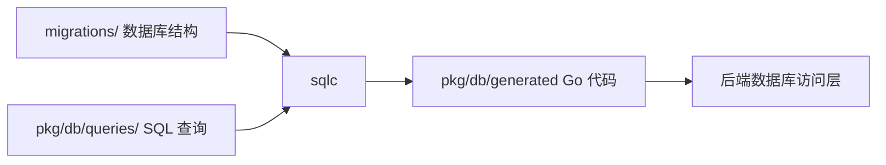

# Other — server

## 模块概览

`server` 模块是后端 Go 服务的模块根配置层，主要由两个文件组成：

- `server/go.mod`：定义 Go module 名称、Go 版本和后端运行所需依赖。
- `server/sqlc.yaml`：定义 sqlc 如何从 SQL 查询和数据库迁移生成类型安全的 Go 数据访问代码。

该模块本身不包含函数、类型或运行时逻辑，因此调用图中没有内部调用、外部调用或执行流。它的作用是为后端代码提供构建边界、依赖集合和数据库代码生成规则。

## Go 模块定义

`server/go.mod` 声明后端模块路径为：

```go
module github.com/multica-ai/multica/server
```

这意味着后端内部包通常以该 module path 为根路径导入，例如生成后的数据库包会位于：

```go
github.com/multica-ai/multica/server/pkg/db/generated
```

Go 版本配置为：

```go
go 1.26.1
```

开发者在本地构建、测试或生成代码时，应使用兼容该版本的 Go 工具链。

## 依赖结构

`go.mod` 中的依赖反映了后端服务的主要能力边界。

### HTTP、路由与跨域

后端使用 Chi 生态处理 HTTP 路由和 CORS：

```go
github.com/go-chi/chi/v5
github.com/go-chi/cors
```

这些依赖通常用于服务入口、REST API 路由注册、中间件链和跨域策略配置。

### 数据库访问

PostgreSQL 访问使用 `pgx/v5`：

```go
github.com/jackc/pgx/v5
```

`server/sqlc.yaml` 也明确配置：

```yaml
sql_package: "pgx/v5"
```

因此 sqlc 生成的数据库访问代码会使用 `pgx/v5` 类型，而不是标准库 `database/sql`。

### SQL 代码生成

sqlc 配置位于 `server/sqlc.yaml`，它不会出现在 `go.mod` 依赖中，但生成目标是 Go 代码：

```yaml
queries: "pkg/db/queries/"
schema: "migrations/"
out: "pkg/db/generated"
package: "db"
```

这表示：

- SQL 查询文件放在 `pkg/db/queries/`
- 数据库 schema 来源是 `migrations/`
- 生成代码输出到 `pkg/db/generated`
- 生成包名为 `db`

开发者修改 SQL 查询或迁移后，需要重新运行 sqlc 生成代码，确保 Go 类型、参数结构和返回结构与 SQL 保持一致。

### WebSocket

实时通信能力由 Gorilla WebSocket 提供：

```go
github.com/gorilla/websocket
```

该依赖通常用于服务端 WebSocket 升级、连接读写和事件推送。

### Redis 与测试替身

Redis 客户端和 mock 依赖分别是：

```go
github.com/redis/go-redis/v9
github.com/go-redis/redismock/v9
```

生产代码应使用 `go-redis/v9`；单元测试中可以用 `redismock/v9` 验证 Redis 调用行为。

### 认证与标识符

认证和 ID 相关依赖包括：

```go
github.com/golang-jwt/jwt/v5
github.com/google/uuid
github.com/oklog/ulid/v2
```

其中 `jwt/v5` 用于 JWT 解析、签名和验证；`uuid` 与 `ulid` 用于生成或处理不同格式的唯一标识符。

### 外部服务集成

后端包含多个外部服务 SDK：

```go
github.com/aws/aws-sdk-go-v2/service/s3
github.com/aws/aws-sdk-go-v2/service/secretsmanager
github.com/openai/openai-go/v3
github.com/resend/resend-go/v2
github.com/slack-go/slack
```

这些依赖分别覆盖对象存储、密钥管理、OpenAI API、邮件发送和 Slack 集成。

### 可观测性与运维

可观测性和运行时支持依赖包括：

```go
github.com/prometheus/client_golang
github.com/lmittmann/tint
gopkg.in/natefinch/lumberjack.v2
github.com/robfig/cron/v3
```

常见用途包括 Prometheus 指标暴露、结构化日志输出、日志滚动和定时任务调度。

### CLI 与配置解析

命令行和配置文件相关依赖包括：

```go
github.com/spf13/cobra
github.com/spf13/pflag
github.com/pelletier/go-toml/v2
gopkg.in/yaml.v3
```

`cobra` 和 `pflag` 适合构建服务端管理命令或启动命令；`toml` 与 `yaml` 用于读取结构化配置。

## sqlc 生成配置

`server/sqlc.yaml` 使用 sqlc v2 配置格式：

```yaml
version: "2"
```

当前只配置了一个 PostgreSQL 生成目标：

```yaml
sql:
  - engine: "postgresql"
```

生成流程可以理解为：



生成选项如下：

```yaml
emit_json_tags: true
emit_empty_slices: true
```

这两个选项会影响生成结构体的行为：

- `emit_json_tags: true`：为生成的 Go struct 字段添加 JSON tag，便于 API 响应或序列化复用。
- `emit_empty_slices: true`：查询返回空集合时生成空切片，而不是 `nil` 切片，减少调用方处理 JSON 输出时的分支。

## 与代码库其他部分的关系

`server` 是 monorepo 中后端服务的 Go module 边界。前端、桌面端和共享 TypeScript 包不直接受 `go.mod` 控制；它们由 pnpm workspace 和 Turborepo 管理。

后端数据库访问链路由 `sqlc.yaml` 连接：

1. 开发者在 `migrations/` 中维护 PostgreSQL schema。
2. 开发者在 `pkg/db/queries/` 中维护 SQL 查询。
3. sqlc 根据 schema 和 queries 生成 `pkg/db/generated`。
4. 后端业务代码导入生成包，获得类型安全的查询方法、参数结构和结果结构。

因此，修改数据库字段、表结构或 SQL 查询时，应同时关注迁移文件、查询文件和生成代码是否一致。

## 维护建议

新增后端依赖时，应优先确认依赖属于 `server` 后端运行时，而不是前端或共享 TypeScript 包。后端依赖应添加到 `server/go.mod`，并通过 Go 工具链维护 `go.sum`。

修改数据库查询时，应避免手写与生成代码重复的数据访问封装。优先让 sqlc 从 SQL 文件生成强类型方法，再在业务层组合这些方法。

修改 `sqlc.yaml` 的输出目录、包名或 SQL package 会影响所有导入 `pkg/db/generated` 的后端代码。此类变更属于较高影响范围，应配合全量类型检查和后端测试一起完成。