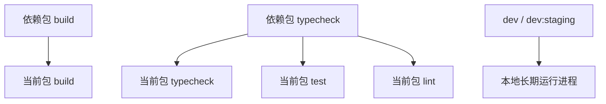

# Other — turbo.json

## 模块概览

`turbo.json` 是 monorepo 的 Turborepo 任务编排配置。它不包含业务代码，也没有函数调用关系或运行时执行流；它的作用是定义 `pnpm`/Turbo 任务之间的依赖、缓存行为、持久进程，以及哪些环境变量会影响全局缓存哈希。

这个文件主要服务于仓库中的前端工作区，例如 `apps/web/`、`apps/desktop/`、`packages/core/`、`packages/ui/`、`packages/views/` 等包的构建、类型检查、测试和开发命令。

## 全局环境变量

`globalEnv` 声明了一组会影响 Turbo 全局哈希的环境变量：

```json
"globalEnv": [
  "DATABASE_URL",
  "PORT",
  "FRONTEND_PORT",
  "FRONTEND_ORIGIN",
  "NEXT_PUBLIC_API_URL",
  "NEXT_PUBLIC_WS_URL",
  "MULTICA_SERVER_URL",
  "DOCS_URL",
  "COMPOSE_PROJECT_NAME",
  "POSTGRES_DB",
  "POSTGRES_PORT",
  "DESKTOP_RENDERER_PORT",
  "DESKTOP_APP_SUFFIX"
]
```

这些变量的值发生变化时，Turbo 会把相关任务视为处于不同环境中，从而避免复用不匹配的缓存结果。

变量大致分为几类：

- 后端和数据库：`DATABASE_URL`、`PORT`、`POSTGRES_DB`、`POSTGRES_PORT`
- Web 前端：`FRONTEND_PORT`、`FRONTEND_ORIGIN`、`NEXT_PUBLIC_API_URL`、`NEXT_PUBLIC_WS_URL`
- 桌面端：`DESKTOP_RENDERER_PORT`、`DESKTOP_APP_SUFFIX`
- 集成和部署环境：`MULTICA_SERVER_URL`、`DOCS_URL`、`COMPOSE_PROJECT_NAME`

其中 `NEXT_PUBLIC_API_URL` 和 `NEXT_PUBLIC_WS_URL` 会进入 Next.js 客户端构建产物，因此必须参与缓存哈希。否则不同 API 或 WebSocket 地址可能错误复用同一份 `.next` 输出。

## 任务定义

### `build`

```json
"build": {
  "dependsOn": ["^build"],
  "inputs": ["src/**", "app/**", "**/*.ts", "**/*.tsx", "**/*.css"],
  "outputs": [".next/**", "!.next/cache/**", "dist/**", "out/**"]
}
```

`build` 是可缓存任务，用于构建各工作区包和应用。

`dependsOn: ["^build"]` 表示当前包执行 `build` 前，必须先执行其依赖包的 `build`。例如应用包依赖 `packages/ui` 或 `packages/core` 时，Turbo 会先构建依赖包，再构建应用本身。

`inputs` 限定参与任务哈希的源码文件范围：

- `src/**`
- `app/**`
- `**/*.ts`
- `**/*.tsx`
- `**/*.css`

这覆盖了常见的 TypeScript、React、Next.js App Router 和样式源码变更。

`outputs` 声明构建产物：

- `.next/**`：Next.js 构建输出
- `!.next/cache/**`：排除 Next.js 内部缓存目录，避免缓存体积膨胀或缓存不稳定
- `dist/**`：库包或 Electron 相关构建输出
- `out/**`：静态导出输出

### `dev`

```json
"dev": {
  "cache": false,
  "persistent": true
}
```

`dev` 用于本地开发进程。它关闭缓存，并标记为持久任务。

`cache: false` 表示开发服务器不会被缓存。`persistent: true` 表示该任务会长期运行，例如 Next.js dev server、Electron renderer dev server 或监听式构建进程。

### `dev:staging`

```json
"dev:staging": {
  "cache": false,
  "persistent": true
}
```

`dev:staging` 和 `dev` 行为一致，但通常用于连接 staging 配置或 staging 后端的开发场景。

它同样不缓存，并作为长期运行任务处理。

### `typecheck`

```json
"typecheck": {
  "dependsOn": ["^typecheck"]
}
```

`typecheck` 定义类型检查顺序。当前包执行类型检查前，会先执行依赖包的 `typecheck`。

这对 monorepo 很重要：如果 `packages/core` 的类型错误会影响 `packages/views` 或 `apps/web`，Turbo 会优先暴露依赖层的问题。

### `test`

```json
"test": {
  "dependsOn": ["^typecheck"]
}
```

`test` 在当前包运行测试前，会先确保依赖包完成 `typecheck`。

注意这里依赖的是上游包的 `typecheck`，不是上游包的 `test`。这意味着测试任务更关注依赖包的类型契约是否有效，而不会强制执行整个依赖链的测试套件。

### `lint`

```json
"lint": {
  "dependsOn": ["^typecheck"]
}
```

`lint` 与 `test` 类似，执行前先检查依赖包的类型。

这样可以避免在依赖包类型已经损坏时继续运行下游 lint，减少噪声错误。

## 任务关系



## 与代码库的连接方式

`turbo.json` 通常不会被业务代码直接引用。它通过包管理和脚本命令间接参与开发流程：

- `pnpm typecheck` 会触发各工作区的 `typecheck` 任务，并遵守 `dependsOn`
- `pnpm test` 会触发各工作区的 `test` 任务，并先检查依赖包类型
- `pnpm lint` 会触发各工作区的 `lint` 任务
- `make dev` 或工作区内的开发脚本会使用 `dev` / `dev:staging` 这类持久任务
- `pnpm build` 或发布流程会使用 `build` 的依赖排序和缓存输出

这个配置是前端 monorepo 的任务图入口之一。具体每个包执行什么命令，仍由各自的 `package.json` 脚本定义；`turbo.json` 只定义跨包调度规则、缓存边界和环境敏感性。

## 修改注意事项

修改 `globalEnv` 时，需要确认变量是否会影响构建产物或任务行为。会改变客户端 bundle、API 地址、端口、数据库连接或部署环境的变量，应保留在这里。

修改 `build.inputs` 时，需要注意缓存失效范围。如果新增源码类型或配置文件会影响构建结果，应把对应路径纳入输入范围。

修改 `build.outputs` 时，应只包含稳定的构建产物。像 `.next/cache/**` 这类内部缓存目录已经被显式排除，通常不应重新加入。

修改任务依赖时，需要考虑 monorepo 包边界。`^build` 和 `^typecheck` 表示依赖包优先执行，是保证共享包先于应用验证的关键规则。