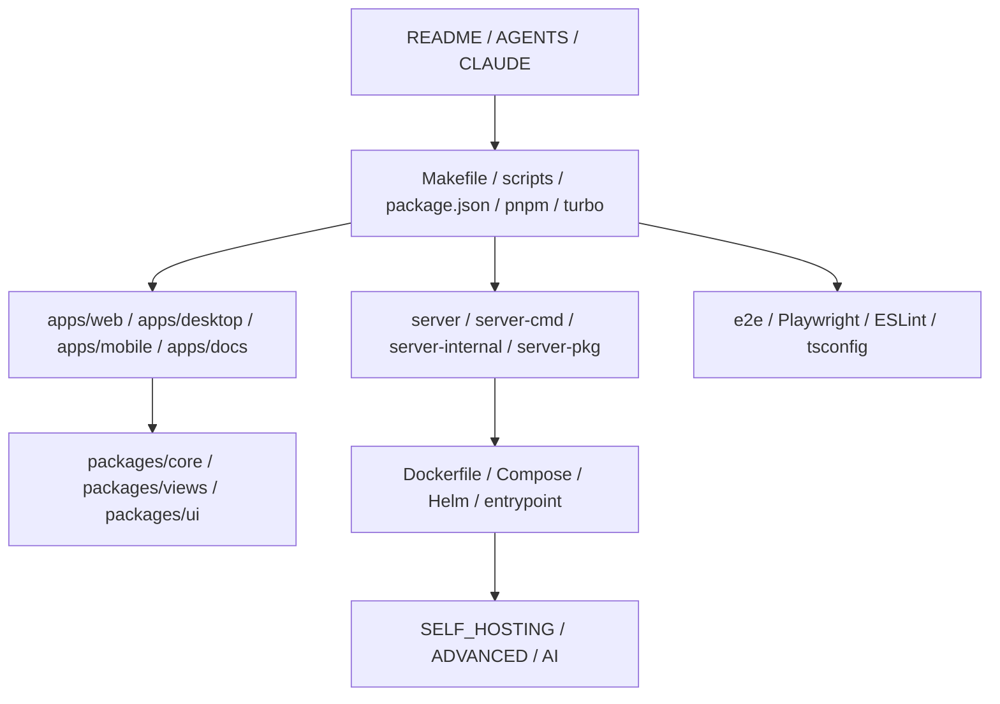

# Other

## Other 模块组概览

Other 模块组汇总了 Multica 仓库的“非单一业务域”资产：仓库入口文档、开发规范、构建与部署配置、测试与脚本入口、前端 workspace 基础设施，以及 Web、Desktop、Mobile、Docs、Server 等顶层模块说明。它们共同定义了项目如何被理解、安装、开发、测试、打包和自托管。

这些子模块大致分为四层：

## 协作与规范入口

仓库级协作规则由 [AGENTS.md](agents-md.md) 和 [CLAUDE.md](claude-md.md) 共同承担。[AGENTS.md](agents-md.md) 是代理进入仓库时的快速入口，强调先读取 `CLAUDE.md`、遵守包边界，并在修改符号前使用 GitNexus 做影响分析。[CLAUDE.md](claude-md.md) 则是更权威的开发约束来源，定义 `server/`、`apps/*`、`packages/*` 的职责分工，以及 React Query、Zustand、平台隔离、API 兼容性等硬规则。

公开入口由 [README.md](readme-md.md) 和 [README.zh-CN.md](readme-zh-cn-md.md) 承担，面向新用户解释 Multica、Agent、Runtime、Workspace、自托管和开发入口。更细的工程决策、设计规范、分析事件和运维 runbook 分布在 [docs](docs.md)、[docs-ideation](docs-ideation.md) 与 [docs-plans](docs-plans.md)。

## 本地开发与验证链路

本地开发通常从 [Makefile](makefile.md) 开始：`make dev`、`make setup`、`make check` 等目标会调用 [scripts](scripts.md) 中的脚本，完成环境文件选择、PostgreSQL 准备、Go 迁移、后端服务、Web 前端和测试流程编排。

Node monorepo 由 [package.json](package-json.md)、[pnpm-workspace.yaml](pnpm-workspace-yaml.md) 和 [turbo.json](turbo-json.md) 串联。`package.json` 提供根级脚本和工具依赖，`pnpm-workspace.yaml` 定义 `apps/*` 与 `packages/*` 工作区范围，`turbo.json` 定义构建、测试、类型检查和持久开发进程的缓存关系。

验证层由 [playwright.config.ts](playwright-config-ts.md) 和 [e2e](e2e.md) 支撑。Playwright 配置统一测试目录、浏览器项目和前端地址，`e2e/` 则通过真实后端 API 建立登录态、工作区和问题数据，只在外部服务边界使用 mock。

## 应用层与共享包关系

前端产品并不是每个应用各自实现业务逻辑，而是通过共享包分层复用：

- [apps-web](apps-web.md) 是 Next.js Web 外壳，负责路由、认证跳转、Provider、SEO、Cookie、URL 与通知桥接。
- [apps-desktop](apps-desktop.md) 是 Electron 桌面端外壳，补充窗口、菜单、更新、本地 CLI 和 daemon 管理。
- [apps-mobile](apps-mobile.md) 是 Expo / React Native iOS 客户端，在移动端独立实现路由、缓存、实时订阅和本地状态。
- [apps-docs](apps-docs.md) 是独立文档站，使用 Next.js App Router 与 Fumadocs 渲染多语言 MDX。

共享业务层由 [packages-core](packages-core.md)、[packages-views](packages-views.md) 和 [packages-ui](packages-ui.md) 组成。`packages/core` 提供 API、类型、React Query、状态和纯业务逻辑；`packages/views` 组合业务页面，如 `AgentsPage`、`IssueDetail`、`ProjectsPage`；`packages/ui` 提供无业务依赖的 UI 原语、设计 token 和通用组件。类型检查与 lint 基础由 [packages-tsconfig](packages-tsconfig.md) 和 [packages-eslint-config](packages-eslint-config.md) 统一。

## 服务端、CLI 与 Agent 执行链路

后端边界从 [server](server.md) 开始：`go.mod` 和 `sqlc.yaml` 定义 Go module、依赖和数据库代码生成规则。[server-cmd](server-cmd.md) 提供多个可执行入口，包括 `server`、`multica`、`migrate` 和用量回填工具。[server-internal](server-internal.md) 承载服务端内部支撑能力，例如 agent template、analytics event、认证辅助、CLI client、cloud runtime client 和任务归因。[server-pkg](server-pkg.md) 中的 `server/pkg/agent` 则统一封装 Codex、Claude 等不同 Agent CLI 的执行接口。

CLI 与 daemon 的用户可见行为由 [CLI_AND_DAEMON.md](cli-and-daemon-md.md) 和 [CLI_INSTALL.md](cli-install-md.md) 说明：`multica` CLI 负责登录、配置、workspace、issue、project、autopilot 与 daemon 管理；daemon 发现本机 agent CLI、注册 runtime、领取任务，在隔离目录中执行 agent，并把流式消息、用量和结果回传服务端。

## 构建、自托管与部署

容器构建由 [Dockerfile](dockerfile.md) 和 [Dockerfile.web](dockerfile-web.md) 分别覆盖后端与 Web 前端。后端镜像构建 `server`、`multica`、`migrate` 和回填工具，启动时通过 [docker](docker.md) 中的 `entrypoint.sh` 先执行 `./migrate up`，再 `exec ./server`。Web 镜像使用 pnpm workspace 与 Next.js standalone runtime。

本地开发数据库由 [docker-compose.yml](docker-compose-yml.md) 提供。完整自托管由 [docker-compose.selfhost.yml](docker-compose-selfhost-yml.md) 编排 PostgreSQL、backend 和 frontend；[docker-compose.selfhost.build.yml](docker-compose-selfhost-build-yml.md) 则把官方镜像替换为从当前源码构建的开发镜像。

部署文档分三层：[SELF_HOSTING.md](self-hosting-md.md) 是自托管入口，[SELF_HOSTING_AI.md](self-hosting-ai-md.md) 面向 AI Agent 给出可执行快速流程，[SELF_HOSTING_ADVANCED.md](self-hosting-advanced-md.md) 记录生产环境变量、反向代理、对象存储、邮件、指标、升级和回填等高级配置。Kubernetes 路径由 [deploy-helm](deploy-helm.md) 提供 Helm Chart，编排后端、前端、PostgreSQL、Ingress 和监控规则。

## 维护性资产

[skills-lock.json](skills-lock-json.md) 锁定仓库依赖的外部 agent skill 来源与哈希，保证代理能力不会无意漂移。它和 [AGENTS.md](agents-md.md)、[CLAUDE.md](claude-md.md) 一起构成 AI 协作的外围约束：前者锁定能力来源，后两者约束能力如何在仓库中使用。