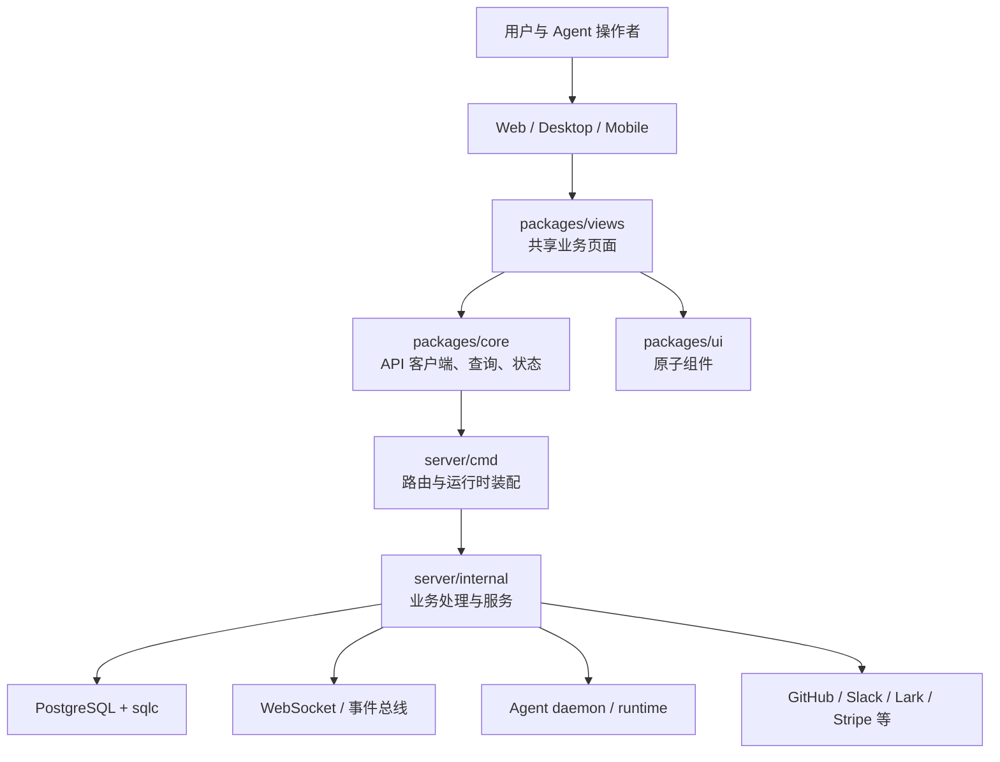

# multica — Wiki

# multica

Multica 是一个开源的托管 Agent 平台，用来把编码 Agent 变成团队里的真实协作者：可以被分配 issue、发表评论、更新状态、执行任务，并通过工作区、项目、模板、技能和外部集成参与日常研发协作。

这个仓库是一个 Go 后端加多端前端的 monorepo。Web、Desktop 和 Mobile 提供不同入口；共享业务逻辑沉在 `packages/core`，共享业务视图沉在 `packages/views`，原子 UI 组件沉在 `packages/ui`；后端由 `server` 提供 HTTP API、WebSocket 实时事件、任务调度、Agent daemon 控制面、数据访问和外部集成。



## 代码库的组织方式

Multica 的前端采用 pnpm workspaces 和 Turborepo 管理。`apps/web` 是 Next.js App Router 应用，`apps/desktop` 是 Electron 桌面端，`apps/mobile` 是 Expo / React Native iOS 应用，`apps/docs` 承载文档站点。Web 和 Desktop 大量复用 `packages/views`、`packages/core` 和 `packages/ui`，因此开发共享产品功能时通常先看 [Other](other.md) 中的前端 workspace 说明，再进入具体应用目录。

后端集中在 `server` 下，入口、路由、实时通信和后台 worker 的装配属于 [Server Runtime, Routing & Realtime](server-runtime-routing-realtime.md)。请求进入服务端后，先经过 [Authentication, Middleware & Security](authentication-middleware-security.md) 定义的认证、权限、CSRF、PAT、daemon token 和脱敏边界，再交给各业务 handler 和 service。

核心协作对象是 workspace、issue、comment、chat message 和 agent task。工作区、成员、项目、标签、通知偏好等元数据在 [Workspace, Projects & Collaboration Metadata](workspace-projects-collaboration-metadata.md) 中维护；issue 时间线、评论、聊天和任务生命周期由 [Issues, Tasks, Comments & Chat](issues-tasks-comments-chat.md) 串联；Agent 模板、daemon 注册、任务领取、取消和运行结果上报则属于 [Agents, Runtimes & Daemon Execution](agents-runtimes-daemon-execution.md)。

持久化边界由 [Data Access, Schema & Migrations](data-access-schema-migrations.md) 管理：迁移 SQL 定义 PostgreSQL schema，手写查询交给 sqlc 生成强类型 Go 访问层。跨端协议、WebSocket 事件名、失败原因和通用 UUID/时间工具集中在 [Shared Utilities & Protocols](shared-utilities-protocols.md)，避免字符串契约分散在 handler、daemon 和前端之间。

## 关键端到端流程

一个典型的人类协作流程从 Web 或 Desktop 的共享页面开始。页面在 `packages/views` 中渲染业务界面，通过 `packages/core` 的 API client、React Query hooks 和 Zustand stores 读取或更新状态，再请求 Go API。服务端 handler 完成认证、参数解析和数据库写入后，会发布实时事件，让其他浏览器窗口、桌面端和相关工作区成员看到最新 issue、评论或通知。

Agent 执行流程从 issue、chat 或 autopilot 规则触发。`Issues, Tasks, Comments & Chat` 创建 `agent_task_queue` 记录并通知 daemon；[Agents, Runtimes & Daemon Execution](agents-runtimes-daemon-execution.md) 负责 daemon 心跳、任务领取、运行时选择和执行结果上报；具体 Claude Code、Codex、Hermes、OpenCode、Copilot、Cursor 等 CLI 由统一 runtime adapter 包装。任务启动、取消和失败原因会同时进入数据库、实时事件和观测链路。

自动化流程由 [Autopilot, Webhooks & Scheduling](autopilot-webhooks-scheduling.md) 负责。外部 webhook、定时 trigger 或手动 API 请求会被标准化为可审计的 run，再根据规则创建或更新 issue/task。这个流程会复用任务服务、实时事件、权限模型和观测能力，因此它不是孤立的定时器，而是 Multica 协作系统的一部分。

外部平台接入集中在 [External Integrations](external-integrations.md)。GitHub、Slack、Lark/飞书、Composio、Stripe 和云计费等集成负责把外部身份、事件、消息和付费状态映射到 Multica 的 workspace、member、issue 和 runtime 语义上。底层协议 client 留在 `server/pkg`，产品语义留在 `server/internal`。

文件上传、附件下载、文本预览和对象存储适配由 [Storage, Files & Attachments](storage-files-attachments.md) 处理。观测、指标、分析事件、日志上下文和功能开关由 [Observability, Analytics & Feature Flags](observability-analytics-feature-flags.md) 统一承接，主服务启动时也会从配置加载 feature flag 规则并形成运行期决策。

## 本地开发入口

首次启动通常使用：

```bash
make dev
```

这个命令会自动完成本地设置并启动主要服务。只开发前端 Web 时可以运行：

```bash
pnpm dev:web
```

桌面端入口是：

```bash
pnpm dev:desktop
```

移动端入口是：

```bash
pnpm dev:mobile
```

常用检查命令包括：

```bash
pnpm typecheck
pnpm test
pnpm lint
pnpm build
make test
make check
```

如果修改数据库 schema 或查询，需要关注 `server/migrations`、`server/pkg/db/queries` 和 sqlc 生成代码；如果修改共享页面或状态逻辑，需要遵守 `packages/views -> packages/core + packages/ui` 的依赖方向。`packages/core` 不应该依赖 DOM、`localStorage` 或环境变量，`packages/ui` 不应该依赖业务包，`packages/views` 不应该直接依赖 Next.js 或 React Router。

## 新开发者应该先看哪里

理解产品主链路时，建议先读 [Workspace, Projects & Collaboration Metadata](workspace-projects-collaboration-metadata.md)、[Issues, Tasks, Comments & Chat](issues-tasks-comments-chat.md) 和 [Agents, Runtimes & Daemon Execution](agents-runtimes-daemon-execution.md)。这三块解释了 Multica 如何把团队协作对象和 Agent 执行对象连接起来。

理解服务端运行方式时，从 [Server Runtime, Routing & Realtime](server-runtime-routing-realtime.md)、[Authentication, Middleware & Security](authentication-middleware-security.md) 和 [Data Access, Schema & Migrations](data-access-schema-migrations.md) 开始。理解前端共享方式时，从 [Other](other.md) 中的 `apps/*`、`packages/core`、`packages/views`、`packages/ui` 说明开始。

理解自动化、集成和可运维能力时，再进入 [Autopilot, Webhooks & Scheduling](autopilot-webhooks-scheduling.md)、[External Integrations](external-integrations.md)、[Skills, Templates & Agent Knowledge](skills-templates-agent-knowledge.md)、[Storage, Files & Attachments](storage-files-attachments.md) 和 [Observability, Analytics & Feature Flags](observability-analytics-feature-flags.md)。CLI、迁移和维护命令的实现见 [CLI & Maintenance Tools](cli-maintenance-tools.md)。