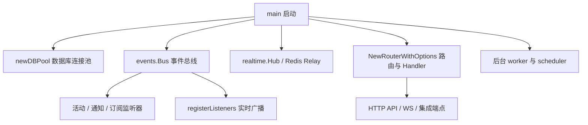
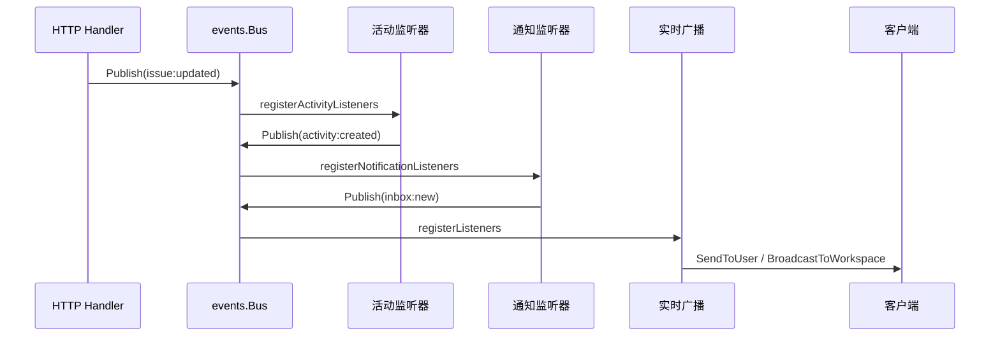

# Server Runtime, Routing & Realtime — cmd

## 模块概览

`server/cmd/server` 是后端进程的运行时装配层：它不承载核心业务规则，而是负责把数据库、HTTP 路由、事件总线、实时广播、后台 worker、健康检查、指标、第三方集成和关闭流程组装成一个可运行的 API server。

核心入口是 `main()`，核心路由构造函数是 `NewRouterWithOptions()`。事件相关代码通过 `events.Bus` 串联业务事件、活动日志、通知、autopilot 同步和 WebSocket 广播。



## 启动流程

`main()` 按固定顺序完成运行时初始化：

1. `logger.Init()` 初始化结构化日志。
2. 读取关键环境变量并打印配置告警，例如 `JWT_SECRET`、邮件后端、`MULTICA_DEV_VERIFICATION_CODE`。
3. 通过 `featureflag.NewServiceFromEnv()` 加载特性开关，支持 YAML 规则和 `FF_<KEY>` 环境变量覆盖。
4. 使用 `newDBPool()` 创建主 `pgxpool.Pool`，随后 `Ping()` 验证连接，并通过 `logPoolConfig()` 打印实际连接池配置。
5. 创建 `events.Bus`、`realtime.Hub`、`daemonws.Hub`。
6. 如果存在 `REDIS_URL`，构造 Redis-backed realtime relay；否则使用单节点内存 hub。
7. 调用 `registerListeners()` 将事件总线接到实时广播层。
8. 创建 `db.Queries`，注册订阅、活动日志、通知监听器。
9. 初始化 metrics、heartbeat scheduler、HTTP router、task/autopilot 服务和后台 worker。
10. 启动 HTTP server、metrics server、runtime sweeper、autopilot failure monitor、DB stats logger、webhook worker、channel supervisor 和 DB-backed scheduler。
11. 接收 `SIGINT` / `SIGTERM` 后按顺序优雅关闭。

关闭顺序是重要约束：先停止 autopilot failure monitor，再 drain HTTP server，之后停止 sweeper 并调用 `heartbeatScheduler.Stop()` 刷新最后一批 heartbeat。这样可以避免请求仍在写入 heartbeat 队列时后台批处理已经退出。

## 数据库连接池

`dbstats.go` 负责数据库连接池配置和运行时观测。

`newDBPool(ctx, dbURL)` 使用 `pgxpool.ParseConfig()` 解析连接串，然后按以下优先级设置连接池大小：

1. `DATABASE_MAX_CONNS` / `DATABASE_MIN_CONNS`
2. `DATABASE_URL` 上的 `pool_max_conns` / `pool_min_conns`
3. 代码默认值 `defaultMaxConns = 25`、`defaultMinConns = 5`

它刻意不回退到 pgx 默认值 `max(4, NumCPU)`，因为该默认值曾导致 daemon claim/heartbeat 流量下连接池耗尽。

`runDBStatsLogger(ctx, pool)` 每 15 秒采样 `pool.Stat()`。当 `EmptyAcquireCount` 或 `CanceledAcquireCount` 增长时记录 `db pool pressure` warn 日志，否则记录 baseline `db pool stats`。这让连接池等待、取消和平均 acquire 延迟能在生产日志中直接观察。

`newSamplerDBPool(ctx, dbURL)` 创建一个独立的 metrics 采样连接池，`MaxConns` 固定为 `samplerMaxConns = 2`。业务 metrics scrape 不会占用主连接池，避免 `/metrics` 在数据库卡顿时反向影响业务请求。

## HTTP 路由装配

`NewRouter()` 是兼容包装，内部调用 `NewRouterWithOptions()` 并丢弃返回的 `*handler.Handler`。

`NewRouterWithOptions(pool, hub, bus, analyticsClient, rdb, opts)` 是实际的 router factory。它创建 `db.Queries`、邮件服务、存储层、CloudFront signer、CORS 配置和 `handler.Config`，然后调用 `handler.New(...)` 构造主 `Handler`。

`RouterOptions` 用于从 `main()` 注入运行时依赖：

- `HTTPMetrics`：HTTP middleware 指标。
- `BusinessMetrics`：业务指标记录器。
- `DaemonHub`：daemon WebSocket hub。
- `DaemonWakeup`：任务唤醒通知器，可由 Redis relay 包装。
- `FeatureFlags`：服务端特性开关。
- `HeartbeatScheduler`：main 注入 `handler.NewBatchedHeartbeatScheduler()`，测试默认使用同步行为。

当 `rdb != nil` 时，`NewRouterWithOptions()` 会把多个 request-path store 切换到 Redis 实现，包括 `UpdateStore`、`ModelListStore`、`LocalSkillListStore`、`LivenessStore` 和 webhook rate limiter。这里的 Redis client 是普通请求路径 client，不应复用 realtime relay 的阻塞读取 client。

路由层还负责装配集成运行时，包括 channel engine、Lark/Feishu、Slack、Composio、storage、cloud runtime recorder 等。具体业务逻辑仍在 `internal/handler`、`internal/service`、`internal/integrations/*` 中，`cmd/server` 只做依赖注入和生命周期绑定。

## 实时广播与事件总线

`registerListeners(bus, b)` 将 `events.Bus` 事件转发给 `realtime.Broadcaster`。这里依赖接口 `realtime.Broadcaster`，而不是具体的 `*realtime.Hub`，因此 main 可以在单节点内存 hub、Redis relay、dual-write broadcaster 之间切换。

事件分两类处理：

- 个人事件：`inbox:new`、`inbox:read`、`invitation:created` 等只通过 `SendToUser()` 发给目标用户。
- 工作区事件：其他带 `WorkspaceID` 的事件通过 `BroadcastToWorkspace()` 广播到工作区房间。
- daemon 事件：没有 workspace 但类型以 `daemon:` 开头时通过 `Broadcast()` 全局广播。

`registerListeners()` 会为每条成功发送的事件调用 `realtime.M.RecordEvent(e.Type)`。当前 task/chat 的 per-resource scope routing 尚未启用，相关事件仍走 workspace fanout；`Event.TaskID` / `Event.ChatSessionID` 只是为后续切换保留。

Redis relay 在 `main()` 中按 `REALTIME_RELAY_MODE` 选择：

- `sharded`：默认模式，使用 `realtime.NewShardedStreamRelay()`。
- `dual`：同时写 sharded relay 和 legacy relay，用于迁移。
- `legacy`：使用旧 `realtime.NewRedisRelayWithClients()`。

`newNamedRedisClient()` 为不同用途设置 Redis client name，例如 `store`、`realtime-write`、`realtime-read`，可通过 `REDIS_DISABLE_CLIENT_NAME=true` 禁用。

## 活动日志监听器

`registerActivityListeners(bus, queries)` 监听 issue 和 task 事件，并写入 `activity_log`。

处理的事件包括：

- `protocol.EventIssueCreated`：创建 `created` 活动。
- `protocol.EventIssueUpdated`：根据 payload 中的变更 flag 分别创建活动，例如 `status_changed`、`priority_changed`、`assignee_changed`、`start_date_changed`、`due_date_changed`、`title_changed`、`description_updated`。
- `protocol.EventTaskCompleted`：通过 `handleTaskActivity()` 创建 `task_completed` 活动。
- `protocol.EventTaskFailed`：通过 `handleTaskActivity()` 创建 `task_failed` 活动。

每次成功写入后，`publishActivityEvent(bus, original, activity)` 会发布 `protocol.EventActivityCreated`。该 payload 匹配前端 timeline 期望的结构：

```go
map[string]any{
    "issue_id": "...",
    "entry": map[string]any{
        "type": "activity",
        "id": "...",
        "actor_type": "...",
        "actor_id": "...",
        "action": "...",
        "details": json.RawMessage(...),
        "created_at": "...",
    },
}
```

`handleTaskActivity()` 会先通过 `queries.GetIssue()` 查 issue，以获得 `WorkspaceID`，然后以 `ActorType = "agent"` 和 `ActorID = agent_id` 写入活动。

## 通知监听器

`notification_listeners.go` 负责把业务事件转成 inbox rows，并发布个人实时事件。入口是 `registerNotificationListeners(bus, queries)`。

主要辅助函数：

- `parseMentions(content)`：委托 `util.ParseMentions()` 解析 markdown mention。
- `loadUserPrefs(ctx, queries, workspaceID, userIDs)`：批量加载用户通知偏好。
- `isNotifMuted(prefs, notifType)`：根据 `notifTypeToGroup` 判断某类通知是否被静音。
- `notifyDirect(...)`：给指定 recipient 创建 `inbox_item`。
- `notifySubscribers(...)`：通知 issue subscriber，并对特定类型向 parent issue subscriber 冒泡。
- `notifyIssueSubscribers(...)`：执行实际 subscriber 查询、偏好过滤、inbox 写入和 `inbox:new` 发布。
- `notifyMentionedMembers(...)`：处理 `@member`、`@squad`、`@all` mention。
- `archiveStaleTaskFailedInbox(...)`：当 issue 进入终态时归档陈旧 `task_failed` inbox。
- `inboxItemToResponse(item)`：把 `db.InboxItem` 转成 JSON payload map。

通知类型通过 `notifTypeToGroup` 映射到用户可配置偏好组，例如 `assignments`、`status_changes`、`comments`、`updates`、`agent_activity`。未出现在该 map 中的通知不可配置，默认发送。

`parentBubbleNotifTypes` 当前只允许 `status_changed` 从子 issue 冒泡到父 issue 订阅者。这样父 issue 观察者只收到关键状态信号，而不会被评论、优先级等细碎更新打扰。

`comment:created` 有一个重要例外：当 `author_type == "system"` 时直接跳过通知和 mention 解析。系统评论仍会通过普通 WS 广播出现在 timeline，但不会生成 inbox，避免受控系统消息中嵌入的文本被误当成人类 mention。

## Autopilot 事件同步

`registerAutopilotListeners(bus, svc)` 保持 autopilot run 与 issue/task 状态同步。

监听规则：

- `issue:updated`：当 `status_changed == true` 且 issue 状态进入 `done`、`in_review`、`cancelled`、`blocked` 时，先用 `svc.Queries.GetIssue()` 加载完整 issue，再调用 `svc.SyncRunFromIssue(ctx, dbIssue)`。
- `task:completed`、`task:failed`、`task:cancelled`：调用 `syncRunFromTaskEvent()`。
- `syncRunFromTaskEvent()` 会通过 `task_id` 加载 task。若 `task.AutopilotRunID.Valid`，调用 `svc.SyncRunFromTask(ctx, task)`；若是 `task:failed` 且没有 run id，则调用 `svc.SyncRunFromLinkedIssueTask(ctx, task)`。

这里的 listener 只负责根据事件找到需要同步的实体，run 状态转换逻辑在 `internal/service.AutopilotService` 中。

## Autopilot 失败率监控

`autopilot_failure_monitor.go` 是后台防护 worker，用于自动暂停近期失败率过高的 autopilot，避免定时任务持续消耗资源。

配置结构是 `failureMonitorConfig`：

- `Interval`：扫描间隔，默认 `24h`；小于等于 0 时禁用。
- `Lookback`：统计窗口，默认 `7 * 24h`。
- `MinRuns`：最少运行次数，默认 `50`。
- `FailRatio`：失败比例阈值，默认 `0.9`。
- `StartupDelay`：启动延迟，默认 `1m`。

`envFailureMonitorConfig()` 从以下环境变量覆盖默认值：

- `AUTOPILOT_FAIL_MONITOR_INTERVAL`
- `AUTOPILOT_FAIL_MONITOR_LOOKBACK`
- `AUTOPILOT_FAIL_MONITOR_STARTUP_DELAY`
- `AUTOPILOT_FAIL_MONITOR_MIN_RUNS`
- `AUTOPILOT_FAIL_MONITOR_FAIL_RATIO`

`runAutopilotFailureMonitor(ctx, queries, bus, cfg)` 在 startup delay 后立即执行一次 `tickAutopilotFailureMonitor()`，随后按 `cfg.Interval` 周期执行。

单次扫描流程：

1. 调用 `queries.SelectAutopilotsExceedingFailureThreshold()` 查询候选 autopilot。
2. 对每个候选调用 `queries.SystemPauseAutopilot()`。
3. 如果返回 `pgx.ErrNoRows`，通过 `isNoRows()` 视为已被其他流程暂停的良性 no-op。
4. 成功暂停后调用 `service.RecordAutopilotRuleVersion(...)` 记录系统发布版本，失败只打 warn，不中断扫描。
5. 调用 `emitAutopilotPausedNotifications(...)` 创建 inbox 通知。
6. 发布 `protocol.EventAutopilotUpdated`，payload 由 `autopilotEventPayload()` 构造，原因是 `auto_paused_high_failure_rate`。

`resolveAutopilotPausedRecipients()` 决定通知接收人：如果 autopilot 由 member 创建，通知该 member；如果由 agent 创建，则加载 agent owner，再映射到 workspace member。

## 健康检查

`health.go` 定义 `serverHealth`，用于 live/readiness endpoint。

`newServerHealth(pool)` 读取 `migrations.AllVersions()`，把当前 binary 要求的 migration version 列表存入 `requiredMigrations`。

`liveHandler()` 总是返回：

```json
{"status":"ok"}
```

`readyHandler()` 调用 `readiness(ctx)`，并返回 `readinessResponse`：

```json
{
  "status": "ok",
  "checks": {
    "db": "ok",
    "migrations": "ok"
  }
}
```

`readiness()` 有 3 秒缓存，由 `atomic.Pointer[cachedReadiness]` 和 `refreshMu` 控制，避免高频 readiness probe 对数据库造成额外压力。

`computeReadiness()` 做三项检查：

1. `db != nil`
2. `db.Ping()` 在 2 秒 timeout 内成功
3. `schema_migrations` 中已应用的 required migration 数量等于 `len(requiredMigrations)`

它使用 `readinessQuery = SELECT COUNT(*) FROM schema_migrations WHERE version = ANY($1)`，而不是只检查最新版本，因此能发现缺失的 out-of-order migration。

`writeJSON()` 会先 `json.Marshal()` 到 buffer，再设置准确的 `Content-Length`，最后写入 response，避免直接 streaming 导致 chunked encoding。

## Realtime metrics 健康端点

`realtimeMetricsHandler(token)` 返回 `/health/realtime` 的 handler，用于暴露 realtime 和 daemonws 的运行时计数：

```go
snapshot := realtime.M.Snapshot()
snapshot["daemonws"] = daemonws.M.Snapshot()
```

访问控制分两种模式：

- 配置了 token：必须使用 `Authorization: Bearer <token>`，由 `hasBearerToken()` 做常量时间比较。
- 未配置 token：只允许没有 forwarding header 的直接 loopback 请求，否则返回 404。

`isDirectLoopbackRequest()` 会拒绝带有 `X-Forwarded-For`、`X-Forwarded-Host`、`X-Forwarded-Proto`、`X-Real-Ip`、`Forwarded` 的请求。这里不信任代理头识别真实客户端，只把这些头作为“请求经过代理，必须 fail closed”的信号。

## 后台 worker 与 scheduler

`main()` 启动多个长生命周期 worker：

- `runRuntimeSweeper(...)`：扫描并标记 stale runtime offline，使用与 handler heartbeat 写路径一致的 `LivenessStore`。
- `heartbeatScheduler.Run(sweepCtx)`：批量刷新 daemon heartbeat。
- `runAutopilotFailureMonitor(...)`：自动暂停高失败率 autopilot。
- `runDBStatsLogger(...)`：周期记录连接池压力。
- `h.WebhookDeliveryWorker.Run(...)`：异步 webhook delivery。
- `h.ChannelSupervisor.Run(...)`：维护 channel installation 的 inbound lease 和连接生命周期。
- `schedulerMgr.Run(...)`：DB-backed periodic scheduler。

`schedulerMgr` 注册了至少两个 job：

- `scheduler.TaskUsageHourlyJob(pool)`：小时级 task usage rollup。
- `scheduler.AutopilotScheduleDispatchJob(pool, queries, autopilotSvc)`：scheduled autopilot dispatch。

这些 job 使用 `sys_cron_executions` 提供分布式 lease、审计、重试和崩溃恢复。

## 事件链路示例

一次 issue 状态更新通常会经过以下链路：



`events.Bus` 是同步分发，因此 listener 注册顺序会影响同一事件中的副作用顺序。`main()` 明确要求 `registerSubscriberListeners()` 在 `registerNotificationListeners()` 前注册，因为通知 listener 会读取 subscriber 表，需要先保证订阅关系已写入。

## 与代码库其他层的边界

`cmd/server` 的职责是运行时 glue code：

- 数据访问通过 `db.Queries`，具体 SQL 由 `server/pkg/db/generated` 提供。
- 业务规则在 `internal/service` 和 `internal/handler`。
- HTTP middleware、auth、rate limit、workspace 权限等在 `internal/middleware` 和 handler 层。
- WebSocket hub、relay、metrics 在 `internal/realtime`。
- daemon 连接在 `internal/daemonws`。
- channel/Lark/Slack 具体协议在 `internal/integrations/*`。
- feature flag 解析在 `pkg/featureflag`。

新增功能时应尽量把业务判断放到 service/handler/integration 包中，让 `cmd/server` 只负责创建依赖、注册 listener、启动/停止 worker。这样可以保持启动层可读，也让测试能够通过 `NewRouterWithOptions()` 或具体 listener 函数直接覆盖行为。