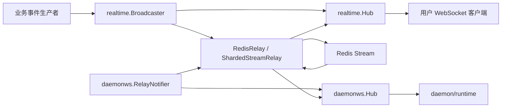

# Server Runtime, Routing & Realtime — internal

## 模块概览

该模块负责服务端内部的实时通信能力，主要由两条 WebSocket 通道和一层 Redis 中继组成：

- `server/internal/realtime`：面向浏览器、桌面端等用户客户端的实时 WebSocket Hub。
- `server/internal/daemonws`：面向 daemon/runtime 进程的内部 WebSocket Hub，用于心跳、任务唤醒、运行时配置刷新和 WS RPC。
- Redis relay：在多 API 节点部署时，把本节点事件发布到 Redis Stream，再由其他节点消费并本地投递。

整体设计是“本地 Hub 负责连接和房间，Relay 负责跨节点传播”。业务代码依赖 `realtime.Broadcaster` 或 `daemonws.RelayNotifier`，避免直接耦合具体 Hub 实现。



## 用户实时通道：`internal/realtime`

`realtime.Hub` 管理普通客户端 WebSocket 连接，并按 scope 维护订阅房间。它实现 `Broadcaster` 接口，因此业务事件生产者可以通过统一接口广播消息，而不需要知道当前是单节点、本地双写还是 Redis 中继模式。

核心 scope 定义在 `broadcaster.go`：

```go
const (
	ScopeWorkspace     = "workspace"
	ScopeUser          = "user"
	ScopeTask          = "task"
	ScopeChat          = "chat"
	ScopeDaemonRuntime = "daemon_runtime"
)
```

`ScopeWorkspace` 和 `ScopeUser` 是连接建立后自动订阅的身份 scope。`ScopeTask` 和 `ScopeChat` 是更细粒度的资源 scope，需要通过 `ScopeAuthorizer` 授权。`ScopeDaemonRuntime` 不是给浏览器客户端使用的，它是 daemon 唤醒事件在 Redis relay 中的传输 scope。

## `realtime.Hub` 的连接生命周期

`HandleWebSocket` 是用户 WebSocket 的 HTTP 入口。它要求 URL 中提供 `workspace_id`，或通过 `workspace_slug` 加 `SlugResolver` 解析出工作区 ID。

认证路径有两种：

- Cookie 认证：读取 `auth.AuthCookieName`，通过 `authenticateToken` 校验 JWT 或 PAT。
- 首帧认证：升级 WebSocket 后，`firstMessageAuth` 要求第一帧是 `{"type":"auth","payload":{"token":"..."}}`。

认证后会调用 `MembershipChecker.IsMember` 校验用户是否属于目标 workspace。校验通过后创建 `Client`，写入 `hub.register`，并启动：

- `client.writePump()`：从 `send` channel 写 WebSocket 消息，并定期发送 ping。
- `client.readPump()`：读取客户端帧，处理订阅、取消订阅和 ping。

`Hub.Run` 是中心事件循环，处理注册、注销和全局广播。注册时会自动订阅：

```go
h.subscribe(client, ScopeWorkspace, client.workspaceID)
h.subscribe(client, ScopeUser, client.userID)
```

断开时，`removeClient` 会从所有 scope room 删除该客户端，关闭 `client.send`，更新连接指标，并在某个 room 从 1 个订阅者变为 0 个订阅者时触发 `onLastSubscriber` 回调。

## 来源校验和代理处理

用户 WebSocket 使用包级 `upgrader`，其 `CheckOrigin` 指向 `checkOrigin`。逻辑分三层：

1. 没有 `Origin` 时允许，支持非浏览器客户端。
2. `Origin` host 等于请求 `Host` 时允许，等价于 same-origin。
3. 如果请求来自可信代理，允许 `Origin` host 匹配 `X-Forwarded-Host` 的第一个 host。
4. 否则检查 `ALLOWED_ORIGINS`、`CORS_ALLOWED_ORIGINS` 或 `FRONTEND_ORIGIN` 解析出的白名单。

可信代理来自 `MULTICA_TRUSTED_PROXIES`，由 `loadTrustedProxies` 解析 CIDR。启动时也可以通过 `SetTrustedProxies` 覆盖，使 WebSocket 与 server router 使用同一套代理信任配置。

## 客户端订阅协议

`Client.handleFrame` 识别三类入站帧：

- `subscribe`
- `unsubscribe`
- `ping`

订阅 payload 使用：

```go
type subPayload struct {
	Scope string `json:"scope"`
	ID    string `json:"id"`
}
```

`handleSubscribe` 的规则：

- `workspace`：只能订阅当前连接的 `workspaceID`。
- `user`：只能订阅当前连接的 `userID`。
- `task` / `chat`：如果配置了 `hub.authorizer`，调用 `AuthorizeScope(context.Background(), userID, workspaceID, scope, id)`。
- 其他 scope：返回 `subscribe_error`，错误为 `unknown_scope`。

成功订阅会返回：

```json
{
  "type": "subscribe_ack",
  "payload": {
    "scope": "task",
    "id": "..."
  }
}
```

取消订阅始终返回 `unsubscribe_ack`，即使本来没有订阅该 scope。

## 本地广播和慢客户端驱逐

`realtime.Hub` 的主要投递方法：

- `BroadcastToScope(scopeType, scopeID, message)`
- `BroadcastToWorkspace(workspaceID, message)`
- `SendToUser(userID, message, excludeWorkspace...)`
- `Broadcast(message)`

实际投递走 `BroadcastToScopeDedup`、`fanoutUser` 或 `fanoutAllDedup`。这些方法都采用非阻塞写入：

```go
select {
case client.send <- message:
	sent++
default:
	slow = append(slow, client)
}
```

如果客户端 `send` channel 满了，会被加入 slow 列表，随后由 `evictSlow` 删除连接、关闭发送 channel，并更新：

- `MessagesDroppedTotal`
- `SlowEvictionsTotal`
- `DisconnectsTotal`
- `ActiveConnections`

这个策略保证广播路径不会被单个慢客户端阻塞。

## 事件去重

用户通道和 daemon 通道都有类似的去重逻辑：

- 用户客户端：`Client.markSeen(eventID string)`
- daemon 客户端：`client.markSeen(eventID string)`

每个连接保存最多 128 个最近的 `eventID`。空 `eventID` 表示不启用去重。该机制用于 Redis loopback 和双写路径：本地快速投递先标记事件，Redis 消费回放同一事件时会被跳过。

## Redis relay

`internal/realtime` 提供三种 Redis 相关实现：

- `RedisRelay`
- `ShardedStreamRelay`
- `MirroredRelay`

它们都实现或组合实现 `Broadcaster` 与 `RelayPublisher`。

### `RedisRelay`

`RedisRelay` 使用“每个 scope 一个 Redis Stream”的模型。发布时调用 `publish` 或 `PublishWithID`，写入：

```go
StreamKey(scopeType, scopeID)
// 形如：ws:scope:{scopeType}:{scopeID}:stream
```

消息被包装成 `envelope`：

```go
type envelope struct {
	EventID     string `json:"event_id"`
	EventType   string `json:"event_type"`
	Scope       string `json:"scope"`
	ScopeID     string `json:"scope_id"`
	WorkspaceID string `json:"workspace_id"`
	ActorID     string `json:"actor_id"`
	CreatedAt   string `json:"created_at"`
	NodeID      string `json:"node_id"`
	PayloadJSON string `json:"payload_json"`
}
```

`Start` 会：

- 写入 `M.NodeID`
- ping 写 Redis 和读 Redis
- 给 `Hub` 注册 `SetSubscriptionCallbacks`
- 为已有本地 scope 启动 consumer
- 启动 `heartbeatLoop`
- 启动 `consumerSweeper`

当本地某个 scope 从 0 个订阅者变为 1 个订阅者时，`startConsumer` 启动对应 stream 的 `XREADGROUP` 循环。当 room 清空时，`stopConsumer` 停掉该 consumer。

`deliverEnvelope` 根据 `envelope.Scope` 决定投递路径：

- `ScopeDaemonRuntime`：调用 `DaemonRuntimeDeliverer.DeliverDaemonRuntime`
- `"global"`：调用 `hub.fanoutAllDedup`
- `ScopeUser`：调用 `hub.fanoutUser`
- 其他 scope：调用 `hub.BroadcastToScopeDedup`

### `ShardedStreamRelay`

`ShardedStreamRelay` 使用固定数量的 Redis Stream 分片，避免“活跃 scope 数量越多，阻塞读连接越多”的问题。默认配置由 `DefaultShardedStreamRelayConfig` 提供：

- `Shards`: 8
- `StreamMaxLen`: 100000
- `ReadCount`: 128
- `ReadBlock`: 5 秒
- `ReplayGrace`: 5 分钟

发布时通过 `shardFor(scopeType, scopeID)` 使用 FNV hash 选择分片：

```go
ShardedStreamKey(shard)
// 形如：ws:relay:shard:{shard}
```

每个 API 节点启动后为每个 shard 启动一个 `readShard` 循环。读取后仍然通过 `deliverEnvelope` 做本地过滤和投递。启动读取位置由 `replayStartID` 决定，会从 `now - ReplayGrace` 开始回放，保证节点短暂下线期间发布的事件有机会被重新消费。

### `DualWriteBroadcaster`

`DualWriteBroadcaster` 用于本地快速投递加 Redis 跨节点投递。每次广播生成同一个 ULID：

```go
id := ulid.Make().String()
frame := injectEventID(message, id)
```

然后：

1. 本地调用 `BroadcastToScopeDedup` / `fanoutUser` / `fanoutAllDedup`，立即投递给本节点客户端。
2. 调用 `relay.PublishWithID` 写 Redis。
3. Redis loopback 回到本节点时，由 `markSeen` 去重。

这条路径降低本节点客户端延迟，同时保留跨节点广播能力。

### `MirroredRelay`

`MirroredRelay` 是迁移或灰度用的包装器。它持有 `primary` 和 `mirror` 两个 `ManagedRelay`，启动时两个都读，发布时除 `ScopeDaemonRuntime` 外同时写两个后端，并用相同 `eventID` 去重。

它会记录：

- `RedisMirrorPrimaryErrors`
- `RedisMirrorSecondaryErrors`
- `RedisMirrorDivergenceTotal`

`ScopeDaemonRuntime` 只写 primary，避免 daemon 唤醒事件在镜像链路中重复扩散。

## Daemon WebSocket 通道：`internal/daemonws`

`daemonws.Hub` 管理 daemon/runtime 连接。它不是浏览器通道，不使用 cookie 认证；连接身份由 HTTP handler 在升级前完成认证后，以 `ClientIdentity` 传入：

```go
type ClientIdentity struct {
	DaemonID       string
	UserID         string
	WorkspaceID    string
	WorkspaceIDs   []string
	RuntimeIDs     []string
	ClientVersion  string
	Capabilities   string
}
```

`AuthorizedWorkspaceIDs` 会优先使用 `WorkspaceIDs`，并去重、去空；如果为空，则回退到旧的单 workspace 字段 `WorkspaceID`。`AllowsWorkspace` 在没有 workspace scope 时保持 permissive，这是为了兼容旧单元测试中直接构造 `ClientIdentity` 的场景。

`HandleWebSocket` 要求连接至少具备 runtime scope 或 user identity：

```go
if len(identity.RuntimeIDs) == 0 && identity.UserID == "" {
	http.Error(w, `{"error":"runtime_ids or user identity required"}`, http.StatusBadRequest)
	return
}
```

连接建立后会按三种索引注册：

- `byRuntime[runtimeID]`
- `byWorkspace[workspaceID]`
- `byUser[userID]`

这使 daemon 事件可以按 runtime、workspace 或 user 精准投递。

## Daemon 入站帧

`client.readPump` 读取 daemon 入站消息，并交给 `handleFrame`。入站消息使用 `protocol.Message`。当前识别：

- `protocol.EventDaemonHeartbeat`
- `protocol.EventDaemonRPCRequest`

未知类型被静默忽略，用于向前兼容。`MessageKindRecorder` 可通过 `SetMessageKindRecorder` 注入，用于按 kind 统计入站帧数量。kind 是去掉 `"daemon:"` 前缀后的类型名，例如 `"heartbeat"`。

### 心跳：`handleHeartbeatFrame`

daemon 心跳 payload 是 `protocol.DaemonHeartbeatRequestPayload`。处理流程：

1. 解析 payload。
2. 校验 `payload.RuntimeID` 非空。
3. 校验 runtime 是否在连接认证时绑定的 `c.runtimes` 内。
4. 调用 `HeartbeatHandler`。
5. 将返回的 `protocol.DaemonHeartbeatAckPayload` 包装为 `protocol.EventDaemonHeartbeatAck` 发回。

心跳 handler 的 context 使用 `context.Background()`，没有套 `WithTimeout`。原因是 handler 会触达 `LocalSkillListStore.PopPending` / `LocalSkillImportStore.PopPending` 一类 Redis Lua claim 操作，这类操作有副作用，不能在客户端取消时安全回滚。连接断开时依靠 daemon 的 HTTP heartbeat fallback 保证恢复。

### WS RPC：`handleRPCFrame`

`daemon:rpc_request` 用于 daemon 通过 WebSocket 调用服务端逻辑，例如 `tasks.claim`。入口是 `handleRPCFrame`，handler 类型为：

```go
type RPCHandler func(
	ctx context.Context,
	identity ClientIdentity,
	method string,
	body json.RawMessage,
) (status int, respBody json.RawMessage, err error)
```

关键行为：

- 必须有 `request_id`，否则忽略。
- 没有注册 RPC handler 时返回 `503`，daemon 回退 HTTP。
- 每个连接最多并发 `maxInFlightRPCPerClient = 8` 个 RPC。
- 超过并发上限返回 `429`，daemon 回退 HTTP。
- 如果请求携带 `TimeoutMs`，服务端 handler 会使用 `context.WithTimeout(c.ctx, TimeoutMs)`。
- 响应通过 `sendRPCResponse` 包装为 `protocol.EventDaemonRPCResponse`，并回显 `request_id`。

发送使用 `trySend`，该方法在 `sendMu` 下检查 `sendClosed`，避免连接 teardown 后异步 RPC goroutine 写入已关闭 channel。

## Daemon 出站事件

daemon 通道的出站事件主要是 wakeup hint，不承担最终正确性。daemon 仍然通过 HTTP claim 等路径保证语义正确。

`Hub` 提供三个公开通知方法：

- `NotifyTaskAvailable(runtimeID, taskID)`
- `NotifyRuntimeProfilesChanged(workspaceID, profileID)`
- `NotifyWorkspacesChanged(userID)`

它们分别构造：

- `taskAvailableFrame`
- `runtimeProfilesChangedFrame`
- `workspacesChangedFrame`

实际投递走内部方法：

- `notifyFrame(runtimeID, data, eventID)`
- `notifyWorkspaceFrame(workspaceID, data, eventID)`
- `notifyUserFrame(userID, data, eventID)`

这些方法都会非阻塞写入 daemon 客户端 `send` channel；如果 channel 满，则注销连接并关闭 socket，计入 `SlowEvictionsTotal`。

## `RelayNotifier`

`daemonws.RelayNotifier` 把 daemon wakeup 同时投递到本地 Hub 和 Redis relay：

```go
type RelayNotifier struct {
	local *Hub
	relay realtime.RelayPublisher
}
```

每次通知都会生成 ULID 作为 `eventID`：

- 先调用本地 `Hub.notify...`，让当前节点的 daemon 立即收到。
- 再调用 `relay.PublishWithID(realtime.ScopeDaemonRuntime, shardKey, "", frame, eventID)` 发布到 Redis。
- 其他 API 节点消费后，通过 `DeliverDaemonRuntime(scopeID, frame, eventID)` 做本地投递。

`DeliverDaemonRuntime` 会先解析 `protocol.Message.Type`，再决定 `scopeID` 的语义：

- `EventDaemonTaskAvailable`：从 payload 读取 `RuntimeID`，投递到 `byRuntime`。
- `EventDaemonRuntimeProfilesChanged`：从 payload 读取 `WorkspaceID`，投递到 `byWorkspace`。
- `EventDaemonWorkspacesChanged`：把 relay 的 `scopeID` 当作 `userID`，投递到 `byUser`。

## 路由和启动集成

从调用关系看，server 启动层负责组装这些组件：

- `cmd/server/main.go` 创建 `realtime.NewHub()`。
- `cmd/server/main.go` 创建 `daemonws.NewHub()`。
- `cmd/server/main.go` 根据配置创建 `NewRedisRelayWithClients`、`NewShardedStreamRelay`、`NewMirroredRelay` 或 `NewDualWriteBroadcaster`。
- `cmd/server/main.go` 调用 relay 的 `Start`、`Stop`、`Wait` 管理生命周期。
- `cmd/server/main.go` 调用 `SetDaemonRuntimeDeliverer`，让 Redis relay 可以把 `ScopeDaemonRuntime` 事件送回 `daemonws.Hub`。
- `cmd/server/main.go` 创建 `daemonws.NewRelayNotifier()`，供 daemon 相关业务事件发布唤醒。
- `cmd/server/listeners.go` 通过 `Broadcaster` 调用 `BroadcastToWorkspace`、`SendToUser`、`Broadcast`。

HTTP routing 层把 WebSocket endpoint 接到对应 handler：

- 用户 WS endpoint 最终调用 `realtime.HandleWebSocket(...)`。
- daemon WS endpoint 在认证后构造 `daemonws.ClientIdentity`，再调用 `daemonws.Hub.HandleWebSocket(...)`。

## 指标

两个包各自维护一个包级指标单例 `M`。

`internal/realtime.Metrics` 覆盖用户实时通道和 Redis relay：

- 连接：`ConnectsTotal`、`DisconnectsTotal`、`ActiveConnections`
- 投递：`MessagesSentTotal`、`MessagesDroppedTotal`、`SlowEvictionsTotal`
- 事件类型：`RecordEvent`
- 订阅：`SubscribesTotal`、`UnsubscribesTotal`、`SubscribeDeniedTotal`
- room gauge：`IncRoom`、`DecRoom`
- Redis：`RedisXAddTotal`、`RedisXReadTotal`、`RedisAckTotal`、`RedisConnected`、`RedisLastError` 等

`internal/daemonws.Metrics` 覆盖 daemon WebSocket：

- 连接：`ConnectsTotal`、`DisconnectsTotal`、`ActiveConnections`
- 慢连接：`SlowEvictionsTotal`
- wakeup：`WakeupPublishedTotal`、`WakeupPublishErrors`、`WakeupReceivedTotal`、`WakeupDeliveredHit`、`WakeupDeliveredMiss`

两者都提供 `Snapshot()` 返回 JSON-friendly map，也都提供 `Reset()` 供测试重置状态。

## 修改和扩展建议

新增用户端事件时，优先依赖 `realtime.Broadcaster`，根据目标受众选择 scope：

- workspace 内所有连接：`BroadcastToWorkspace`
- 某个用户所有连接：`SendToUser`
- 高频资源事件：`BroadcastToScope(ScopeTask, taskID, frame)` 或 `BroadcastToScope(ScopeChat, chatID, frame)`

新增可订阅资源 scope 时，需要同步修改：

- scope 常量
- `Client.handleSubscribe`
- `ScopeAuthorizer.AuthorizeScope` 的实现
- 相关 metrics 维度和测试

新增 daemon 消息时，需要确认方向：

- daemon → server：扩展 `client.handleFrame`，并增加 handler。
- server → daemon：增加 frame 构造函数，并在 `DeliverDaemonRuntime` 中定义 relay 后的投递 scope 语义。

涉及 Redis relay 的改动要保持 `eventID` 贯穿本地投递和 Redis 投递，否则 `markSeen` 无法正确去重。对于可能同时走本地和 Redis 的路径，应使用 `PublishWithID`，不要生成两个不同事件 ID。