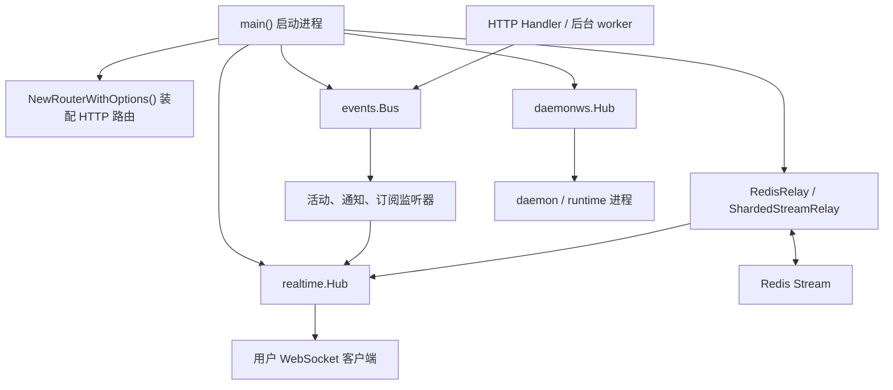

# Server Runtime, Routing & Realtime

## 模块概览

**Server Runtime, Routing & Realtime** 是后端 API server 的运行时装配与实时通信层。它把进程启动、HTTP 路由、健康检查、事件总线、用户 WebSocket、daemon WebSocket、Redis 跨节点中继和后台 worker 串成一个可运行的服务端实例。

子模块分工清晰：

- [cmd](cmd.md)：进程入口与 HTTP API 装配层，核心是 `main()`、`NewRouterWithOptions()`、健康检查和事件监听注册。
- [internal](internal.md)：实时通信基础设施，核心是 `realtime.Hub`、`RedisRelay` / `ShardedStreamRelay`、`daemonws.Hub` 和 `RelayNotifier`。

## 协作方式

`cmd` 负责“把系统跑起来”：`main()` 初始化日志、环境配置、数据库连接池、特性开关、事件总线、实时 Hub、Redis relay、后台任务和关闭流程；`NewRouterWithOptions()` 则把业务 Handler、WebSocket 端点、健康检查与集成端点挂到 HTTP router 上。

`internal` 负责“把消息送到该去的连接”：`realtime.Hub` 管理用户连接、订阅和本地 fanout；Redis relay 在多节点部署时把本节点事件发布到 Redis Stream，再由其他节点消费并投递到各自的本地 Hub；`daemonws.Hub` 则服务内部 daemon/runtime 连接，承载心跳、任务唤醒、运行时配置刷新和 WS RPC。

两者之间通过接口隔离：业务层通常依赖 `realtime.Broadcaster` 或 `daemonws.RelayNotifier`，而不是直接操作具体 Hub。这样 `cmd` 可以在启动时决定是否启用 Redis relay、使用哪个中继实现，以及如何把它们接入事件监听器。

## 跨模块关键流程

**启动与路由装配**：`main()` 创建数据库、`events.Bus`、`realtime.Hub`、Redis relay 和 daemon 通知器，然后调用 `NewRouterWithOptions()` 暴露 HTTP API、用户 WebSocket、daemon WebSocket、健康检查和集成端点。

**业务事件到用户实时更新**：业务 Handler 或后台 worker 发布事件到 `events.Bus`；`cmd` 中注册的活动、通知、订阅监听器处理事件并调用 `realtime.Broadcaster`；`internal/realtime` 根据用户、房间或订阅关系把消息投递到 WebSocket 客户端。多节点场景下，`RedisRelay` 或 `ShardedStreamRelay` 负责跨节点传播。

**daemon/runtime 协调**：服务端通过 `daemonws.RelayNotifier` 触发 `NotifyTaskAvailable()`、`NotifyRuntimeProfilesChanged()` 等内部通知；`daemonws.Hub` 将这些帧发送给对应 daemon 连接，并通过心跳维护运行时状态。

**健康与运行状态**：`cmd/server/health.go` 中的 readiness 流程聚合数据库、缓存或运行时依赖状态；实时层维护 Redis relay、连接和投递相关指标，使服务可以区分 HTTP 可用性、实时通道状态与跨节点中继状态。

## 阅读路径

先看 [cmd](cmd.md) 理解 server 如何启动、路由如何挂载、事件监听器如何注册；再看 [internal](internal.md) 理解用户 WebSocket、daemon WebSocket 和 Redis relay 的连接模型。两部分合起来就是后端从“接收请求”到“发布事件”再到“实时投递”的完整运行链路。