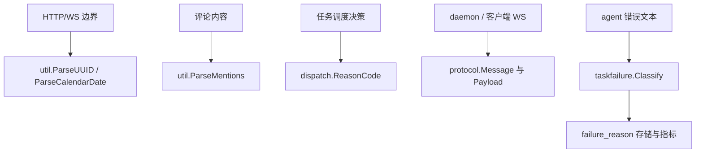

# Shared Utilities & Protocols

## 共享工具与协议模块

本模块为后端提供跨层复用的基础契约，覆盖四类能力：

- `server/internal/util`：UUID、`pgtype`、日期、mention 解析、文本转义、进程控制等后端内部工具。
- `server/internal/dispatch`：执行准入与跳过原因的稳定枚举 `ReasonCode`。
- `server/pkg/protocol`：服务器、Web 客户端、桌面端与 daemon 之间的 WebSocket 事件名、能力协商常量和消息 payload。
- `server/pkg/taskfailure`：写入 `agent_task_queue.failure_reason` 与 `chat_message.failure_reason` 的任务失败原因体系与字符串分类器。

这些包的共同目标是把“跨层会漂移的字符串契约”集中到稳定位置：UUID 转换、事件名、失败原因、调度原因都应该引用常量或工具函数，而不是在 handler、service、daemon 或前端协议层手写字符串。



## `server/internal/util`

`util` 是后端内部的叶子工具包，用于处理边界输入和数据库类型转换。它不承载业务决策，但很多关键路径依赖它保持数据形状一致。

### UUID 与 `pgtype` 转换

`ParseUUID(s string) (pgtype.UUID, error)` 是请求边界的安全 UUID 入口。它使用 `pgtype.UUID.Scan` 解析字符串，并且在无效输入时返回错误，而不是返回零值 UUID。注释中特别强调这是为了避免“坏 UUID 导致写查询匹配不到行，但接口仍返回成功”的数据丢失类问题。

典型使用模式：

```go
id, err := util.ParseUUID(rawID)
if err != nil {
	// 请求边界应返回 4xx，而不是继续写库
	return
}
```

`MustParseUUID(s string) pgtype.UUID` 只适合可信输入，例如 sqlc 往返值、测试 fixture 或已经校验过的 UUID。它内部调用 `ParseUUID`，解析失败会 `panic`。

`UUIDToString(u pgtype.UUID) string` 将有效 UUID 编码为标准 36 字符串；无效值返回空字符串。`UUIDToPtr(u pgtype.UUID) *string` 在有效时返回字符串指针，无效时返回 `nil`，内部复用 `UUIDToString`。

这些函数在多条执行流里承担协议输出与指标上下文转换，例如 `StartTask → UUIDToString`、`CreateAgent → UUIDToString`、`ReportTaskUsage → UUIDToString` 和 `PreviewIssueTrigger → UUIDToString`。因此不要在调用点临时拼接 UUID 字节或手写格式化逻辑。

### 可空文本、整数与时间

`TextToPtr`、`PtrToText`、`StrToText` 在 `pgtype.Text` 与 Go 字符串之间转换：

- `TextToPtr(t pgtype.Text)`：无效值返回 `nil`。
- `PtrToText(s *string)`：`nil` 返回无效 `pgtype.Text`。
- `StrToText(s string)`：空字符串返回无效 `pgtype.Text`，非空字符串标记为有效。

`TimestampToString` 和 `TimestampToPtr` 使用 `time.RFC3339` 输出 `pgtype.Timestamptz`。调用者包括 autopilot 失败监控 payload 构造逻辑。

`Int8ToPtr`、`Int4ToPtr`、`PtrToInt4` 负责 `pgtype.Int8` / `pgtype.Int4` 与 Go 指针值之间的可空转换。

### 日期语义

`DateToPtr(d pgtype.Date) *string` 将 `pgtype.Date` 格式化为 `YYYY-MM-DD`。这用于 issue 的 `start_date` / `due_date` 这类“日历日”字段，不能通过带时区的 instant 渲染。

`ParseCalendarDate(s string) (pgtype.Date, error)` 接受两种输入：

- 首选 `YYYY-MM-DD`。
- 兼容 RFC3339，但只接受严格落在 UTC 零点的时间，例如 `2026-03-01T00:00:00Z`。

非 UTC 零点的 timestamp 会被拒绝，因为它可能是旧客户端把本地零点当 UTC 发送后的结果，真实日历日已经不可恢复。新增客户端应始终发送 `YYYY-MM-DD`。

### mention 解析

`MentionRe` 匹配 markdown 里的 mention 链接：

```text
[@Label](mention://member/id)
[@Label](mention://agent/id)
[@Label](mention://squad/id)
[MUL-123](mention://issue/id)
[@all](mention://all/all)
```

`ParseMentions(content string) []Mention` 返回去重后的 `Mention` 列表，去重 key 是 `type:id`。`Mention` 包含：

- `Type`：`member`、`agent`、`squad`、`issue` 或 `all`
- `ID`：对应实体 id，或 `all`

`Mention.IsMentionAll()` 判断单个 mention 是否是 `@all`，`HasMentionAll(mentions []Mention)` 判断列表中是否包含 `@all`。评论处理路径 `computeCommentAgentTriggers` 同时调用 `ParseMentions` 和 `HasMentionAll` 来计算 agent 触发目标。

正则里的 label 使用非贪婪 `.+?`，而不是简单的 `[^]]*`，因此能正确处理 `David[TF]` 这类包含方括号的显示名。

### 文本反转义

`UnescapeBackslashEscapes(s string) string` 只解码四种常见反斜杠序列：

- `\n`
- `\r`
- `\t`
- `\\`

其他序列会原样保留，例如 `\d`、`\w`、`\u`、`\"`。这样 CLI 和 daemon task completion 可以修复 LLM 或 shell 传入的字面量换行，同时避免破坏正则、printf 格式串或用户明确想保留的内容。

### Windows 隐藏控制台

`EnsureHiddenConsole()` 在非 Windows 平台是 no-op；在 Windows 上会确保 daemon 拥有一个隐藏 console。它必须在 daemon 启动且任何子进程创建之前调用，调用点是 `runDaemonForeground`。这样后续 `git`、`cmd` 等子进程继承隐藏 console，避免弹出可见控制台窗口。

## `server/internal/dispatch`

`dispatch.ReasonCode` 是执行准入、跳过、合并与排队结果的跨层枚举。它的设计重点是：结果原因必须在做出分支决策的位置产生，并原样传递到响应，而不是从人类可读错误字符串反推。

成功路径代码包括：

- `ReasonQueued`
- `ReasonCoalesced`
- `ReasonDeferred`

拒绝或未触发路径包括：

- `ReasonInvocationNotAllowed`
- `ReasonTargetUnavailable`
- `ReasonRuntimeOffline`
- `ReasonAttributionBlocked`
- `ReasonAlreadyActive`
- `ReasonSelfTriggerSuppressed`
- `ReasonInternalError`

`ReasonInvocationNotAllowed` 故意保持泛化，不区分“目标是私有的”和“目标不存在”，避免通过枚举结果泄露私有 agent 的存在、名称或所有者。新增调度原因时应保持这种 wire 稳定性与枚举安全性。

## `server/pkg/protocol`

`protocol` 包定义 WebSocket 消息协议。`Message` 是统一信封：

```go
type Message struct {
	Type    string          `json:"type"`
	Payload json.RawMessage `json:"payload"`
}
```

`Type` 必须使用 `events.go` 中的事件常量，`Payload` 使用 `messages.go` 中对应结构体序列化。

### 事件命名

事件名按领域分组，例如：

- issue：`EventIssueCreated`、`EventIssueUpdated`、`EventIssueDeleted`
- comment/reaction：`EventCommentCreated`、`EventReactionAdded`
- agent：`EventAgentStatus`、`EventAgentCreated`
- task：`EventTaskQueued`、`EventTaskRunning`、`EventTaskCompleted`
- chat：`EventChatMessage`、`EventChatDone`、`EventChatCancelFinalized`
- daemon：`EventDaemonHeartbeat`、`EventDaemonRegister`、`EventDaemonRPCRequest`
- integration：GitHub、Lark、Slack 安装生命周期事件

任务事件的粒度面向用户可见变化，而不是每个内部状态翻转。前端按 `task:` 前缀订阅并失效 workspace task snapshot，因此新增任务事件时要考虑缓存失效语义。

### 能力协商

daemon 能力常量包括：

- `DaemonCapabilitySkillBundlesV1`
- `DaemonCapabilityCoalescedCommentsV1`
- `DaemonCapabilityRPCV1`

`DaemonCapabilityRPCV1` 表示 daemon 支持通过 WebSocket 控制连接承载 request/response RPC。服务端和 daemon 双方都支持时，claim 可走 WS；否则继续使用 HTTP claim endpoint。

应用端能力 `AppCapabilityChatDraftRestoreV1` 由客户端通过 `X-Client-Capabilities` 广告，表示客户端理解 `chat:cancel_finalized` 和 durable draft restore 恢复路径。没有该能力的客户端保留旧的同步 restore 行为，避免取消空 chat task 时丢失用户 prompt。

### daemon RPC

`RPCRequestPayload` 和 `RPCResponsePayload` 在 `EventDaemonRPCRequest` / `EventDaemonRPCResponse` 中使用：

- `RequestID` 用于请求响应关联。
- `Method` 选择服务端 handler，例如 `"tasks.claim"`。
- `Body` 是方法级 JSON。
- `TimeoutMs` 给服务端 handler 设置执行预算，防止 daemon 已超时并回退 HTTP 后，WS RPC 仍晚提交。

`RPCResponsePayload.Status` 复用 HTTP status 语义，使 daemon 可以统一处理 WS 与 HTTP 结果。成功时使用 `Body`，失败时使用 `Error`。

### daemon heartbeat

`DaemonHeartbeatRequestPayload` 与 HTTP heartbeat body 保持语义一致，包含 `RuntimeID` 和 `SupportsBatchImport`。

`DaemonHeartbeatAckPayload` 是服务端 ack，包含：

- `ServerCapabilities`
- `RuntimeGone`
- `PendingUpdate`
- `PendingModelList`
- `PendingLocalSkills`
- `PendingLocalSkillImport`
- `PendingLocalSkillImports`

`HeartbeatStatusRuntimeGone` 和 `RuntimeGone=true` 表示服务端 runtime 行已经不存在，daemon 应清理本地 stale runtime 并重新注册，而不是继续用死 UUID heartbeat。

### chat payload

chat 相关 payload 支持跨设备同步和取消后的延迟收敛：

- `ChatMessagePayload`：新 chat message 广播。
- `ChatDonePayload`：agent 完成回复，携带刚持久化的 assistant message，客户端可直接写入 messages cache，避免 live timeline 到最终消息切换时闪烁。
- `ChatCancelFinalizedPayload`：取消任务的最终结果。`Outcome` 为 `ChatCancelOutcomeStopped` 时携带 `"Stopped."` assistant row；为 `ChatCancelOutcomeRestored` 时提示发起者客户端去拉 durable draft restore。恢复内容不会通过 workspace-wide broadcast 暴露。
- `ChatSessionUpdatedPayload`：会话标题、pin 状态或 archive 状态更新。`Pinned` 和 `Status` 是指针字段，未设置时接收端应保持原缓存值。
- `ChatSessionDeletedPayload`、`ChatSessionReadPayload`：用于其他设备清理会话列表或同步未读状态。

调用点包括 `maybeGenerateChatTitleAsync`、`UpdateChatSession`、`SetChatSessionPinned`、`SetChatSessionArchived` 和 `DeleteChatSession`。

## `server/pkg/taskfailure`

`taskfailure` 是任务失败原因的规范来源。它定义写入 `agent_task_queue.failure_reason` 和 `chat_message.failure_reason` 的 21 个稳定值，并提供 `Classify(rawError string) Reason` 将 agent runtime / CLI 的自由文本错误归类。

### 失败原因分组

`Reason` 是 string-backed enum。字符串会持久化到数据库，并作为 Prometheus label 暴露，因此重命名是破坏性变更。

7 个平台侧原因没有 `agent_error.` 前缀：

- `ReasonQueuedExpired`
- `ReasonRuntimeOffline`
- `ReasonRuntimeRecovery`
- `ReasonTimeout`
- `ReasonIterationLimit`
- `ReasonAgentBlocked`
- `ReasonAPIInvalidRequest`

14 个 agent 侧原因带 `agent_error.` 前缀：

- provider：`ReasonAgentProviderAuthOrAccess`、`ReasonAgentProviderQuotaLimit`、`ReasonAgentProviderCapacityOrRateLimit`、`ReasonAgentProviderServerError`、`ReasonAgentProviderNetwork`
- agent / runner：`ReasonAgentProcessFailure`、`ReasonAgentEmptyOrUnparseableOutput`、`ReasonAgentTimeout`、`ReasonAgentContextOverflow`
- config / runtime：`ReasonAgentMissingConfig`、`ReasonAgentModelNotFoundOrUnavailable`、`ReasonAgentRuntimeVersionUnsupported`、`ReasonAgentRuntimeMissingExecutable`
- fallback：`ReasonAgentUnknown`

`Reason.IsAgentError()` 通过 `agent_error.` 前缀判断来源，因此未来新增 `agent_error.*` 值会自动归入 agent 侧。`AllReasons()` 返回稳定顺序的副本，主要用于预热 Prometheus `failure_reason` label set，调用者不能依赖修改返回 slice 影响包级状态。

### 字符串分类器

`Classify(rawError string) Reason` 在 daemon 上报失败时调用，调用点包括 `reportTaskResult` 和 `handleTask`。它会 trim 输入、转小写，然后按固定顺序匹配。顺序很重要：更具体的规则先执行，避免被泛化规则吞掉。

典型规则包括：

- context overflow：`context length`、`maximum context`、同时包含 `token` 和 `limit`
- missing config：缺失环境变量、缺失 API key、未配置 provider
- auth/access：HTTP `401` / `403`、`unauthorized`、`not logged in`、`invalid api key`
- quota：HTTP `402`、余额不足、usage limit、credits、quota
- capacity/rate limit：HTTP `429` / `529`、rate limit、overloaded
- provider server error：provider 5xx、internal error、service unavailable、bad gateway
- provider network：stream disconnected、dial tcp、DNS、i/o timeout
- process failure：exit status、signal、panic、sigsegv、process exited

HTTP 状态码匹配使用带数字边界的正则，例如 `httpAuthCodeRe` 和 `providerHTTP5xxRe`，避免把 `4030`、`1401ms`、`402913 tokens` 误判成 provider 错误。

`Classify` 的规则顺序需要与 MUL-1949 的 SQL CASE 表达式保持一致。新增或调整分类时，不能只改 Go 代码；还需要同步历史回填 SQL 或迁移策略，否则新写入数据和历史数据会出现 taxonomy 漂移。