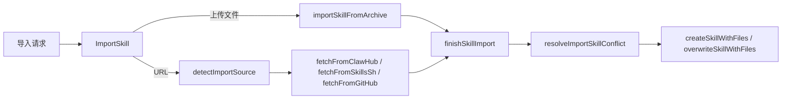
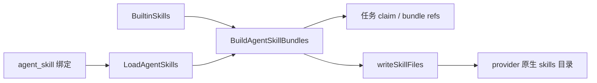

# Skills, Templates & Agent Knowledge — internal

## 模块概览

`Skills, Templates & Agent Knowledge` 模块负责把“可被代理运行时读取的知识包”从多个来源写入工作区、绑定到代理，并在任务执行时装配成运行时可消费的 skill 目录。核心实现分布在：

- `server/internal/handler/skill.go`：HTTP 处理器、导入解析、技能文件、代理技能绑定。
- `server/internal/handler/skill_create.go`：技能与 supporting files 的事务化创建和覆盖。
- `server/internal/handler/skill_import_archive.go`：`.skill` / `.zip` 上传导入。
- `server/internal/service/builtin_skills.go`：平台内置技能的编译期嵌入。
- 相关调用点：`agent_template.go` 复用导入器创建模板技能，`task.go` 装配代理技能包，`execenv/context.go` 把技能写入运行时目录。

这里的“skill”不是代理本身，而是一组 Markdown 指令和附属文本文件。主内容总是 `SKILL.md`，在数据库中存为 `skill.content`；附属文件存为 `skill_file` 行，路径相对 skill 根目录。

## 数据模型与 API 形状

HTTP 层使用几种明确的响应形状来控制 payload 大小和调用场景：

| 类型 | 用途 |
|---|---|
| `SkillResponse` | 技能详情基础形状，包含 `content`。 |
| `SkillSummaryResponse` | 技能列表形状，不包含 `content`，避免 `SKILL.md` 大文件拖慢列表接口。代理技能列表会额外填充 `Enabled`。 |
| `AgentSkillSummary` | 嵌入 `GET /api/agents`、`GET /api/agents/{id}` 的极简形状。 |
| `SkillFileResponse` | 单个 supporting file 的响应形状。 |
| `SkillWithFilesResponse` | 技能详情加 `files`，用于详情、创建、更新、导入结果。 |
| `SkillImportResult` | 带 `status`、`reason`、`skill`、`existing_skill` 的结构化导入结果。 |

`decodeSkillConfig` 会把 `skill.config` 的 JSONB 解成任意 JSON 值；缺失或解析失败时返回 `{}`，所以 API 调用方可以把 `config` 当成对象处理。

`skill.config.origin` 是导入来源的统一展示字段。URL 导入会写入 `clawhub`、`skills_sh` 或 `github`；本地运行时导入会写入 `runtime_local`；代理模板创建技能时会写入 `agent_template`，并保留上游导入器返回的 `owner`、`repo` 等字段。

## 路由入口

路由注册在 `server/cmd/server/router.go`：

```text
GET    /api/skills
POST   /api/skills
GET    /api/skills/search
POST   /api/skills/import

GET    /api/skills/{id}
PUT    /api/skills/{id}
DELETE /api/skills/{id}

GET    /api/skills/{id}/files
PUT    /api/skills/{id}/files
DELETE /api/skills/{id}/files/{fileId}

GET    /api/agents/{id}/skills
PUT    /api/agents/{id}/skills
POST   /api/agents/{id}/skills/add
PUT    /api/agents/{id}/skills/{skillId}/enabled
DELETE /api/agents/{id}/skills/{skillId}
```

技能接口都以工作区为边界。`loadSkillForUser` 通过 `resolveWorkspaceID` 和 `GetSkillInWorkspace` 加载技能，避免跨工作区访问。代理技能绑定路径先用 `loadAgentForUser` 解析代理，再检查技能是否属于同一 `agent.WorkspaceID`。

## 技能 CRUD

`ListSkills` 调用 `ListSkillSummariesByWorkspace`，只返回摘要，不返回 `content`。这是一个有意的性能边界：`SKILL.md` 经常达到几十到几百 KB，列表接口不承担传输完整正文。

`GetSkill` 通过 `loadSkillForUser` 加载技能，再调用 `ListSkillFiles` 返回 `SkillWithFilesResponse`。

`CreateSkill` 的流程是：

1. 解析 `workspace_id` 和当前用户。
2. 解码 `CreateSkillRequest`。
3. 校验 `Name` 非空。
4. 对 `Files` 调用 `validateFilePath`，拒绝空路径、绝对路径和 `..` 遍历。
5. 调用 `createSkillWithFiles` 写入技能和文件。
6. 发布 `protocol.EventSkillCreated`。
7. 返回 `201`。

`UpdateSkill` 先通过 `canManageSkill` 授权：工作区 owner/admin 可以管理任意技能，普通 member 只能管理自己创建的技能。更新在事务中完成，`Name`、`Description`、`Content`、`Config` 都是可选字段；如果请求带了 `Files`，则先 `DeleteSkillFilesBySkill`，再重建完整文件集合。`SKILL.md` 路径会被跳过，因为主内容只允许存放在 `skill.content`。

`DeleteSkill` 同样要求 `canManageSkill`。删除前会先删除技能的 label 绑定，再删除技能本身，并发布 `protocol.EventSkillDeleted`。

## 内容清洗与路径安全

`sanitizeNullBytes` 实际做了两件事：

- 删除 `\x00`，避免 PostgreSQL `TEXT` 写入时报 `SQLSTATE 22021`。
- 用 `strings.ToValidUTF8` 移除非法 UTF-8 字节，避免 Windows 编码内容导入时写库失败。

`validateFilePath` 是所有 supporting file 的基本路径门禁：

```go
func validateFilePath(p string) bool {
	if p == "" {
		return false
	}
	if filepath.IsAbs(p) {
		return false
	}
	cleaned := filepath.Clean(p)
	if strings.HasPrefix(cleaned, "..") {
		return false
	}
	return true
}
```

`skillpkg.IsReservedContentPath` 负责识别 `SKILL.md` 的规范和非规范写法，例如 `./SKILL.md`。创建、更新、单文件 upsert、运行时写文件都会把它当作保留路径处理。

## 事务化创建与覆盖

`createSkillWithFiles` 是普通创建入口，会自己开启事务。实际写入逻辑在 `createSkillWithFilesInTx`，这样代理模板创建可以把“创建代理、导入技能、绑定技能”等操作合并到一个外层事务中。

`createSkillWithFilesInTx` 的约定：

- `input.Config == nil` 时写入 `{}`。
- `Name`、`Description`、`Content`、文件路径和内容都会经过 `sanitizeNullBytes`。
- supporting files 中的 `SKILL.md` 会被跳过。
- 返回 `SkillWithFilesResponse`，其中 `Files` 只包含实际写入的 supporting files。

`overwriteSkillWithFiles` 用于同名导入冲突时的覆盖。它不是普通 update 的别名，而是更窄的本地/导入覆盖语义：

- 在事务内重新读取目标技能。
- 用 `canOverwriteSkillByLocalImport` 重新校验权限。
- 只有原始创建者可以通过导入覆盖；workspace owner/admin 如果不是创建者，必须走应用内编辑。
- `ExpectedName` 非空时必须等于当前技能名，防止过期确认框把内容写到错误技能上。
- 保留 `id`、`name`、`created_by`、`created_at` 和 `agent_skill` 绑定。
- 替换 `description`、`content`、`config` 和完整文件集合。

## 导入来源

`ImportSkill` 支持两类请求体：

- `multipart/form-data`：上传 `.skill` / `.zip`，走 `importSkillFromArchive`。
- JSON：按 URL 导入，走 `detectImportSource` 后分发到 `fetchFromClawHub`、`fetchFromSkillsSh` 或 `fetchFromGitHub`。

导入的共同尾部是 `finishSkillImport`。所有来源都会被归一化成 `importedSkill`：

```go
type importedSkill struct {
	name        string
	description string
	content     string
	files       []importedFile
	bundleSize  int
	origin      map[string]any
}
```

`finishSkillImport` 会：

1. 过滤不安全文件路径。
2. 把 `origin` 写入 `config.origin`。
3. 清洗导入名。
4. 根据 `on_conflict` 处理同名冲突。
5. 创建或覆盖技能。
6. 发布 `EventSkillCreated` 或 `EventSkillUpdated`。



## URL 导入

`detectImportSource` 支持：

- `clawhub.ai` / `www.clawhub.ai`
- `skills.sh` / `www.skills.sh`
- `github.com` / `www.github.com`
- 不含 `/` 和 `.` 的裸 slug，默认按 ClawHub 处理

### ClawHub

`fetchFromClawHub` 使用 ClawHub API：

1. `parseClawHubSlug` 从 URL 中取 slug。
2. 请求 `/skills/{slug}` 获取元数据。
3. 从 `tags["latest"]` 或 `LatestVersion.Version` 取最新版本。
4. 请求 `/skills/{slug}/versions/{version}` 获取文件列表。
5. 下载每个文件。
6. `SKILL.md` 写入 `importedSkill.content`，其他文件走 `addFile`。

`SearchSkills` 只搜索 ClawHub。`searchClawHubSkills` 请求 `/search?q=...`，并对前 `clawHubSearchStatsLimit` 个结果额外请求详情来填充安装量。

### skills.sh

`fetchFromSkillsSh` 解析 `https://skills.sh/{owner}/{repo}/{skill-name}`，再从 GitHub 拉取实际内容。它会按顺序尝试常见布局：

- `skills/{name}/SKILL.md`
- `.claude/skills/{name}/SKILL.md`
- `plugin/skills/{name}/SKILL.md`
- `{name}/SKILL.md`
- 仓库根目录 `SKILL.md`，但要求 frontmatter `name` 等于 URL 中的 skill name
- 递归扫描 GitHub tree，通过 frontmatter `name` 找匹配目录

找到主文件后，使用 `skillpkg.ParseSkillFrontmatter` 提取 `name` 和 `description`，再通过 GitHub Contents API 递归收集 supporting files，跳过 `SKILL.md` 和 license 文件。

### GitHub

`fetchFromGitHub` 支持：

```text
github.com/{owner}/{repo}
github.com/{owner}/{repo}/tree/{ref}/{path...}
github.com/{owner}/{repo}/blob/{ref}/{path.../SKILL.md}
```

`parseGitHubURL` 会解析 owner、repo、ref 和 skill 目录。GitHub URL 的 `/tree/{ref}/{path}` 在 ref 含 `/` 时有歧义，例如 `release/v2/skills/foo`。因此 `resolveGitHubRefAndPath` 会从最长前缀开始调用 `githubRefExists`，用 commits API 确认哪个前缀是真实 branch/tag/commit。

如果 GitHub API 因 `401`、`403` 或 `429` 被限制，`resolveGitHubRefAndPath` 会回退到 `parseGitHubURL` 的单段 ref 猜测。`doGitHubAPIGet` 和 `newRawFileRequest` 都支持 `GITHUB_TOKEN`，但 raw file 请求只会在 host 是 `raw.githubusercontent.com` 时附加 token，避免把 token 泄露给第三方来源。

## 导入大小限制与二进制文件

URL 和压缩包导入共享这些限制：

| 常量 | 含义 |
|---|---|
| `maxImportFileSize` | 单文件最大 `1 MiB`。 |
| `maxImportTotalSize` | supporting files 总大小最大 `8 MiB`。 |
| `maxImportFileCount` | supporting files 最多 `128` 个。 |

`fetchRawFile` 使用 `io.LimitReader(resp.Body, maxImportFileSize+1)`，超出单文件限制会返回 `errImportCapExceeded`。`importedSkill.addFile` 负责总大小和文件数限制。cap 错误会中止导入，因为静默丢文件会产生看起来成功但实际不完整的技能。

`isLikelyBinaryFilePath` 会按扩展名跳过图片、字体、压缩包、Office/PDF、媒体、可执行文件、数据库/cache 等二进制文件。跳过二进制文件不会失败，因为这些文件无法可靠存入 PostgreSQL `TEXT`，代理也不会按文本读取它们。

## 压缩包导入

`importSkillFromArchive` 处理 `multipart/form-data` 上传：

- 请求体外层由 `maxImportArchiveUploadSize` 限制为 `16 MiB`。
- 表单字段 `file` 是必填项。
- `on_conflict` 可选，但压缩包导入始终返回结构化 `SkillImportResult`。

`parseSkillArchive` 接受两种布局：

```text
SKILL.md
scripts/helper.md

my-skill/SKILL.md
my-skill/scripts/helper.md
```

它会选择最浅的 `SKILL.md` 作为 skill 根目录。每个 zip entry 都会经过路径清洗，拒绝绝对路径和 traversal，防止 zip-slip。主 `SKILL.md` 读取成功后，名称来源优先级是：

1. `SKILL.md` frontmatter 的 `name`
2. 包裹目录名，例如 `my-skill/`
3. 上传文件名去扩展名

supporting files 会过滤：

- 任意深度的 `SKILL.md`
- `__MACOSX`
- 点开头的路径段
- license 文件
- 非安全路径
- 超过单文件限制或不可读的 entry
- 二进制文件

最后按路径排序，保证导入结果稳定。

## 冲突处理

`on_conflict` 支持四种策略：

| 策略 | 行为 |
|---|---|
| `fail` 或空 | 同名时返回冲突。URL 导入如果未显式传 `on_conflict`，保持旧响应兼容。 |
| `skip` | 返回 `status: "skipped"` 和 `existing_skill`，不写库。 |
| `overwrite` | 覆盖同名技能，但只允许原创建者。 |
| `rename` | 尝试创建 `{baseName}-2` 到 `{baseName}-51`。 |

`resolveImportSkillConflict` 是冲突分发点。覆盖失败会通过 `skillImportOverwriteFailure` 映射成清晰状态：

- `errSkillOverwriteNotFound` → `409 target skill no longer exists`
- `errSkillOverwriteForbidden` → `403 only the skill creator can overwrite this skill`
- `errSkillOverwriteNameMismatch` → `409 target skill name no longer matches the imported skill`

`ExistingSkillIdentity` 会暴露 `id`、`name`、`created_by` 和 `can_overwrite`，供 CLI/UI 决定是否展示覆盖入口。

## 技能文件接口

`ListSkillFiles` 返回指定技能的 supporting files，不包含主 `SKILL.md`。

`UpsertSkillFile` 要求当前用户可管理技能，并校验：

- 请求体是 `CreateSkillFileRequest`
- `Path` 通过 `validateFilePath`
- `Path` 不是 `skillpkg.IsReservedContentPath`

写入使用 `UpsertSkillFile` 查询，内容和路径都经过 `sanitizeNullBytes`。

`DeleteSkillFile` 会先 `GetSkillFile(fileID)`，再确认 `file.SkillID == skill.ID`。这个额外检查很重要：用户已经对父 skill 授权，但 URL 里的 `fileId` 仍可能指向其他 skill 的文件。

## 代理技能绑定

代理与技能是多对多关系，绑定状态在 `agent_skill` 连接表中。HTTP 处理器在 `skill.go` 中：

- `ListAgentSkills`：读取代理绑定的技能摘要，并填充 `Enabled`。
- `SetAgentSkills`：替换整个绑定集合。
- `AddAgentSkills`：增量添加绑定。
- `SetAgentSkillEnabled`：切换单个绑定的启用状态。
- `RemoveAgentSkill`：删除单个绑定。

`SetAgentSkills` 和 `AddAgentSkills` 都会调用 `validateAgentSkillIDsInWorkspace`。该函数会去重，然后对每个 skill id 调用 `GetSkillInWorkspace`，确保不能把其他工作区的技能绑定到当前代理。

绑定变更成功后统一调用 `writeUpdatedAgentSkills`：

1. 重新查询 `ListAgentSkillSummaries`。
2. 组装 `SkillSummaryResponse`。
3. 发布 `protocol.EventAgentStatus`，payload 包含 `agent_id` 和最新 `skills`。
4. 返回最新技能列表。

`set` 和 `add` 的语义差异要保持清楚：`SetAgentSkills` 会先 `RemoveAllAgentSkills`，再按请求重建；`AddAgentSkills` 只追加，不清空已有绑定。

## 内置技能

`server/internal/service/builtin_skills.go` 使用 Go `embed` 把 `server/internal/service/builtin_skills/*` 编译进服务端：

```go
//go:embed builtin_skills
var builtinSkillsFS embed.FS
```

`TaskService.BuiltinSkills` 返回 `loadBuiltinSkills()` 的结果。每个内置技能目录必须包含 `SKILL.md`；缺少主文件的目录会被跳过。除 `SKILL.md` 外的所有文件都会通过 `fs.WalkDir` 加入 `AgentSkillData.Files`，路径保持相对目录结构。

内置技能目录名带 `multica-` 前缀，例如 `multica-autopilots`、`multica-creating-agents`。这个前缀不是展示细节，而是为了避免写入运行时 skill 目录时与用户自己创建的 workspace skill 自然 slug 冲突。

内置技能和 workspace skill 的差异：

- 内置技能没有数据库 id；`BuildAgentSkillBundles` 会给它分配 `builtin:{Name}`。
- 内置技能的 `Source` 默认是 `skillbundle.SourceBuiltin`。
- workspace skill 的 `Source` 默认是 `skillbundle.SourceWorkspace`。
- 每个代理在任务执行时都会额外获得内置技能，不需要显式绑定。

## 代理模板与技能导入器的复用

`agent_template.go` 不重新实现技能导入，而是复用同一套 URL 探测和拉取逻辑：

- `fetchSkillFromURL` 调用 `detectImportSource`。
- 根据来源分发到 `fetchFromClawHub`、`fetchFromSkillsSh`、`fetchFromGitHub`。
- 成功后把 `importedSkill` 转成 `skillCreateInput`。
- 在外层事务中调用 `createSkillWithFilesInTx`。

模板创建技能时会先查同名技能。如果已存在，复用已有 skill id；否则创建新技能，并把 `config.origin.type` 标成 `agent_template`，同时保存 `template_slug` 和 `source_url`。这样模板创建出来的技能在详情页仍能显示一致的“从哪里导入”信息。

## 任务执行时的技能装配

运行时装配不直接使用 HTTP 响应类型，而是使用服务层的 `AgentSkillData`：

```go
type AgentSkillData struct {
	ID          string
	Source      string
	Name        string
	Description string
	Hash        string
	SizeBytes   int64
	Content     string
	Files       []AgentSkillFileData
}
```

`TaskService.LoadAgentSkills` 从数据库加载代理绑定的 workspace skills，并为每个技能加载 `ListSkillFiles`。`TaskService.LoadAgentSkillBundles` 再追加 `BuiltinSkills()`，并调用 `BuildAgentSkillBundles`。

`BuildAgentSkillBundles` 做三件事：

1. 为缺失的 `Source` 和内置 `ID` 补默认值。
2. 调用 `skillbundle.BuildManifest` 计算 bundle hash、总大小、文件数和每个文件的 SHA256。
3. 返回完整 `bundles` 和轻量 `refs`。`refs` 可用于 slim claim 或缓存判断，`bundles` 保留完整内容。

任务 claim 路径中，`server/internal/handler/daemon.go` 会加载代理技能并追加内置技能。执行环境准备阶段，`writeSkillFiles` 把这些技能写成 provider-native 的目录结构：

```text
skills/
  skill-slug/
    SKILL.md
    supporting-file.md
```

`writeSkillFiles` 会用 `sanitizeSkillName` 从 `AgentSkillData.Name` 生成目录名，并通过 `allocateCollisionFreeSkillDir` 避免覆盖用户机器上已有的同名 skill 目录。如果发生冲突，会分配类似 `issue-review-multica` 的兄弟目录。主 `SKILL.md` 会经过 `ensureSkillFrontmatter`，在缺少 frontmatter `name` 时补齐，使 provider 能按原生规则发现该技能。



## 权限边界

技能管理有两个相关但不同的权限函数：

- `canManageSkill`：应用内 update/delete/file upsert/delete 使用。创建者或 workspace owner/admin 可管理。
- `canOverwriteSkillByLocalImport`：导入覆盖使用。只有原创建者可覆盖。

这个差异是故意的。导入覆盖通常来自本地运行时或外部 bundle，同名覆盖的风险比普通 UI 编辑更高，因此不会因为用户是 workspace admin 就允许覆盖他人创建的技能。

代理技能绑定使用代理管理权限：`SetAgentSkills`、`AddAgentSkills`、`SetAgentSkillEnabled`、`RemoveAgentSkill` 都先调用 `canManageAgent`。

读取技能仍然通过工作区成员身份和 `loadSkillForUser` 约束，所有查询都带 `workspace_id`。

## 事件与实时同步

技能和绑定变更会通过事件总线通知前端和其他客户端：

| 操作 | 事件 |
|---|---|
| `CreateSkill` / 成功导入创建 | `protocol.EventSkillCreated` |
| `UpdateSkill` / 成功导入覆盖 | `protocol.EventSkillUpdated` |
| `DeleteSkill` | `protocol.EventSkillDeleted` |
| 代理技能绑定变更 | `protocol.EventAgentStatus` |

事件 payload 使用响应对象而不是裸数据库行，例如 `{"skill": resp}` 或 `{"agent_id": ..., "skills": resp}`。这样前端可以直接刷新技能列表、详情页或代理技能 chip，而不需要了解 sqlc 类型。

## 常见贡献注意点

修改导入来源时，保持 `ImportSkill` 和 `agent_template.go` 的 `fetchSkillFromURL` 同步。模板和普通导入应共享同一套来源识别、URL 规范化和 fetch 行为。

新增 supporting file 写入路径时，必须同时考虑三层防线：`validateFilePath`、`skillpkg.IsReservedContentPath`、`sanitizeNullBytes`。不要把 `SKILL.md` 存进 `skill_file`。

修改列表接口时，不要把 `content` 加回 `ListSkills` 或 `ListAgentSkills` 的默认响应。完整正文属于详情接口和运行时装配路径。

修改覆盖语义时，不要把 `canManageSkill` 直接替换进 `overwriteSkillWithFiles`。导入覆盖的权限模型是创建者专属，且覆盖必须保留技能 id 和已有代理绑定。

修改内置技能时，需要同时更新 `server/internal/service/builtin_skills/*/SKILL.md` 和对应 `references/*-source-map.md`。仓库规则要求 CLI/API/产品行为变化时，同步更新相关内置技能文档。

修改运行时 skill 写入时，需要注意用户机器上可能已有同名 provider-native skill。`writeSkillFiles` 的 collision-free 目录分配是保护用户文件的关键行为，不应退化成覆盖或静默跳过。