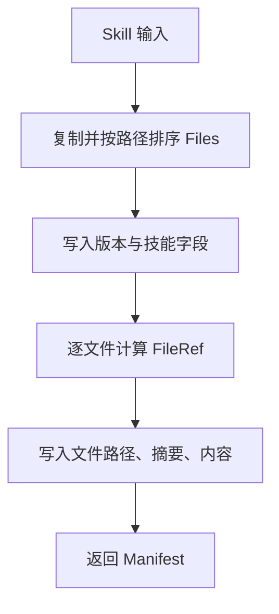
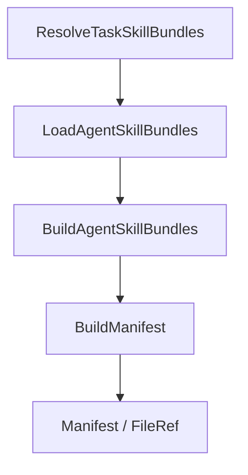

# Skills, Templates & Agent Knowledge — pkg

## skillbundle 包

`server/pkg/skillbundle` 定义技能包的轻量数据模型，并提供 `BuildManifest` 生成稳定清单。这个包的核心职责是把一个 `Skill` 规范化为可比较、可缓存、可校验的 `Manifest`，供 daemon 和 task service 判断技能内容是否变化。

当前实现集中在 [hash.go](/Users/bytedance/proj/multica/server/pkg/skillbundle/hash.go)。

## 核心概念

`Skill` 表示一个技能包：

```go
type Skill struct {
	ID          string
	Source      string
	Name        string
	Description string
	Content     string
	Files       []File
}
```

其中：

- `ID`：技能唯一标识。
- `Source`：技能来源，当前约定值包括 `SourceWorkspace` 和 `SourceBuiltin`。
- `Name`、`Description`：展示和检索用元数据。
- `Content`：技能主内容，通常对应主要说明文本。
- `Files`：技能包附带文件集合，每个 `File` 只有 `Path` 和 `Content`。

`Manifest` 是 `BuildManifest` 的输出：

```go
type Manifest struct {
	Hash      string
	SizeBytes int64
	FileCount int
	Files     []FileRef
}
```

它包含整个技能包的总哈希、总字节数、文件数量，以及每个附带文件的摘要信息。

## `BuildManifest` 的行为

`BuildManifest(skill Skill) Manifest` 会生成确定性的技能包清单。相同的 `Skill` 内容无论 `Files` 输入顺序如何，都会得到相同的 `Manifest.Hash` 和相同顺序的 `Manifest.Files`。

处理流程如下：

1. 复制 `skill.Files`，避免修改调用方传入的切片。
2. 按 `File.Path` 字典序排序。
3. 初始化 SHA-256 哈希器。
4. 写入版本标记 `"v1"`。
5. 写入技能级字段：`Source`、`ID`、`Name`、`Description`、`Content`。
6. 对每个文件计算单文件摘要 `sha256:<hex>`。
7. 将文件路径、文件摘要、文件内容继续写入总哈希。
8. 累加 `SizeBytes`，生成排序后的 `FileRef` 列表。
9. 返回 `Manifest`。



## 哈希格式

总哈希和单文件哈希都使用 SHA-256，并带有 `sha256:` 前缀：

```go
Hash:   "sha256:" + hex.EncodeToString(h.Sum(nil))
SHA256: "sha256:" + hex.EncodeToString(fileHash[:])
```

`writeHashPart` 使用长度前缀写入每段内容：

```go
func writeHashPart(h interface{ Write([]byte) (int, error) }, value string) {
	_, _ = fmt.Fprintf(h, "%d:%s\n", len(value), value)
}
```

这种格式避免了简单拼接带来的歧义。例如 `"ab" + "c"` 和 `"a" + "bc"` 在纯拼接时可能不可区分，但长度前缀会分别写成不同的片段。

`BuildManifest` 当前写入固定版本 `"v1"`。如果未来清单算法、字段集合或编码规则变化，应通过版本字段演进，避免新旧哈希语义混淆。

## 文件排序与稳定性

`BuildManifest` 明确按 `File.Path` 排序：

```go
sort.Slice(files, func(i, j int) bool {
	return files[i].Path < files[j].Path
})
```

这使清单不依赖调用方构造 `Files` 的顺序。对应测试 `TestBuildManifestStableAcrossFileOrder` 覆盖了这个约束。

排序后的文件顺序也会反映在 `Manifest.Files` 中，因此调用方可以把 `Manifest.Files` 当作稳定输出使用。

## 字节数与文件数

`Manifest.SizeBytes` 统计的是 `skill.Content` 与所有 `File.Content` 的字节长度之和：

```go
size := int64(len(skill.Content))
size += int64(len(file.Content))
```

它不包含 `ID`、`Name`、`Description`、`Source`、路径或哈希字符串的长度。

`Manifest.FileCount` 等于排序后文件列表长度，也就是 `len(skill.Files)`。

`FileRef.SizeBytes` 是单个 `File.Content` 的字节长度。

## 与 daemon 和 task service 的关系

`skillbundle` 位于 `server/pkg`，不直接依赖内部业务包。它被上层流程调用，用来把技能包转换为稳定引用。

主要调用路径包括：



关键集成点：

- `BuildAgentSkillBundles` 构造 agent 可用技能包，并调用 `BuildManifest` 生成清单。
- `ResolveTaskSkillBundles` 通过 task service 加载技能包，最终拿到 `Manifest` 和 `FileRef`。
- `validateSkillBundle` 使用 `BuildManifest` 校验技能缓存或技能包内容。
- `skillRefFromBundle` 使用 `BuildManifest` 和 `File` 生成 daemon 层可返回的技能引用。
- 测试 `TestBuildManifestChangesWhenContentChanges` 确认内容变化会改变清单哈希。

这个包本身没有外部调用，也不访问文件系统、数据库、网络或环境变量。它是纯计算模块，适合被缓存校验、API 响应构造和测试直接复用。

## 使用示例

```go
skill := skillbundle.Skill{
	ID:          "reviewer",
	Source:      skillbundle.SourceWorkspace,
	Name:        "Code Reviewer",
	Description: "审查代码变更",
	Content:     "检查正确性、风险和测试覆盖。",
	Files: []skillbundle.File{
		{
			Path:    "references/checklist.md",
			Content: "检查错误处理和边界条件。",
		},
	},
}

manifest := skillbundle.BuildManifest(skill)
```

调用方通常关心：

- `manifest.Hash`：技能包整体是否变化。
- `manifest.SizeBytes`：技能包内容体积。
- `manifest.FileCount`：附带文件数量。
- `manifest.Files`：每个文件的路径、SHA-256 和大小。

## 修改注意事项

修改 `BuildManifest` 会影响 daemon 技能解析、任务技能加载和技能缓存校验。尤其要谨慎处理以下行为：

- 不要移除 `Files` 排序，否则相同内容可能因为输入顺序不同产生不同哈希。
- 不要改动 `writeHashPart` 的编码规则，除非同步升级版本标记。
- 新增参与哈希的字段会让所有既有技能包哈希变化。
- `SizeBytes` 当前只统计内容正文，不统计路径和元数据；如果调整语义，需要同步检查调用方展示和校验逻辑。
- `Manifest.Files` 当前按路径稳定排序，调用方可能依赖这个顺序。