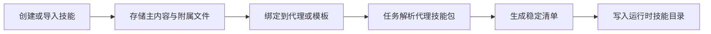

# Skills, Templates & Agent Knowledge

## 模块概览

`Skills, Templates & Agent Knowledge` 负责管理代理运行时可消费的知识包：从工作区创建或导入 skill，将其绑定到代理或模板，并在任务执行时解析为带清单的技能包。详细接口与持久化逻辑见 [internal 子模块](skills-templates-agent-knowledge-internal.md)，稳定清单与哈希模型见 [pkg 子模块](skills-templates-agent-knowledge-pkg.md)。

## 子模块协作

`server/internal/handler/skill.go` 是主要入口，覆盖 `ListSkills`、`GetSkill`、`CreateSkill`、`UpdateSkill`、`DeleteSkill`、`ImportSkill`、`ListSkillFiles`、`UpsertSkillFile` 等 HTTP 工作流。它把 `SKILL.md` 作为主内容，把 supporting files 作为相对路径文件集合管理，并通过 `SkillResponse`、`SkillSummaryResponse`、`SkillWithFilesResponse` 控制不同场景的响应粒度。

`server/internal/handler/skill_create.go` 和 `skill_import_archive.go` 承担写入侧的专门逻辑：前者处理技能及附属文件的事务化创建与覆盖，后者处理 `.skill` / `.zip` 上传导入。`server/internal/service/builtin_skills.go` 提供编译期内置技能来源，使工作区技能与平台内置技能可以进入同一套后续装配流程。

`server/pkg/skillbundle` 则提供跨服务边界使用的轻量模型。`BuildManifest` 将 `Skill` 的主内容与 `File` 集合规范化为 `Manifest`，生成 `Hash`、`SizeBytes`、`FileCount` 和文件引用信息，供 daemon 与 task service 判断技能包是否变化。

## 跨模块工作流

典型链路从 `ImportSkill` 或 `CreateSkill` 开始：处理器解析来源、校验路径、写入 `skill` 与 `skill_file`。模板相关逻辑可复用导入器创建模板技能，代理配置再引用这些技能。

任务执行时，`ResolveTaskSkillBundles` 调用 `LoadAgentSkillBundles` 和 `BuildAgentSkillBundles` 收集代理绑定的技能，随后进入 `skillbundle.BuildManifest`。这里 `Manifest`、`FileRef` 和内部的 `writeHashPart` 共同保证同一技能内容生成稳定哈希，daemon 可以据此判断是否需要重新同步运行时文件。

最终，`execenv/context.go` 根据解析出的技能包把 `SKILL.md` 与 supporting files 写入运行时目录。这样，HTTP 管理层、任务服务和运行时环境共享同一套 skill 语义，但各自只处理自己的职责边界。