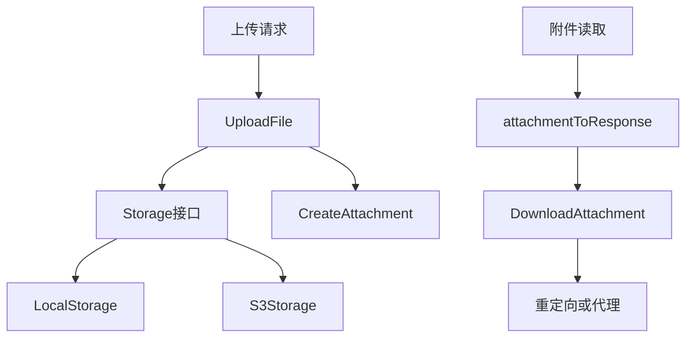

# Storage, Files & Attachments

## 模块定位

该模块负责文件上传、附件元数据、下载跳转/代理、文本预览、本地静态文件服务，以及 S3/兼容对象存储适配。核心代码分布在：

- `server/internal/handler/file.go`：HTTP 接口、权限校验、附件响应组装、下载策略、预览代理。
- `server/internal/storage/storage.go`：存储后端接口定义。
- `server/internal/storage/local.go`：本地磁盘存储实现。
- `server/internal/storage/s3.go`：S3 及兼容对象存储实现。
- `server/internal/storage/util.go`：`Content-Disposition` 和内联展示策略。

## 核心数据流



`UploadFile` 是写入入口。它读取 multipart 字段 `file`，限制最大上传体积为 `100 MB`，通过前 512 字节嗅探内容类型，并用 `extContentTypes` 修正 SVG、CSS、JS、JSON、WASM 等 Go 标准嗅探容易误判的类型。

有工作区上下文时，文件会写入 `workspaces/{workspaceID}/{uuidv7}{ext}`；无工作区上下文时，用于头像等场景，写入 `users/{userID}/{uuidv7}{ext}`。工作区附件会同时创建 `attachments` 数据库记录，并可通过表单字段关联到 `issue_id`、`comment_id`、`chat_session_id` 或 `task_id`。

## 附件响应模型

`AttachmentResponse` 是客户端看到的统一附件结构，主要字段包括：

- `id`、`workspace_id`、`issue_id`、`comment_id`、`chat_session_id`、`chat_message_id`
- `uploader_type`、`uploader_id`
- `filename`、`content_type`、`size_bytes`
- `url`：存储层返回的原始对象 URL。
- `download_url`：当前响应中用于下载/预览的 URL，可能是短期签名 URL。
- `markdown_url`：允许持久化到 issue、comment、chat markdown 正文里的稳定 URL。

`attachmentToResponse` 负责把 `db.Attachment` 转成 `AttachmentResponse`。如果 `h.CFSigner` 存在，`download_url` 会被替换成 CloudFront 签名 URL；否则默认为 `/api/attachments/{id}/download`。

`markdown_url` 由 `buildMarkdownURL` 决定。只有当 `storageURLIsPubliclyReadable` 判断存储 URL 是公开、持久、无签名查询参数的绝对 HTTP(S) URL 时，才会直接持久化 `a.Url`。其他情况统一使用稳定下载端点，并在配置了 `MULTICA_PUBLIC_URL` 时拼成绝对 URL，避免 Desktop 或移动 WebView 中相对 `/api/...` 无法解析到 API host。

## 存储抽象

`Storage` 接口定义了所有后端必须支持的能力：

```go
type Storage interface {
    Upload(ctx context.Context, key string, data []byte, contentType string, filename string) (string, error)
    Delete(ctx context.Context, key string)
    DeleteKeys(ctx context.Context, keys []string)
    KeyFromURL(rawURL string) string
    CdnDomain() string
    GetReader(ctx context.Context, key string) (io.ReadCloser, error)
}
```

`Upload` 返回的是会写入数据库的对象 URL。`KeyFromURL` 是下载、预览、删除路径的关键反向映射：handler 不直接保存存储 key，而是从附件 URL 中恢复 key 后调用 `GetReader`、`Delete` 或 presign 逻辑。

`DownloadPresigner` 是可选接口，由 `S3Storage` 实现，用于生成带 `Content-Disposition` 的临时下载 URL：

```go
type DownloadPresigner interface {
    PresignGetWithContentDisposition(ctx context.Context, key string, ttl time.Duration, contentDisposition string) (string, error)
}
```

## 本地存储

`NewLocalStorageFromEnv` 读取：

- `LOCAL_UPLOAD_DIR`，默认 `./data/uploads`
- `LOCAL_UPLOAD_BASE_URL`，可选，例如 `http://localhost:8080`

`LocalStorage.Upload` 会把文件写入本地目录，并在有原始文件名时写入同路径的 `.meta.json` sidecar。sidecar 保存 `filename` 和 `content_type`，供 `ServeFile` 设置和 S3 上传路径一致的 `Content-Disposition`，避免浏览器下载时只显示 UUID 文件名。

安全边界集中在三个点：

- `GetReader` 拒绝空 key、拒绝 `.meta.json`、并通过 `isUnder` 防止路径逃逸。
- `ServeFile` 同样拒绝 `.meta.json` 和路径穿越。
- `Delete` 会同时删除对象文件和 sidecar。

`ServeLocalUpload` 只在 `h.Storage` 是 `*storage.LocalStorage` 时工作。它为 `/uploads/*` 设置附件预览 CSP，然后调用 `LocalStorage.ServeFile`。

## S3 存储

`NewS3StorageFromEnv` 读取：

- `S3_BUCKET`，必填；未设置则云上传关闭。
- `S3_REGION`，默认 `us-west-2`。
- `AWS_ACCESS_KEY_ID` / `AWS_SECRET_ACCESS_KEY`，可选；否则走默认 AWS credential chain。
- `AWS_ENDPOINT_URL`，用于 MinIO、R2、B2、Wasabi 等兼容后端。
- `S3_USE_PATH_STYLE`，未设置时在自定义 endpoint 下默认开启。
- `CLOUDFRONT_DOMAIN`，用于返回 CDN URL。

`S3Storage.Upload` 调用 `PutObject`，写入 `ContentType`、`ContentDisposition`、`CacheControl: max-age=432000,public` 和存储类型。真实 AWS 默认使用 `INTELLIGENT_TIERING`，自定义 endpoint 使用 `STANDARD`。

`uploadedURL` 的优先级是：

1. 配置了 `CLOUDFRONT_DOMAIN`：返回 `https://{domain}/{key}`。
2. 配置了 `AWS_ENDPOINT_URL`：根据 path-style 或 virtual-hosted-style 构造兼容存储 URL。
3. 默认 AWS S3：优先 virtual-hosted-style；bucket 名含点时回退 path-style，避免 TLS 通配证书不匹配。

## 下载策略

`DownloadAttachment` 服务 `GET /api/attachments/{id}/download`。它不依赖 `X-Workspace-ID` 或 `X-Workspace-Slug`，而是通过 `loadAttachmentForDownload` 只按附件 ID 查库，再校验当前用户是否属于附件所在工作区。拒绝时返回 404，避免把附件 ID 是否存在暴露给非成员。

下载模式由 `resolveAttachmentDownloadMode` 决定：

- 显式配置 `cloudfront`：使用 `h.CFSigner.SignedURLWithContentDisposition` 后 302。
- 显式配置 `presign`：要求 `Storage` 实现 `DownloadPresigner`，生成 S3 presigned URL 后 302。
- 显式配置 `proxy`：通过 API 代理流式返回。
- `auto`：有 `CFSigner` 走 CloudFront；URL 看起来是 localhost、内网、`.local`、私网 IP 等则走 proxy；否则优先 presign，最后回退 proxy。

`proxyAttachmentDownload` 会设置 `Content-Type`、`Content-Disposition`、`Cache-Control: no-store`、`X-Content-Type-Options: nosniff` 和附件预览 CSP。若底层 reader 实现 `io.ReadSeeker`，直接交给 `http.ServeContent` 获得标准 Range 支持；否则进入 `serveProxyRange`。

`serveProxyRange` 为非 seekable 后端实现单段 `Range`：

- 无 Range 或未知大小：返回完整 `200`。
- 单段可满足 Range：返回 `206`、`Content-Range`、指定长度 body。
- 越界 Range：返回 `416` 和 `Content-Range: bytes */{total}`。
- 多段 Range：按 RFC 语义忽略，返回完整 `200`，避免非 seekable 路径错误失败。

## 文本预览

`GetAttachmentContent` 服务 `GET /api/attachments/{id}/content`，用于文本类附件预览。它先走 `loadAttachmentForRequest`，因此需要请求能解析到工作区上下文。

预览只允许 `isTextPreviewable` 白名单内的内容类型或扩展名。允许的类型包括 `text/*`、JSON、JavaScript、XML、YAML、TOML、shell、PHP，以及常见源码/配置文件扩展名。该白名单需要和前端 `packages/views/editor/utils/preview.ts` 中的 `TEXT_EXTENSIONS`、`TEXT_CONTENT_TYPES`、`TEXT_BASENAMES`、`extensionToLanguage` 保持同步。

预览读取有硬限制：`maxPreviewTextSize = 2 MB`。响应始终使用 `Content-Type: text/plain; charset=utf-8`，并通过 `X-Original-Content-Type` 暴露原 MIME，防止恶意 HTML 被浏览器当文档执行。

## 安全策略

`ContentDisposition` 会先调用 `sanitizeFilename`，替换控制字符、换行、空字节、双引号、分号、反斜杠，防止响应头注入。

`isInlineContentType` 只允许图片、视频、音频、PDF inline；但明确排除 `image/svg+xml`。SVG 可携带脚本、`foreignObject` 或事件属性，必须强制下载，避免存储型 XSS。

附件预览响应通过 `setAttachmentPreviewSecurityHeaders` 设置 CSP。`attachmentPreviewCSPHeader` 默认只允许 `'self'` 作为 `frame-ancestors`，并合并配置的 `AttachmentFrameAncestors`。`normalizeFrameAncestorSource` 只接受合法的 `http://` 或 `https://` 源，忽略空值和 `*`。

## 附件关联和删除

`linkAttachmentsByIssueIDs` 把一组附件关联到 issue，只更新还没有 `issue_id` 的附件。

`linkAttachmentsByIDs` 把一组附件关联到 comment，只更新属于同一 issue 且还没有 `comment_id` 的附件。

`DeleteAttachment` 要求当前用户是上传者，或工作区角色为 `admin` / `owner`。数据库记录删除成功后，通过 `deleteS3Object` 调用当前 `Storage` 后端删除对象。虽然函数名保留了 `S3`，实际会通过 `Storage.KeyFromURL` 和 `Storage.Delete` 同时支持本地和 S3 后端。

`deleteS3Objects` 是批量版本，先把 URL 转成 key，再调用 `Storage.DeleteKeys`。

## 与其他模块的连接

issue 详情通过 `ListAttachments` 读取 issue 附件列表。评论列表通过 `groupAttachments` 批量加载 comment 附件，避免 N+1 查询。聊天消息通过 `groupChatMessageAttachments` 批量加载 `chat_message_id` 关联附件。

agent 任务上传走 `UploadFile` 的 `task_id` 分支。该分支要求请求来自 task-scoped token，即 `X-Actor-Source` 必须是 `task_token`，并且表单 `task_id` 必须匹配中间件注入的 `X-Task-ID`。随后会校验任务属于当前工作区、上传者是任务自己的 agent，并要求任务存在 `chat_session_id`。这样生成的附件会先绑定到 task 和 chat session，之后由任务完成流程绑定到 assistant message。