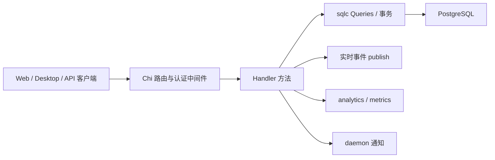

# Workspace, Projects & Collaboration Metadata

## 模块概览

该模块负责 workspace 级协作实体和元数据：工作区、成员与邀请、项目与项目资源、标签、自定义 issue 属性、pin、通知偏好、dashboard 聚合、onboarding、feedback/contact-sales，以及 squad 协作编排。后端实现集中在 `server/internal/handler/*`，通过 sqlc 的 `h.Queries` 访问数据库，通过 `h.publish` 向实时通道发布 `server/pkg/protocol/events.go` 中定义的事件。

## 路由与权限模型

公共端点只有少量运行时配置和营销入口：

- `GetConfig`：`GET /api/config`，匿名可访问，只返回前端安全配置。
- `CreateContactSales`：`POST /api/contact-sales`，匿名可访问，路由层有 `RATE_LIMIT_CONTACT_SALES` 限流。

用户级端点需要登录但不需要当前 workspace：

- `PatchOnboarding`、`CompleteOnboarding`、`JoinCloudWaitlist`
- `CreateFeedback`
- `ListMyInvitations`、`GetMyInvitation`、`AcceptInvitation`、`DeclineInvitation`

workspace 级端点挂在 `middleware.RequireWorkspaceMember` 后面，通过 `X-Workspace-ID` / workspace context 解析当前 workspace。`/api/workspaces/{id}` 下还有更细粒度的角色门禁：

- member 可读：`GetWorkspace`、`ListMembersWithUser`、`ListWorkspaceInvitations`
- owner/admin 可写：`UpdateWorkspace`、`CreateInvitation`、`UpdateMember`、`DeleteMember`、`RevokeInvitation`
- owner 专属：`DeleteWorkspace`

## Workspace 与成员生命周期

`WorkspaceResponse` 由 `workspaceToResponse` 从 `db.Workspace` 转换，包含 `id`、`name`、`slug`、`description`、`context`、`settings`、`repos`、`issue_prefix`、`avatar_url` 和时间戳。`settings` 默认 `{}`，`repos` 默认 `[]`，避免客户端处理 `null`。

`CreateWorkspace` 会：

1. 校验登录用户。
2. 检查 `h.cfg.DisableWorkspaceCreation`，对应 `/api/config` 中的 `workspace_creation_disabled`。
3. 校验 `name`、`slug`，并通过 `isReservedSlug` 拒绝保留 slug。
4. 在事务中创建 workspace，并用 `CreateMember` 创建 owner 成员。
5. 发送 `analytics.WorkspaceCreated`，调用 `notifyDaemonWorkspacesChanged`。
6. 不会标记用户 onboarded；`onboarded_at` 只由 `CompleteOnboarding` 或 `AcceptInvitation` 管理。

`UpdateWorkspace` 支持修改名称、描述、上下文、设置、仓库列表、issue 前缀和头像。`validateAndNormalizeWorkspaceRepos` 会把 `repos` 标准化为仓库对象数组，校验 URL 只接受 http(s)、ssh/git URL 或 `git@host:path` 形式，并去重。更新后发布 `workspace:updated`；如果改了名称，还会通知所有成员的 daemon workspace 列表刷新。

成员响应有两种：

- `MemberResponse`：只含 membership 元数据。
- `MemberWithUserResponse`：由 `memberWithUserResponse` 生成，额外带 `name`、`email`、`avatar_url`。

`UpdateMember` 使用 `normalizeMemberRole` 标准化 `owner`、`admin`、`member`。降级最后一个 owner 会返回 400。成员角色变更后会失效 `MembershipCache` 并发布 `member:updated`。

`DeleteMember` 和 `LeaveWorkspace` 都通过 `revokeAndRemoveMember` 收敛关联状态：撤销该用户拥有的 runtimes，归档相关 agents，取消运行中任务，强制 runtime offline，删除 daemon token，清理 channel 绑定和 agent invocation target，最后删除 member 行。事务提交后 `publishRevocation` 广播任务取消、agent 归档和 runtime 刷新事件，再发布 `member:removed`。

## 邀请流程

当前 `POST /api/workspaces/{id}/members` 路由实际调用 `CreateInvitation`，不是旧的即时加成员流程。

`CreateInvitation` 使用 `CreateMemberRequest` 的 `email` 和 `role` 字段，但行为是创建 `workspace_invitation`：

- 邮箱会 trim + lowercase。
- `normalizeMemberRole` 校验角色，但禁止邀请为 `owner`。
- 已经是成员时返回 409。
- 先调用 `ExpireStalePendingInvitations` 把过期 pending 邀请置为 expired，避免唯一索引挡住新邀请。
- 若仍有 live pending 邀请，返回 409。
- 已注册用户会写入 `invitee_user_id`。
- 创建后发布 `invitation:created`，记录 `analytics.TeamInviteSent`，并在有 `EmailService` 时异步发送邀请邮件。

`AcceptInvitation` 是该流程最重要的事务边界：它在一个事务中执行 `AcceptInvitation`、`CreateMember` 和 `MarkUserOnboarded`。这保证接受邀请的用户不会出现“已加入 workspace 但仍被 onboarding gate 拦住”的状态。事务提交后会发布 `member:added`、`invitation:accepted`，通知 daemon workspace 列表变化，并记录 `TeamInviteAccepted`；如果这是用户第一次完成 onboarding，还会记录 `OnboardingCompleted`，路径为 `invite_accept`。

`DeclineInvitation` 只允许邀请归属用户操作 pending 邀请，成功后发布 `invitation:declined`。`RevokeInvitation` 由 workspace 管理员取消 pending 邀请，成功后发布 `invitation:revoked`。

## Projects 与项目资源

`ProjectResponse` 由 `projectToResponse` 生成，包含项目元数据和三个派生计数：`issue_count`、`done_count`、`resource_count`。资源列表不内联在普通 `GET /api/projects/{id}` 中；需要调用 `ListProjectResources`。

项目状态和优先级由 handler 预校验：

- `validProjectStatuses`：`planned`、`in_progress`、`paused`、`completed`、`cancelled`
- `validProjectPriorities`：`urgent`、`high`、`medium`、`low`、`none`

`CreateProject` 支持在创建项目时一次性附带 `resources`。无资源时走简单插入；有资源时项目和资源在同一事务中创建，失败会整体回滚。内嵌资源使用独立类型 `CreateProjectResourceRequestPayload`，避免 standalone request 变化破坏创建项目的请求面。

`UpdateProject` 会先读取原项目，再读取原始 JSON body，用 `rawFields` 区分“字段缺失”和“显式清空”。例如 `description`、`icon`、`lead_id`、`start_date`、`due_date` 只有在请求体里出现时才修改；出现且为 `null` 或空日期则清空。成功后发布 `project:updated`。

`DeleteProject` 会重新校验项目属于当前 workspace，并要求 owner/admin，然后发布 `project:deleted`。

`SearchProjects` 使用 `buildProjectSearchQuery` 构造动态 SQL，支持短语匹配、多词 AND、`include_closed`、分页和最多 50 条 limit。响应头 `X-Total-Count` 返回总数；当命中来源是 description 时会生成 `matched_snippet`。

项目资源由 `ProjectResourceResponse` 表示，当前支持两种 `resource_type`：

- `github_repo`：`resource_ref` 使用 `githubRepoRef`，校验 `url`，并保留 `default_branch_hint`、`ref`。
- `local_directory`：`resource_ref` 使用 `localDirectoryRef`，包含 `local_path`、`daemon_id`、可选 `label`。`local_path` 必须像绝对路径，支持 POSIX、UNC 和 Windows drive path。

`findLocalDirectoryConflict` 强制每个 `(project, daemon_id)` 最多一个 `local_directory`。这是应用层约束，因为数据库唯一索引只能比较完整 JSON；如果同一 daemon 有两个不同路径，daemon 端会按首个匹配资源路由任务，可能把 agent 写入错误工作目录。

项目资源 CRUD 成功后分别发布：

- `project_resource:created`
- `project_resource:updated`
- `project_resource:deleted`

daemon claim 侧通过 `listProjectResourcesForProject` 把项目资源附加到任务上下文；执行环境也会读取项目上下文和可用命令。因此修改项目资源不仅影响 UI，还会影响 agent 运行目录和仓库上下文。

## Labels

标签是 workspace 级目录元数据，由 `LabelResponse` 表示。默认 `resource_type` 是 `issue`，`agent` 和 `skill` 标签受 `featureflags.ResourceLabelsEnabled` 控制。

输入校验集中在几个 helper：

- `parseLabelResourceType`：只接受 `issue`、`agent`、`skill`。
- `validateLabelName`：去掉首尾空格，拒绝控制字符，最多 32 个 rune。
- `normalizeColor`：只接受 6 位 hex，标准化为 `#rrggbb`。这个约束不能放宽，因为前端 `LabelChip` 会直接把颜色写进 inline style。

`CreateLabel`、`UpdateLabel`、`DeleteLabel` 成功后分别发布 `label:created`、`label:updated`、`label:deleted`。删除标签时 `DeleteLabel` 会开启事务，先清理 issue/agent/skill 三类 junction 表，再删除标签本身，避免留下悬挂关系。

issue 标签绑定使用：

- `ListLabelsForIssue`
- `AttachLabel`
- `DetachLabel`

绑定和解绑都会先通过 `loadIssueForUser` 授权 issue，再确认 label 属于同一 workspace 且 `ResourceType == "issue"`。变更成功后读取最新标签列表并发布 `issue_labels:changed`。如果变更已提交但读取最新列表失败，`listLabelsForIssueSafe` 会返回空响应并跳过广播，避免用错误空列表覆盖订阅端的 optimistic 状态。

agent/skill 标签绑定分别使用 `AttachLabelToAgent`、`DetachLabelFromAgent`、`AttachLabelToSkill`、`DetachLabelFromSkill`。这些接口受 feature flag 保护，并调用 `canManageAgent` / `canManageSkill` 做管理权限判断。

## 自定义 Issue 属性

`property.go` 实现 workspace 级属性定义和每个 issue 的属性值包。设计约束写在文件头注释中：

- 属性定义只能由人类 owner/admin 管理。
- agent 不能创建或修改定义，即使它继承了管理员 runtime owner 的身份。
- 属性值可由成员和 agent 写入。
- 值写入按单个 key 原子更新，两个 agent 写不同属性不会互相覆盖。
- 定义只 archive，不物理删除；已归档定义拒绝新值，但现有值仍可解析和清理。

定义响应是 `PropertyResponse`。支持类型为 `text`、`number`、`select`、`multi_select`、`date`、`checkbox`、`url`。select 类型的 `PropertyConfig.Options` 每项有稳定 `id`、`name`、`color`；如果客户端没给 ID，`validatePropertyConfig` 会用 `uuid.NewString()` 生成。值引用 option ID，因此重命名 option 不需要改 issue 行。

定义写入由 `requirePropertyAdmin` 保护。`CreateProperty` 还会通过 `withPropertyLock` 持有 workspace advisory lock，保证 active property 上限 `maxActivePropertiesPerWorkspace = 20` 不被并发创建绕过。`UpdateProperty` 同时持有 workspace lock 和 property lock：删除 select option 前会调用 `CountIssuesUsingPropertyOptions`，如果 option 仍被使用，返回 409，并用 `describeOptionsInUse` 告诉用户哪些选项仍在多少个 issue 中使用。

issue 属性值使用：

- `SetIssueProperty`：`PUT /api/issues/{id}/properties/{propertyId}`
- `DeleteIssueProperty`：`DELETE /api/issues/{id}/properties/{propertyId}`

`SetIssueProperty` 在 property lock 下读取定义、拒绝 archived 定义、用 `validatePropertyValue` 校验并标准化 JSON，然后把值写入 issue 的 `properties` JSONB，key 是 property UUID 字符串。成功后发布 `issue_properties:changed`，payload 包含完整 `properties` map。

`DeleteIssueProperty` 允许删除 archived 定义的值；清理操作不能因为定义归档而被阻塞。它同样发布 `issue_properties:changed`。

列表过滤由 `parsePropertiesFilterParam` 支持，读取 `properties` query parameter，格式是 `{definitionId: [values]}`。同一属性内是 OR，不同属性之间是 AND；select、multi_select 和 checkbox 会展开为对应 JSON containment 条件。

## Pins 与个人偏好

`PinnedItemResponse` 只承载 pin 元数据：`item_type`、`item_id`、`position` 等，不包含 title、status、identifier、icon。客户端应从 issue/project query cache 派生展示字段，这样 `issue:updated` 或 `project:updated` 可以自然更新侧边栏，不需要 pin query 跨实体失效。

`CreatePin` 只允许 `item_type` 为 `issue` 或 `project`，并会检查目标实体确实存在于当前 workspace。新 pin 的位置是当前最大 position + 1。重复 pin 返回 409。`ReorderPins` 逐项调用 `UpdatePinnedItemPosition`，然后发布 `pin:reordered`，让同一用户的其他会话刷新顺序。

通知偏好由 `GetNotificationPreferences` 和 `UpdateNotificationPreferences` 管理，作用域是 `(workspace_id, user_id)`。没有偏好行时返回空 map。可接受 group 是 `assignments`、`status_changes`、`comments`、`updates`、`agent_activity`、`system_notifications`；值只接受 `all` 或 `muted`。`system_notifications` 不是 inbox 事件组，而是原生系统通知开关，但复用同一 preferences JSON。

## Squads

Squad 是 workspace 内的协作编排元数据，响应由 `squadToResponse` / `squadToResponseWithPreview` 生成。`ListSquads` 对 workspace 成员可见，并批量读取成员 preview，避免每个 squad 单独查询。

`CreateSquad` 允许任意 workspace member 创建 squad，创建者写入 `CreatorID`。leader 必须是当前 workspace 的 agent；如果创建者不是 owner/admin，还必须通过 `memberCanWireAgent` 校验该成员能 `@` 触发这个 agent。创建后自动把 leader 作为 `role = "leader"` 的 squad member 加入，并发布 `squad:created`、记录 `analytics.SquadCreated`。

管理权限由 `canManageSquad` 决定：owner/admin 可管理所有 squad，普通成员只能管理自己创建的 squad。添加成员时：

- `member_type = "agent"`：必须是当前 workspace 的 agent，普通创建者还必须有 agent 调用权限。
- `member_type = "member"`：必须是当前 workspace 成员。

`DeleteSquad` 不是物理删除，而是 archive。归档前会把分配给该 squad 的 issues 和 autopilots 转移给 leader agent，避免后续调度指向已归档 squad。成功后发布 `squad:deleted`，payload 带 `squad_id` 和 `leader_id`。

`ListSquadMemberStatus` 会把 runtime 和任务信号折叠成 `working`、`idle`、`unstable`、`offline`、`archived`。`working` 优先于 runtime 健康；最近 5 分钟内掉线的 runtime 显示为 `unstable`； archived agent 永远显示 `archived`。

## Dashboard 聚合

dashboard 端点只要求 workspace membership，不按 per-agent visibility 过滤，因为 token spend 和 runtime 时间是 workspace 级运营指标。所有端点支持 `?days=N`，默认 30，最多 365；支持 `?project_id=<uuid>`，缺省时统计整个 workspace。

- `GetDashboardUsageDaily`：返回每日 `(date, provider, model)` token 聚合。
- `GetDashboardUsageByAgent`：返回每个 `(agent, provider, model)` token 聚合。
- `GetDashboardAgentRunTime`：返回每个 agent 的终态任务总运行秒数、任务数和失败数。
- `GetDashboardRunTimeDaily`：返回每日终态任务运行秒数、任务数和失败数。

费用不在服务端计算；响应保留 provider + model，让客户端按价格表计算，避免不同 provider 的同名 model 混淆。

## Onboarding、Feedback 与 Contact Sales

`PatchOnboarding` 保存 onboarding questionnaire。`questionnaireAnswers` 兼容历史上 bare string 和当前 array 两种 shape；`questionnaireSchemaVersion = 2`，只有 version 匹配且 source、role、use_case 三项都 resolved 时才算 complete。第一次提交非空 questionnaire 会记录 `OnboardingStarted`；从 incomplete 变 complete 的首次 PATCH 会记录 `OnboardingQuestionnaireSubmitted`。

`CompleteOnboarding` 只做一件事：调用 `MarkUserOnboarded`。它是幂等的，底层 COALESCE 保留第一次时间戳。首次完成时才记录 `OnboardingCompleted`。`workspace_id` 只用于 analytics enrichment，并会先校验 UUID。

`JoinCloudWaitlist` 记录 cloud runtime waitlist 邮箱和原因，不会完成 onboarding。邮箱用 `net/mail` 校验，reason 最多 500 字符。

`onboarding_shim.go` 中的 `BootstrapOnboardingRuntime` 和 `BootstrapOnboardingNoRuntime` 是 desktop < v3 的兼容入口。它们会在事务里创建或复用 Multica Helper / starter issue，并标记用户 onboarded。文件注释明确要求不要添加新功能；v3 起 starter content 由前端 welcome hook 通过通用 `CreateAgent` / `CreateIssue` 创建。

`CreateFeedback` 是登录用户反馈入口。它限制 body 64 KiB、message 10k 字符、每用户每小时 10 次。metadata 会保存 URL、platform、version、OS 和 user_agent；可选 `workspace_id` 会校验 UUID。成功后记录 `FeedbackSubmitted`，其中 `feedbackImageRegex` 只用于计算 `has_images` analytics 标志。

`CreateContactSales` 是匿名销售线索入口。它限制 body 16 KiB，校验姓名、公司名、公司规模、国家地区、use case、goals 长度，并通过 `canonicalBusinessEmail` + `isBusinessEmailDomain` 拒绝免费邮箱域名。每个 business email 每小时最多 3 次。成功写入 `CreateContactSalesInquiry` 后记录 `ContactSalesSubmitted`。

## 运行时配置

`GetConfig` 返回 `AppConfig`，是前端登录前也会调用的公共配置面。只能加入匿名访问安全字段。当前字段包括：

- CDN：`cdn_domain`、`cdn_signed`
- Auth：`allow_signup`、`google_client_id`
- Workspace 创建开关：`workspace_creation_disabled`
- Daemon setup：`daemon_server_url`、`daemon_app_url`
- PostHog：`posthog_key`、`posthog_host`、`analytics_environment`
- 前端安全 feature flags：`feature_flags`
- 自托管版本：`server_version`

`daemonSetupURLsFromEnv` 使用 `MULTICA_PUBLIC_URL` 和 `MULTICA_APP_URL` / `FRONTEND_ORIGIN` 生成 self-host setup URL。`isOfficialCloudDaemonConfig` 只根据 frontend host 是否为 `multica.ai` 判断官方云；官方云会省略 daemon setup URL，避免生成错误的 `setup self-host --server-url https://multica.ai`。

`ServerVersion` 只在非官方云部署中返回。PostHog 配置每次请求重新读环境变量，便于 secret refresh 后不用重启服务。

## 实时事件与前端连接

该模块的写接口通常遵循同一模式：校验输入和 workspace 归属，执行 sqlc 查询或事务，转换为 response，发布协议事件。相关事件集中在 `server/pkg/protocol/events.go`：

- workspace/member/invitation：`workspace:updated`、`workspace:deleted`、`member:*`、`invitation:*`
- project/resource：`project:*`、`project_resource:*`
- labels/properties：`label:*`、`issue_labels:changed`、`property:*`、`issue_properties:changed`
- pins：`pin:created`、`pin:deleted`、`pin:reordered`
- squads：`squad:created`、`squad:updated`、`squad:deleted`

前端 API 方法集中在 `packages/core/api/client.ts`，例如 `listProjects`、`createProjectResource`、`listLabels`、`createProperty`、`setIssueProperty`、`listPins`、`createSquad`、`getNotificationPreferences`、`listMyInvitations`。实时同步由 `packages/core/realtime/use-realtime-sync.ts` 消费这些事件并更新或失效 TanStack Query cache。

## 贡献时需要保持的约束

新增 workspace 级数据必须明确 workspace 归属，并在 SQL 和 handler 中都过滤 `workspace_id`。纯 UUID 边界输入使用 `parseUUIDOrBadRequest`；从 loader 或 DB 结果来的可信 UUID 才使用 `parseUUID`。

新增公开 `/api/config` 字段必须能安全暴露给匿名调用者。不要把用户、workspace 或 tenant scoped 数据放进 `AppConfig`。

新增项目资源类型时，需要扩展 `validateAndNormalizeResourceRef`，并确认 daemon 和 UI 是否理解该 `resource_type`。如果资源会影响 agent 执行位置或上下文，还要检查 daemon claim / execenv 读取路径。

新增 label resource type 时，需要同步 `parseLabelResourceType`、DB 查询、绑定表清理逻辑、事件消费和 feature flag 策略。颜色校验不能放宽成任意 CSS。

修改自定义属性时要保留 `withPropertyLock` 的并发语义。定义更新、option 使用统计和值写入之间必须串行化，否则可能产生孤立 option 引用。

修改成员移除、workspace 删除或 invitation accept 流程时，优先检查事务边界和 post-commit side effects。`revokeAndRemoveMember`、`publishRevocation`、`AcceptInvitation` 的顺序直接影响 runtime 安全、任务取消和客户端一致性。